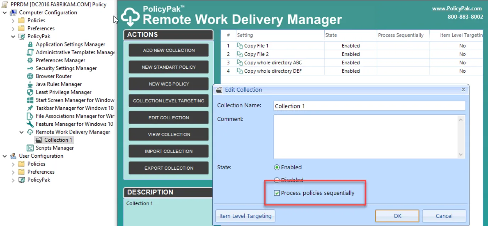

# Using Collections for Groupings and Advanced Configuration

When you make a Endpoint Policy Manager Remote Work Delivery Manager collection, it enables you to group together policy settings for the sake of organization, perform Item-Level Targeting (discussed next), and specify advanced options.

By default, Endpoint Policy Manager Remote Work Delivery Manager will attempt to process policies at the root node, or within any collection, at the same time, without letting one job finish before another job starts. In some situations, this is undesired. For instance, you might want to ensure one file copy is definitely finished and its script running before starting another file copy and letting that script run.

As such, you can use a collection to:

- Process policies sequentially – This will ensure that policies are processed in the order shown in the MMC console, i.e., 1, 2, and so on. When this option is unchecked, policies may process in any order.
- Process policies synchronously — When checked, this will ensure that each individual policy is finished processing before the next one starts.
