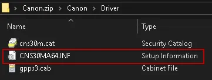
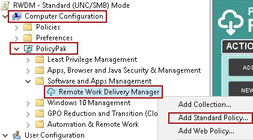
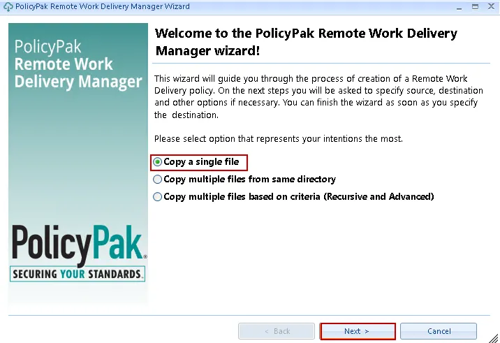
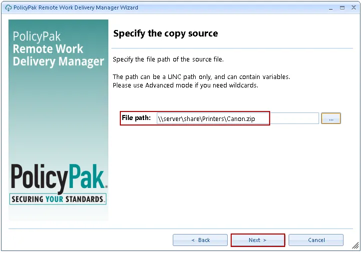
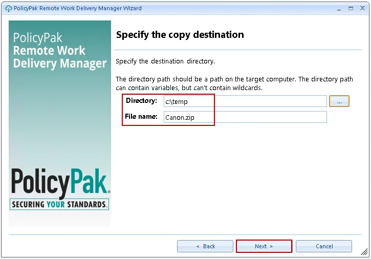
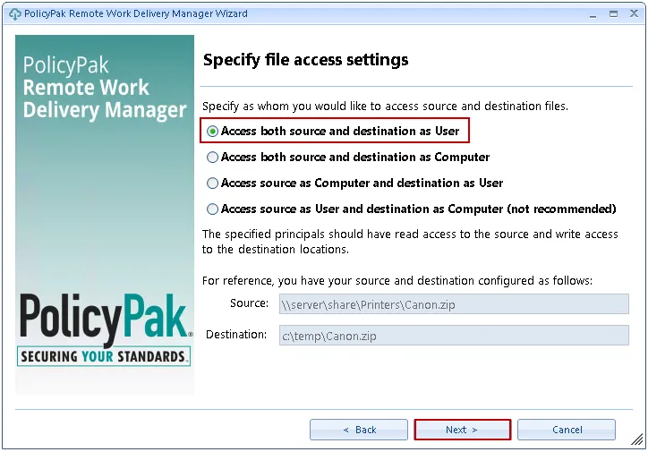
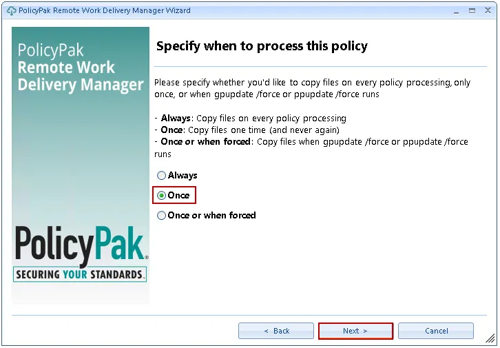
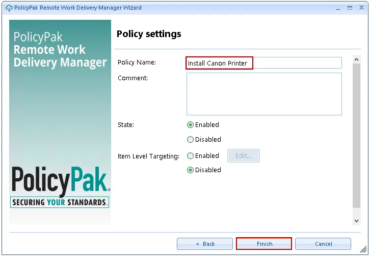
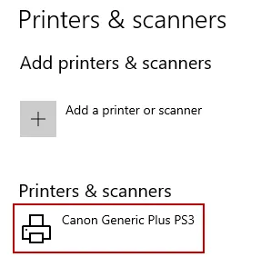

# How To deploy a TCP/IP Printer using Endpoint Policy Manager Remote Work Delivery Manager

__Step 1 –__ Zip up the Printer setup files and store on a network share that is accessible to the users that need to have the printer installed.

For Example:


__NOTE:__ This zip should contain the driver INF file for the printer to be installed.



__Step 2 –__ Using the Microsoft Group Policy Management Console (GPMC), create a new Netwrix Endpoint Policy Manager (formerly PolicyPak) RWDM Standard Policy on either the Computer side (using Switched-Mode), or the User side.



__Step 3 –__ At the Welcome screen select Copy a single file, and click __Next__.



__Step 4 –__ Select Apply this policy to all users who log on to the computer (switched mode), then click __Next__.


__Step 5 –__ Enter the UNC path to the printer zip file from step 1 above, then click __Next__.



__Step 6 –__ Specify the target folder on the endpoint(s) where you would like the zip to be downloaded to, provide the file name for the destination, then click __Next__. 

__NOTE:__ The target folder will be created if it does not exist



__Step 7 –__ Accept the default values and click __Next__.



__Step 8 –__ Select __Once__ then click __Next__.



At the Post-copy actions screen select the __Run PowerShell script__, and __Run process or script as user__ options, then add/edit the command lines below as needed to reflect what is needed for your specific printer model, then click __Next__.

TIP:[ Go to https://www.pdq.com/blog/using-powershell-to-install-printers/ for more information on this topic.](https://www.pdq.com/blog/using-powershell-to-install-printers/)

```
Expand-Archive -LiteralPath 'c:\temp\canon.zip' -DestinationPath C:\Temp    pnputil.exe /a "C:\Temp\Canon\Driver\CNS30MA64.INF"    Start-Sleep -s 10    Add-PrinterDriver -Name "Canon Generic Plus PS3"    Add-PrinterPort -Name "IP Port" -PrinterHostAddress "192.168.1.27"    Add-Printer -DriverName "Canon Generic Plus PS3" -Name "Canon Generic Plus PS3" -PortName "IP Port" 
```


__Important__: The Add-PrinterDriver -Name section above the name specified (i.e., "Canon Generic Plus PS3" in this example) must match one of the names in the INF file!


__Step 9 –__ Skip the Revert actions screen unless you wish to add a revert action.

__Step 10 –__ At the Policy settings screen give the policy a descriptive name, then click __Finish__.



__Step 11 –__ Run GPUPDATE on an endpoint that receives this policy to test, then verify under Printers & Scanners that you see the printer installed.

__NOTE:__ The printer may take around 30 seconds to install.


