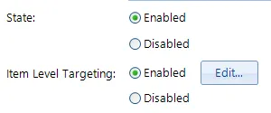

# How do I use Endpoint Policy Manager Remote Work Delivery Manager to update the Client Side Extension?

If you do not have an existing software distribution solution, delivery of software and updates can be a bit of a hassle. Remote Work Delivery Manager (RWDM) can assist you in getting your software out to your endpoints. This includes keeping Netwrix Endpoint Policy Manager (formerly PolicyPak) up to date on all your endpoints.

## Prerequisites

- As the CSE is required to perform an installation or update, it must already be installed on the endpoints and at version 2536 or higher.
- RWDM must properly be licensed or computer in trial mode.
- The Installation MSI file is stored on a file share accessible to all endpoints that require the update.

## Creating the Policy

As with most applications, the Endpoint Policy Manager CSE come in two varieties – 64 and 32 bit. This article will cover creating a policy to cover both.

__Step 1 –__ Create a new Group Policy Object and edit it.

__Step 2 –__ Expand Computer ```Configuration -> PolicyPak -> Apps and Patch Management``` and click on __Remote Work Delivery Manager__.

__Step 3 –__ Add a __New Collection__, rename it, enable and click __OK__.


__Step 4 –__ Add a New Standard Policy.


__Step 5 –__ Select __Copy a single File__ and click __Next__.

__Step 6 –__ Select __Apply this policy to all users who log on to the computer (switched mode)__ and click __Next__.

__Step 7 –__ Enter the UNC path to the MSI file (32 or 64 bit) and click __Next__.


__Step 8 –__ Set the directory that you want to place the downloaded file and ensure the file name is correct. Click __Next__.


__NOTE:__ You can use Environment Variables.

__Step 9 –__ Select __Access both source and destination as User__ and click __Next__.

__Step 10 –__ Select __Always__. This will allow the application to stay up to date as the source file is updated and replaced. Click __Next__.


__Step 11 –__ Under Post-copy actions, select __Run process__ and Type/copy in the installation command ```(msiexec.exe /qb /i %destination%)```. Click __Next__.


__NOTE:__ ```%Destination% = destination path + filename``` (```%Systemdrive\temp\CSE\PPx54.MSI```)

__Step 12 –__ Under Revert actions, select __Do Nothing__ (the application cannot uninstall itself). Click __Next__.


__Step 13 –__ Rename the Policy if desired (e.g. Update PolicyPak CSE – 64bit)

__Step 14 –__ Enable __Item Level Targeting__ and click __Edit__.



- Click on __New Item__ and select __Environment Variable__
- Name = Processor_Architecture
- Value = AMD64 (for 64-bit) OR x86 (for 32-bit)
- Click __OK__ to close


__Step 15 –__ Click __Finish__.

__Step 16 –__ If required, repeat steps 4 – 16 for 32-bit, making the necessary changes along the way.
