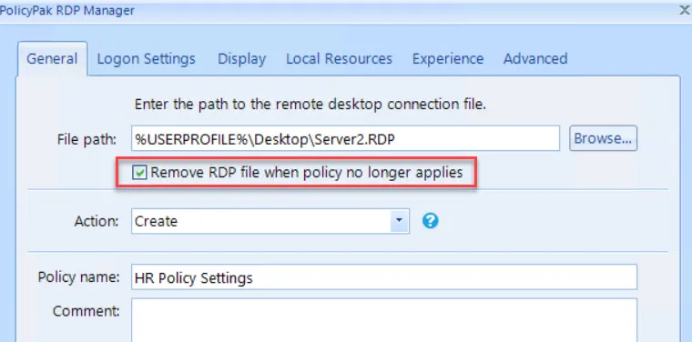
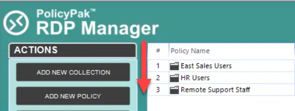

# Understanding Processing Order and Precedence

Within a particular GPO (Computer or User side), the processing order is counted in numerical order. So lower-numbered collections attempt to process first, and higher-numbered collections attempt to process last as shown in Figure 28. Then, within any collection, each policy is processed in numerical order from lowest to highest, as seen in Figure 29.

Figure 28. The order collections are processed in.

Figure 29. The order policies are processed in.

## Merging and Conflicts

Endpoint Policy Manager Scripts & Triggers Manager will merge all policies that come from the Group Policy method (and/or policies and collections deployed from methods other than Group Policy), unless there is a conflict.

## Precedence

Policies can be delivered by Group Policy and non-Group Policy methods such as Microsoft Endpoint Manager (SCCM and Intune) via Endpoint Policy Manager Exporter or Endpoint Policy Manager Cloud. As such, the Endpoint Policy Manager engine needs to make a final determination whether there is any overlap of policies. Here is how the precedence works:

- Policies delivered through Endpoint Policy Manager Cloud have the lowest precedence.
- Policies delivered through Endpoint Policy Manager files have the next highest precedence.
- Policies delivered through Endpoint Policy Manager Group Policy directives have the highest precedence.
