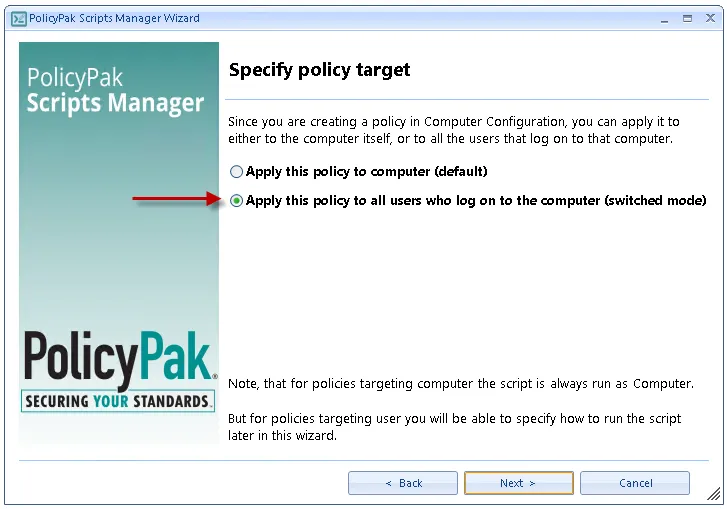
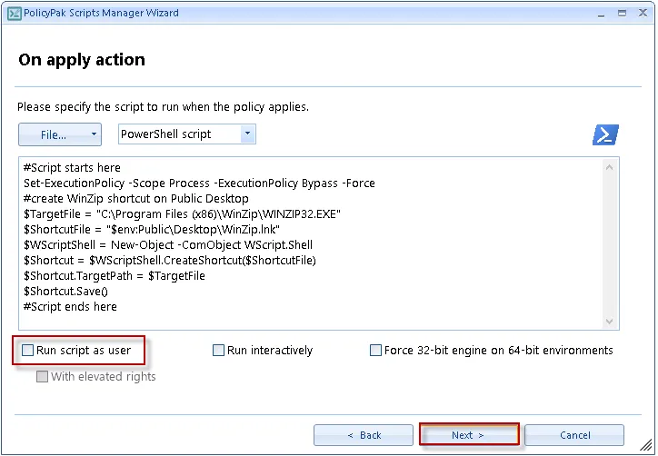

# How to create a shortcut under the Public Desktop using Endpoint Policy Scripts Manager

The steps below are performed using WinZip as an example.

__Step 1 –__ Create a new GPO and link it to the OU where the computers live that will need to have the shortcut added.

__Step 2 –__ Edit the GPO.

__Step 3 –__  Select "Computer Configuration > Netwrix Endpoint Policy Manager (formerly PolicyPak) > Scripts Manager".

__Step 4 –__ Click the "ADD NEW POLICY" button, then click "Next".

__Step 5 –__ At the "Specify policy target" screen be sure to select the 2nd radio button that states "Apply this policy to all users who log on to the computer (switched mode) then click "Next".



__Step 6 –__ At the "On apply action" screen select "PowerShell script" from the dropdown.

__Step 7 –__ In the main text window, paste in the script below and then click "Next".

```
#Script starts here  
#create WinZip shortcut on Public Desktop  
$TargetFile="C:\Program Files (x86)\WinZip\WINZIP32.EXE"  
$ShortcutFile="$env:Public\Desktop\WinZip.lnk"  
$WScriptShell=New-Object-ComObjectWScript.Shell  
$Shortcut=$WScriptShell.CreateShortcut($ShortcutFile)  
$Shortcut.TargetPath =$TargetFile  
$Shortcut.Save()  
 #Script ends here
```

__Step 8 –__ Before clicking "Next" make sure that the "Run script as user" option is unchecked.



__Step 9 –__ Then click "Next" again on the "On revert action" screen.

__Step 10 –__ Select the "Once or when forced" option at the "Specify process mode" screen, then click "Next" again.

__Step 11 –__ Give the policy a descriptive name (i.e. Create WinZip Shortcut on Public Desktop), then click "Finish.

Lastly, log into a computer that lives in the OU where this GPO is applied and within seconds of logging in you should see the WinZip shortcut get created on the desktop. If needed you can run ```GPUPDATE /FORCE``` from a CMD prompt to speed up the process, or for testing.

__NOTE:__ When installing WinZip from MSI, WinZip will remove any desktop icons by default, for this shortcut policy to work properly you should have it apply after WinZip is already installed, or upgraded. Alternatively, you can change the "Policy process mode configuration" to run "Always" instead of "Once or when forced" to always create the shortcut at login or when ```GPUPDATE``` runs.
