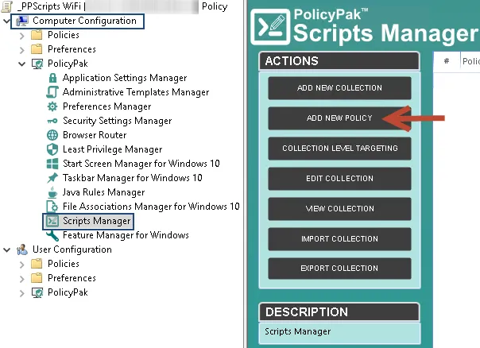
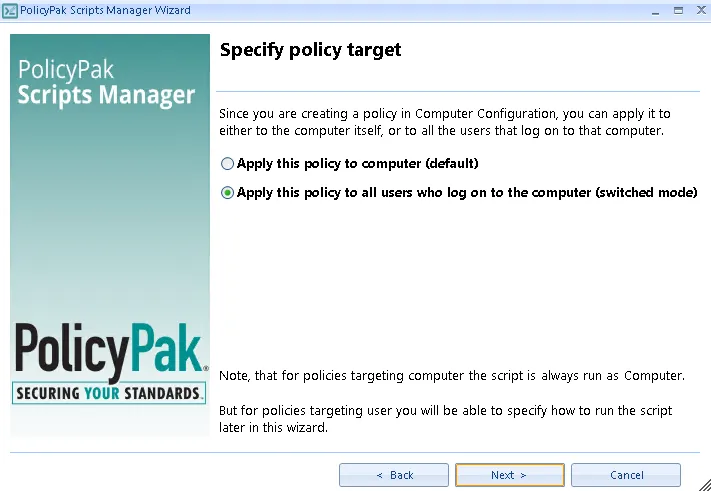
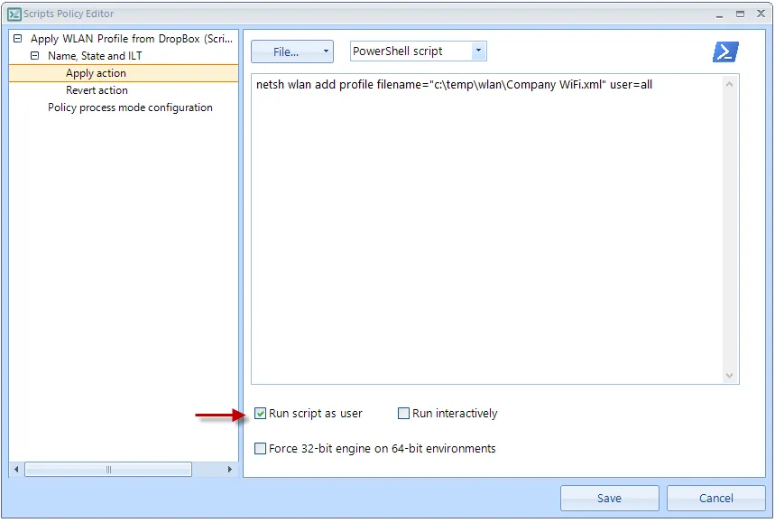

# How to import a WLAN / 802.11 / Wireless profile from a Network Share using Endpoint Policy Scripts Manager?

From an elevated PowerShell prompt on a machine where the WiFi profile is setup and working run the
following to show all WLAN profiles on the PC:

`netsh wlan show profiles`

Export the profile you need by running the command below - substituting values relevant to your WiFi
settings/Environment

`netsh wlan export profile name="Company WiFi" key=clear folder=c:\temp`

**NOTE:** This means the XML file will contain your WiFi password in clear text, please take
whatever measures are needed to protect the contents of this file as dictated by your company's
policy.

Copy the `C:\temp\Company WiFi.xml` to a share accessible by the users and computers that will need
the WiFi Profile. i.e.

`"%logonserver%\share\WiFi\Company WiFi.xml"`

Create the WLAN GPO and apply it to the OU where the Computers live, next use Netwrix Endpoint
Policy Manager (formerly PolicyPak) Scripts Manager > on the Computer side to create a new policy
item.

At the "Specify policy target screen be sure to use switched mode for the policy.

For the Apply action use the command below (remember to use the PowerShell Script option from the
drop down).

`netsh wlan add profile filename="%logonserver%\share\WiFi\Company WiFi.xml" user=all`

Verify that "Run script as user" check box is checked then click "Save"

**NOTE:** If needed you can delete this WLAN profile from a computer using an elevated PowerShell
command prompt.

`netsh wlan delete profile name="Company WiFi"`
