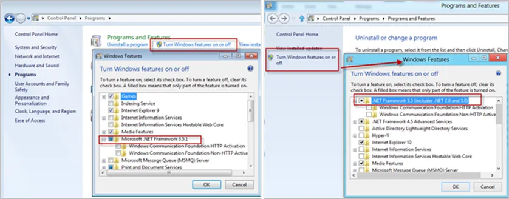

# What must I do to prepare for Endpoint Policy Manager Tech Support to assist me with AppSet creation?

If you have a situation which required Netwrix Endpoint Policy Manager (formerly PolicyPak) Tech
Support to help you update a AppSet from your own system, these are the instructions.

**NOTE:** To use the Endpoint Policy Manager DesignStudio, you will need the following components
pre-installed on your Endpoint Policy Manager Creation Station. The machine you put these components
on should match the END-POINTS you wish to deploy your AppSet to.

It's best if the Endpoint Policy Manager Creation Station is a machine that you can use and re-use
again. We suggest you use a virtual machine loaded with the following components, which you can then
"restore" to "snap back" to this original configuration before creating each AppSet. This idea is
borrowed from creating MSI or App-V packages. You want a clean machine with only the Endpoint Policy
Manager Creation Station utilities before installing your package and producing a AppSet.

If you're using Windows 7 or Windows 8, the .NET Framework can be introduced through Add/Remove
programs, as seen in Figure 1.1.

Figure 1.1: Installing .NET Framework for Windows 7 (left) and Windows 8 (right)

**Step 1 –** Next, install Visual Studio C++ 2008 Express Edition or later on your Endpoint Policy
Manager Creation Station workstation. Any edition later than 2008 will work; you only need one.

- Get C++ 2008 Express Edition by visiting

[http://download.microsoft.com/download/E/8/E/E8EEB394-7F42-4963-A2D8-29559B738298/VS2008ExpressWithSP1ENUX1504728.iso](http://download.microsoft.com/download/E/8/E/E8EEB394-7F42-4963-A2D8-29559B738298/VS2008ExpressWithSP1ENUX1504728.iso).

- Get C++ 2010 or 2013 Express Desktop edition by visiting

[https://visualstudio.microsoft.com/vs/express](https://visualstudio.microsoft.com/vs/express).

**Step 2 –** Follow on-screen instructions to install the edition with the latest service packs and
prerequisites onto your admin workstation. Note that this can take a long time. Also, if prompted,
you do not need to install Silverlight, nor do you need the SQL Express Edition.

Figure ‎1.2: You can download C++ 2010 Express Edition…

Figure ‎1.3: …or Visual Studio 2013 Express. Be sure to select only the "Visual Studio Express 2013
for Windows Desktop" option.

- Sometimes, on some computers, the web-install version of Visual C++ Express Edition fails to
  complete. In those rare cases, you can download the full ISO of all the Express Edition products
  and then install from there. The page to download the full ISO of Visual Studio 2013 for Windows
  Desktops All-In-One ISO is here:

[https://my.visualstudio.com/Downloads?pid=1439](https://my.visualstudio.com/Downloads?pid=1439)

- The download of the full ISO is very large and can take a long time. Again, be sure to install
  only the C++ from the download, and not (oops!) the wrong package like, say C#, which is not
  needed.

    **Step 1 –** After Microsoft C++ 2008 or later is installed, then install Endpoint Policy
    ManagerDesign Studio.msi: This file contains the Endpoint Policy Manager DesignStudio. This tool
    allows you to create AppSets quickly. Users familiar with tools like "Visio" will feel at home
    with DesignStudio.

    **Step 2 –** (Optional). If you wish to create and deploy GPOs from your Endpoint Policy Manager
    Application Settings Manager Creation Station, be sure that the GPMC is installed and
    the Endpoint Policy ManagerAdmin Console.msi is also loaded.

    **Step 3 –** After installation is complete, your Start Menu should have both the Microsoft
    Visual C++ Express Edition node and Endpoint Policy Manager Application Settings Manager nodes
    within the Start Menu, as seen here in this example station.

