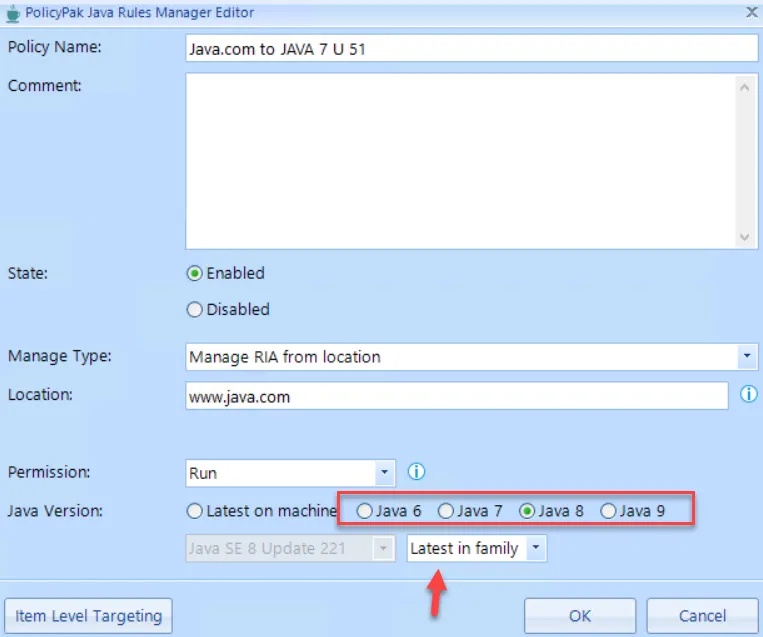
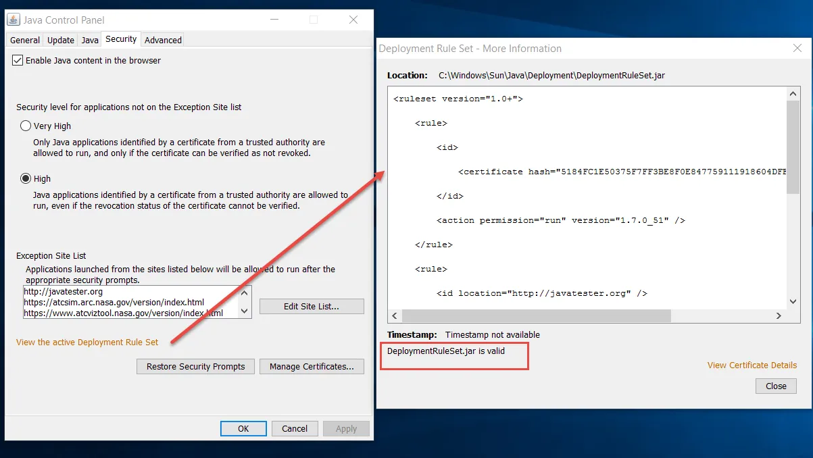

# Version Numbers

Because PolicyPak Application Settings Manager is updated regularly, it's possible you're not using
the latest version. The most important things you can do before working with tech support would be
to take the following steps:

**Step 1 –** Download the latest version of the PolicyPak Application Settings Manager ISO from the
Customer Portal. (The Customer Portal always has the latest version of PolicyPak Application
Settings Manager.)

**Step 2 –** Install the latest Endpoint Policy Manager DesignStudio tools on your Endpoint Policy
Manager Creation Station.

**Step 3 –** Recompile your pXML into a Endpoint Policy Manager DLL file.

**Step 4 –** Ensure that you are running the latest version of the Endpoint Policy Manager CSE on
every system (or at least a test system where you want to perform troubleshooting).

If those steps fail, and your problem reoccurs, please be prepared with the version information from
the following areas, shown in Figure 98, Figure 99, and Figure 100.

Figure 98. Endpoint Policy Manager DesignStudio: Help | About.

Figure 99. Pak compiled version. With any Pak, open in the Group Policy Editor, and click Endpoint
Policy Manager and then About. The About dialog shows the version number used to compile your Pak.

Figure 100. On Windows 7, you can see the version number of the CSE in the "Uninstall or change a
program" applet in Control Panel.

Note that these screenshots do NOT necessarily represent the latest versions of Endpoint Policy
Manager Application Settings Manager and are only shown here for the purposes of our example.
