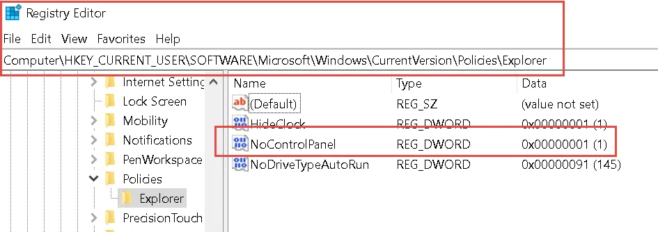

# How can I see the result of Endpoint Policy Manager Cloud inside the Group Policy Editors?

When a computer is joined to a domain, you can check the values on a machine using GPresult /R and
GPresult /h.

But this will only show you the items which are coming from on-prem Group Policy and not Netwrix
Endpoint Policy Manager (formerly PolicyPak) Cloud.

To see Endpoint Policy Manager Cloud results on a Endpoint Policy Manager cloud joined machine, use
the[Endpoint Policy Manager Cloud Reporting Demo](../../video/cloud/reports.md).

You can also see the policies on the machine by running `PPCLOUD /SYNC` and seeing the itemized
list, like what is in the two screenshots below.

That being said, if you deploy Security Settings, then some of those settings will come thru and be
seen in the local Group Policy Editor, like what's seen here.

Even this is not guaranteed for all the settings within Security; this is a rare example.

And, in no cases can you see Group Policy Admin Templates appear in the local `GPEDIT.MSC` or
`RSOP.MSC` Group Policy editor or results reporting.

This also holds true for Endpoint Policy Manager -specific settings, like Endpoint Policy Manager
Browser Router or Endpoint Policy Manager Least Privilege Manager. Even if you have the Admin
Console on a machine getting Endpoint Policy Manager Cloud policies, you won't see the "results"
here.

And, additionally Microsoft's tool RSOP.MSC which would normally show you data in a domain-joined
environment cannot show you anything with regards to Endpoint Policy Manager Cloud data.

To verify if the setting actually made to the end-point via Endpoint Policy Manager Cloud, here are
a few tips.

First, all "proper" ADMX settings are delivered to one of the following locations in the registry:

- For Computer policy settings:

`–HKLM\Software\Policies `(The preferred location)

`–HKLM\Software\Microsoft\Windows\CurrentVersion\Policies `

For user policy settings:

`–HKCU\Software\Policies `(The preferred location)

`–HKCU\Software\Microsoft\Windows\CurrentVersion\Policies`

**NOTE:** Some ADMX settings may not be here, because they are delivered to unusual locations. But
most of what Microsoft delivers goes here.

An additional technique would be to locate the setting you're after in the Microsoft GP Settings
Spreadsheet Reference.

This link could change from time to time, but the latest
[https://www.microsoft.com/en-us/download/details.aspx?id=25250](https://www.microsoft.com/en-us/download/details.aspx?id=25250).

Here's an end to end example of how to check and perform this verification:

Start off with a policy in Endpoint Policy Manager Cloud Admin Template item, like "Prohibit access
to Control Panel and PC settings" like this:

If you want to verify the value, you would use the GP Spreadhseet and find the same policy like
this.

Finally, on the endpoint, use Regedit to verify the final value is or is not present. This means
Endpoint Policy Manager did the work you expect.

