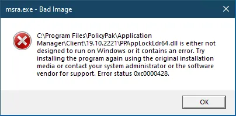
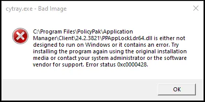

# Why does Windows Remote Assistance (MSRA) report "PPAppLockdr64.dll is not designed to run on Windows or it contains an error" 0xc000428 ?

An issue can occur when running Microsoft Remote Assistance (MSRA) or the Cortex XDR Tray Process (cytray.exe) with the Netwrix Endpoint Policy Manager (formerly PolicyPak) CSE installed, you will see one of the following error messages.

Error message seen is below and says "```PPAppLockdr64.dll``` is either not designed to run on Windows or it contains an error. Error status 0xc0000428.





This is a problem with Microsoft Remote Assistance (MSRA) and/or Palo Alto Cortex XDR Tray Process (cytray.exe) on Windows 10 1903 and later and also on Windows 11 when the Endpoint Policy ManagerCSE is installed.

There are at least two possible workarounds to the problem depending on whether the issue is with Microsoft Remote Assistance (MSRA) or Cortex XDR Tray Process (cytray.exe).

## WORKAROUND 1

(RECOMMENDED) Will resolve the issue for both Microsoft Remote Assistance (MSRA) and Cortex XDR Tray Process (cytray.exe)

Disable the PolicyPak AppLock(TM) feature in the Endpoint Policy Manager CSE.

Endpoint Policy ManagerAppLock is the feature in PP App Manager which GRAYS or HIDES UI elements.

__NOTE:__  Endpoint Policy Manager AppLock is NOT related to Microsoft AppLocker.

Here is the Endpoint Policy Manager side workaround if you are encountering this error:

[How do I turn AppLock off or on based upon the CSE version I'm using?](../../applicationsettings/applock/disable.md)

__NOTE:__  IIn general it is NOT recommended to stop Endpoint Policy Manager AppLock.

## WORKAROUND 2

Only works for Microsoft Remote Assistance (MSRA).

__Step 1 –__ Use the Windows Search to find "Exploit protection" and open exploit protection settings

__Step 2 –__ Click "Program settings"

__Step 3 –__ Then click "Add a program to customize", and choose "Add by program name"

__Step 4 –__ Enter "msra.exe" and click "Add"

__Step 5 –__ Scroll down the list of options until you find "Disable extension points"

__Step 6 –__ Check the "Override system settings" and set the slider to "On"

__Step 7 –__ Then click "Apply" to save your changes

__Step 8 –__ If "msra.exe" is currently running, be sure to end task on "msra.exe" using taskmanager.

__Step 9 –__ Now the next time "msra.exe is launched it will work properly without displaying the error.

Optional: FoFor Workaround 2 you can use Endpoint Policy ManagerScripts Manager to apply these settings to multiple computers/users via PowerShell, for steps please see the KB below:

[How to use Scripts Manager to workaround the "PPAppLockdr64.dll is either not designed to run on Windows or it contains an error" message when running Microsoft Remote Assistance (MSRA.exe) and the Endpoint Policy Manager CSE is installed on Windows 10 1903](../../applicationsettings/microsoftremoteassistance.md)
