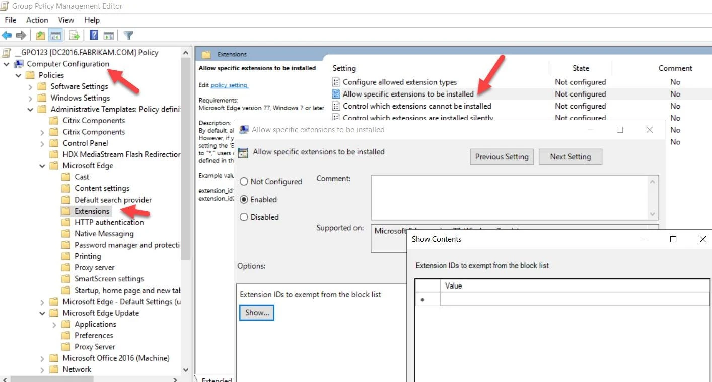
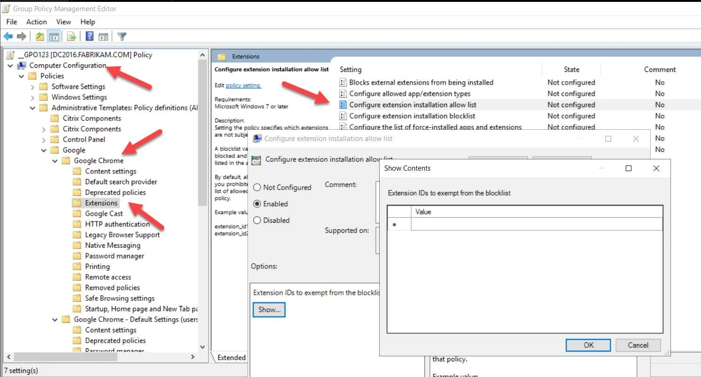
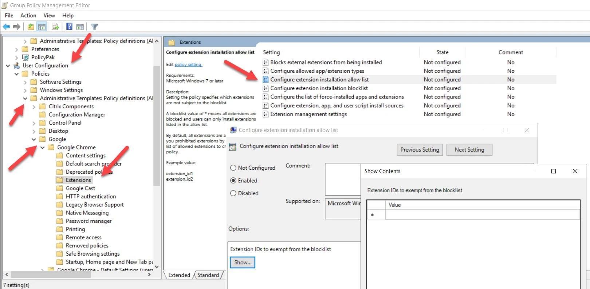

# How do I fix "">Endpoint Policy Manager Browser Router Chromium Extension" was automatically disabled." message in Chrome or Edge?

If you get the message ""Netwrix Endpoint Policy Manager (formerly PolicyPak) Browser Router
Chromium Extension" was automatically disabled" like this… This article will show you the
workaround.

To adjust for this, make sure that the Endpoint Policy Manager Browser Router extension(s) you use
are explicitly added to the policy named "Allow specific extensions to be installed".

You can use this chart to see the Endpoint Policy Manager Browser Router Extension you should allow
to install:
[What is the Chrome Extension ID for all the published versions of Endpoint Policy Manager Browser Router Client Side Extension?](../../browserrouter/clientsideextension/chromeextensionid.md)

In this screenshot, the Endpoint Policy Manager Extension is the third one listed.

Note in this screenshot this is being done on the USER side for EDGE:

But you may also perform the operation per computer on the COMPUTER side (For EDGE) as follows.

Additionally, this same problem can occur in Chrome and hence, you would use the same value, but
using the Chrome ADMX setting. Here is the setting "Configure extension installation allow list" on
the Computer side.

And here is "Configure extension installation allow list" on the User side.

