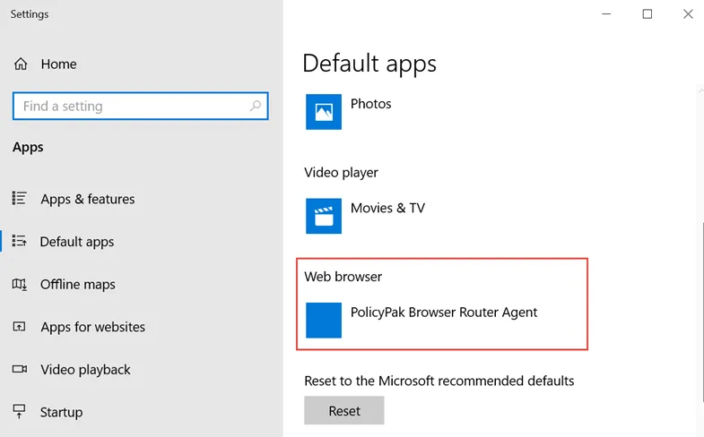

# Why is Browser Router's "Default Browser" or File Associations Manager's configuration not working when I also have a Default Associations Configuration file?

If you're using Netwrix Endpoint Policy Manager (formerly PolicyPak) Browser Router -OR- you're
using Endpoint Policy Manager File Associations Manager to make associations, you CANNOT also use
the Group Policy or MDM method for setting default associations files, like what's seen here.

Underneath the hood, you are "fighting" with Endpoint Policy Manager Browser Router and/or File
Associations manager, like this.

For Endpoint Policy Manager Browser Router, Endpoint Policy Manager Browser Router must "become" the
default OS browser like what's seen here. If Endpoint Policy Manager Browser Router is not set as
the Default Browser (automatically, using Endpoint Policy Manager …) then you will get unusual
behavior.

For Endpoint Policy Manager File Associations Manager, you must remove any Group Policy File
Associations file for it to work reliably.  
Summary: Use only Endpoint Policy Manager … when using Endpoint Policy Manager Browser Router and
also Endpoint Policy Manager File Associations Manager and don't try to use a Group Policy or MDM
File Associations alongside it.
