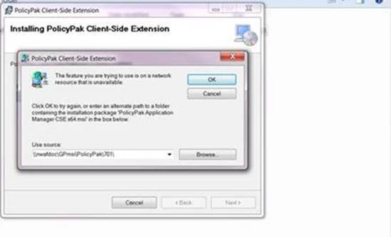
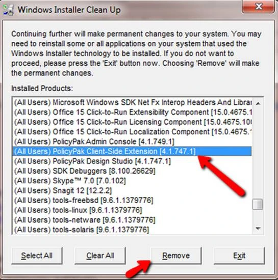

# The CSE won't uninstall or allow in-place upgrade. What should I do?

The issue of the CSE not allowing an uninstall or an updrage isn't a problem with the Netwrix
Endpoint Policy Manager (formerly PolicyPak) CSE. This is a problem with the MSI database that
contains the contents of what is registered or not.

One quick fix we have seen is to rename the newest CSE you get from us to something unique. For
instance, `PolicyPak-CSE-SETUPx64-BUILD12345.MSI`, then retry your upgrade. Users have reported that
this can fix the problem by fooling the MSI database.

If that does not work, you might see a dialog similar to this when trying to install/uninstall. Even
if you revert to a previous version, it is still likely that the CSE won't uninstall.

## Resolution

Microsoft has a one-off fix to deal with broken MSIs that get stuck. Start with this solution from
Microsoft to test on one machine. See Microsoft's article
[Fix problems that block programs from being installed or removed](https://support.microsoft.com/en-us/topic/fix-problems-that-block-programs-from-being-installed-or-removed-cca7d1b6-65a9-3d98-426b-e9f927e1eb4d)
for the procedure on this solution.

If the procedure from Microsoft's article is unsuccessful, try the following steps on one machine.

**Step 1 –** Remove existing CSE version to allow a re-installation of the newest CSE, download
MSICUU from this link:
[https://www.policypak.com/pp-files/msicuu2.zip](https://www.policypak.com/pp-files/msicuu2.zip)

**Step 2 –** Then launch it and select the CSE version and click **Remove**.

**Step 3 –** Manually install the latest Endpoint Policy Manager CSE, and verify it worked as
expected.

If that succeeds, follow these steps.

**Step 1 –** Test a scriptversion of that on some machines.

**Step 2 –** Try to deploy the new CSE to some machines.

**Step 3 –** Run the script on the remainder of your machines.

**Step 4 –** Deploy the new CSE to the remainder of your machines.

If you don't already have a tool you use to deploy the Endpoint Policy Manager CSE, we recommend you
use PDQ Deploy [(www.PDQ.com](https://www.pdq.com/)). There is a free and a paid version of the
tool, either version will work.

Once the new CSE is deployed to the remainder of your machines, follow these steps.

**Step 1 –** Download our
[`MSIZAP` and batch file](https://www.policypak.com/pp-files/ppMSIzapscript-4191.zip).

**NOTE:** `MSIZAP` is a command line version of `MSICUU` that was used in the previous steps..

**Step 2 –** Locate the batch file included in the download.

**Step 3 –** Run the batch file which will perform the uninstall using `MSIZAP`. It only works if
you put the old versions in another location. You'll see if you open up the batch file, which is
much clearer.

**NOTE:** If the batch file needs updating and doesn't contain the MSI codes for the version you are
trying to uninstall, please work with your Netwrix support rep who can get that updated for you.

After the batch file has been run, follow these steps.

**Step 1 –** Manually test the batch file on a handful of machines.

**Step 2 –** Verify that it worked.

**Step 3 –** Don't try to run the script on all your machines yet.

**Step 4 –** Try PDQ Deploy to get the latest CSE on those endpoints.

**Step 5 –** Run the script on the remainder of your machines.

**Step 6 –** Continue to use PDQ deploy to get the rest of the machines CSEs installed.

**Step 7 –** Rename the latest CSE to be a unique name while attempting your upgrade. This might
yield more success, according to at least one customer report.

The machines are now updated with a new CSE. If this solution was unsuccessful, contact your Netwrix
support representative for additional assistance.
