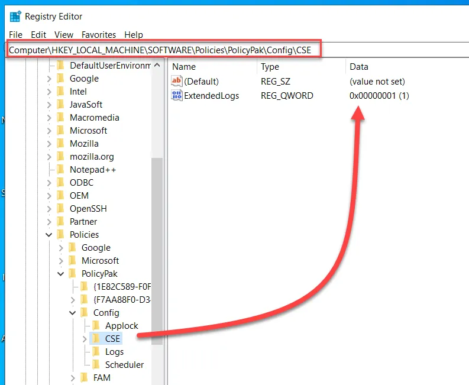
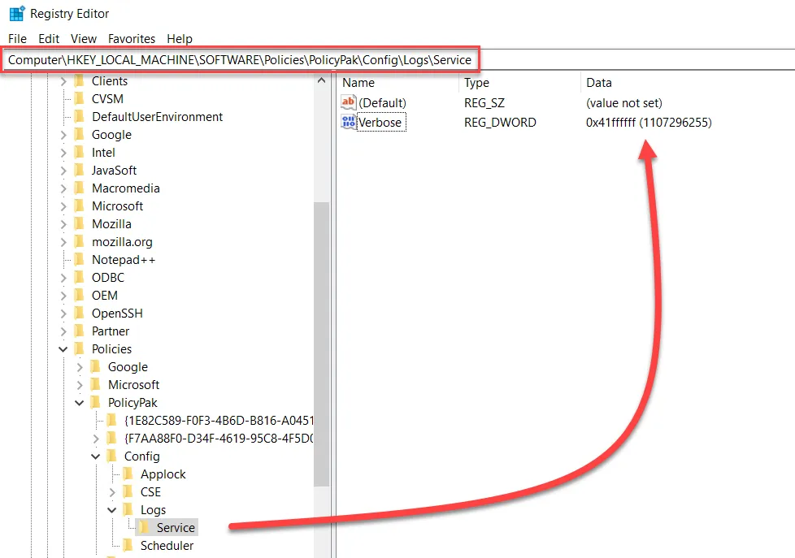

# Enhanced Client Logging

Endpoint Policy Manager technical support may ask you to turn on enhanced client logging if the normal logs aren't producing enough troubleshooting information. Only enable these logs when working with technical support. To enable these logs, go to``` HKLM\SOFTWARE\Policies\PolicyPak\Config\CSE\``` and create a``` REG_DWORD``` named extendedlogs with a value of 1 as seen in Figure 22.



Figure 22. Turning on enhanced client logging.

Additional analysis might be required of the ```ppService.log``` contained within ```%programdata%\PolicyPak```. By default, that log's level is set to ```WARNINGS```. If asked by technical support, you would change the log level of the ```ppService.log``` by first creating a new key within logs called ```Service```. Then within ```Service``` add a ```Reg_DWORD``` called Verbose and set it to ```0xFFFFFFFF```, as seen in Figure 23.



Figure 23. The Service key will not exist by default and must be created before the value is set within it.
