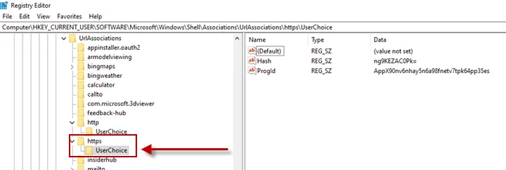
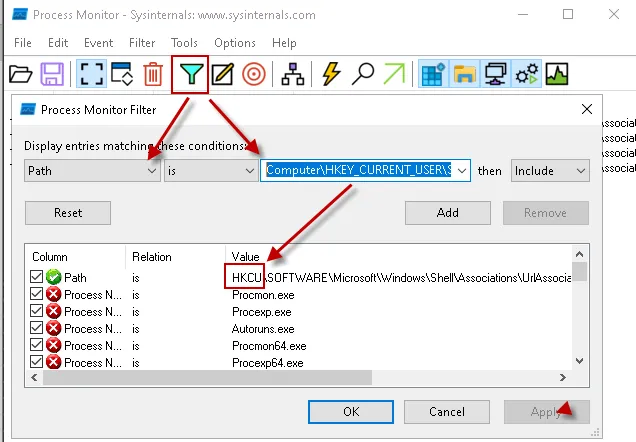
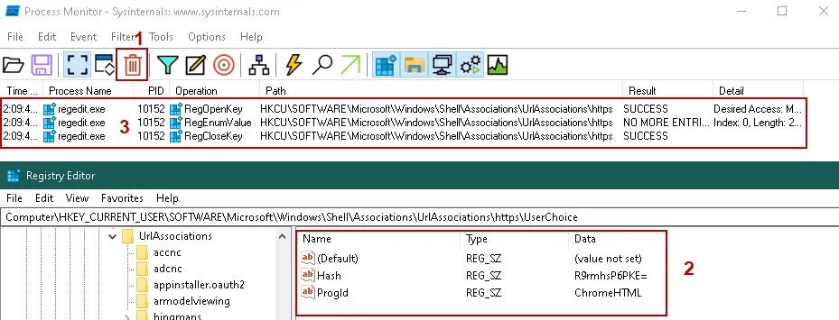
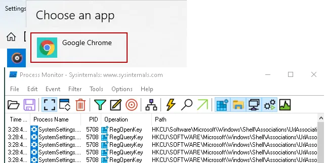

# How to use ProcMon to track changes over time to specific registry keys

More info:
[https://docs.microsoft.com/en-us/archive/blogs/aaron_margosis/the-case-of-the-reverting-office-theme-resolved-with-a-long-running-procmon-trace](https://docs.microsoft.com/en-us/archive/blogs/aaron_margosis/the-case-of-the-reverting-office-theme-resolved-with-a-long-running-procmon-trace)

For this example, we will be monitoring the following Registry Key and values.

**Step 1 –** Download and install ProcMon from:

[https://docs.microsoft.com/en-us/sysinternals/downloads/procmon](https://docs.microsoft.com/en-us/sysinternals/downloads/procmon)

**Step 2 –** Run `ProcMon` elevated.

**Step 3 –** Run `Regedit` (does not need to be run elevated).

**Step 4 –** Next, in the Regedit window go to the path you wish to monitor, highlight the desired
path in the address bar and copy the text.

**Step 5 –** Back in ProcMon click on the filter icon, select the values "Path" and "is" as shown in
the screenshot below, then paste in the registry path you saved to your clipboard earlier in step 4
above. Edit the path to correct for HKCU or HKLM (see note directly below), then click "Add", and
then "Ok" to save and apply the filter.

**NOTE:** Edit the reg path and replace the text `"Computer\HKEY_CURRENT_USER"` with `"HKCU"`, or
`"Computer\HKEY_LOCAL_MACHINE"` with `"HKLM"` as needed. See screenshots below for examples.

**Step 6 –** Test that the filter is working by click clear results in ProcMon, then selecting the
reg key in regedit window, you should see read events in the ProcMon capture window.

Note for this example I used the following path:

`HKCU\SOFTWARE\Microsoft\Windows\Shell\Associations\UrlAssociations\https\UserChoice`

Alternatively, you can test that the filter is working by making a change using the Windows System
Preferences.

Default Browser Selection via System Preferences.

**Step 7 –** Next, and most importantly enable the "Drop Filtered Events" option on the Filter menu.

**Step 8 –** Now all that is left, is to wait until the issue reoccurs.

**Step 9 –** Once it does, whether it's 6 hours, 24 hours, or days later you will need to collect
the Netwrix Endpoint Policy Manager (formerly PolicyPak) logs (pplogs) by following the steps below,
and then upload them to Endpoint Policy Manager Support.

GATHER PPLOGS: You're going to run PPLOGS from CMD TWICE, once as USER and once as ADMIN, give the
files a descriptive name, `pplogs_as_user.zip`, `pplogs_as_admin.zip` etc. Example screenshot:
[https://www.screencast.com/t/Y988r1u7P5B](https://www.screencast.com/t/Y988r1u7P5B)

PLACE LOGS (and anything else gathered) into a SINGLE ZIP upload as SRXxxxx.ZIP to the SUPPORT INBOX
on SHAREFILE:
[https://policypak.sharefile.com/share/getinfo/rc857a57f16b4d4b9](https://policypak.sharefile.com/share/getinfo/rc857a57f16b4d4b9)

And remember to click the UPLOAD button!

Video KB:[Gathering and Uploading Logs](../video/troubleshooting/logs.md)
