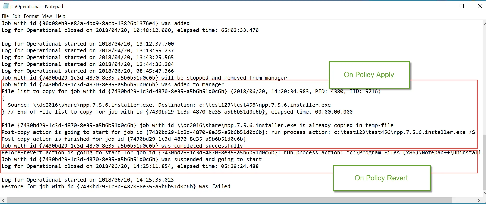

# Logging Locations

The most common problem with Endpoint Policy Manager Remote Work Delivery Manager is that files do
not copy as expected. Here are some tips when trying to troubleshoot Endpoint Policy Manager Remote
Work Delivery Manager.

The log files for Endpoint Policy Manager Remote Work Delivery Manager are found in the following
folder: `%Programdata%\PolicyPak\PolicyPa`k Remote Work Delivery Manager. This is because Endpoint
Policy Manager Remote Work Delivery Manager affects the Computer side (and all users on that
computer). It's also possible there might be some user-side logins in the following folder:
`%appdata%\local\PolicyPak\PolicyPak Remote Work Delivery Manager`. But it will not be useful
because all Endpoint Policy Manager Remote Work Delivery Manager work happens on the Computer side.
Therefore, you will want to check several files in the %Programdata%\PolicyPak\PolicyPak Remote Work
Delivery Manager folder.

These files are as follows:

- `ppUser_OnLogon.log`: New data is added to this log when Group Policy applies at the time of logon
  (and items are set for the User, not the Computer).
- `ppUser_Switched.log`: New data is added to this log when Group Policy applies at the time of
  logon (but items are set for the Computer).
- `ppUser_OnGroupPolicy.log`: New data is added to this log when Group Policy applies in the
  background (on GPupdate or when Group Policy applies in the background).
- `ppUser_onPolicyChanged.log`: New data is added to this log when Group Policy applies in the
  background or when a non-Group Policy method is used (MEMCM, Endpoint Policy Manager Cloud, and so
  on).

Start troubleshooting by verifying that you are set up with the following scenarios:

- You have the GPO (or file).
- You have a collection within the GPO.
- You have the policies within the collection.

Figure 55 is an example of a Endpoint Policy Manager Remote Work Delivery Manager log with some
annotations.

Figure 55. An example of a Endpoint Policy Manager Remote Work Delivery Manager log.

Then, to see details of what Endpoint Policy Manager Remote Work Delivery Manager is trying to do,
you can open up the PP_Operational.log. There will be two PP_Operational logs for Endpoint Policy
Manager Remote Work Delivery Manager (see Figure 56):

- One for the User side (and switched mode) in
  `\appdata\<user>\PolicyPak\PolicyPak Remote Work Delivery Manager`
- One for the Computer side in `Programdata\PolicyPak\PolicyPak Remote Work Delivery Manager`

Figure 56. Log files showing when a policy applies and when a policy reverts.

If needed, logs are automatically wrapped up and can be sent to
[support@policypak.com](mailto:support@policypak.com) using the `PPLOGS.EXE` command on any endpoint
where the client-side extension is installed.
