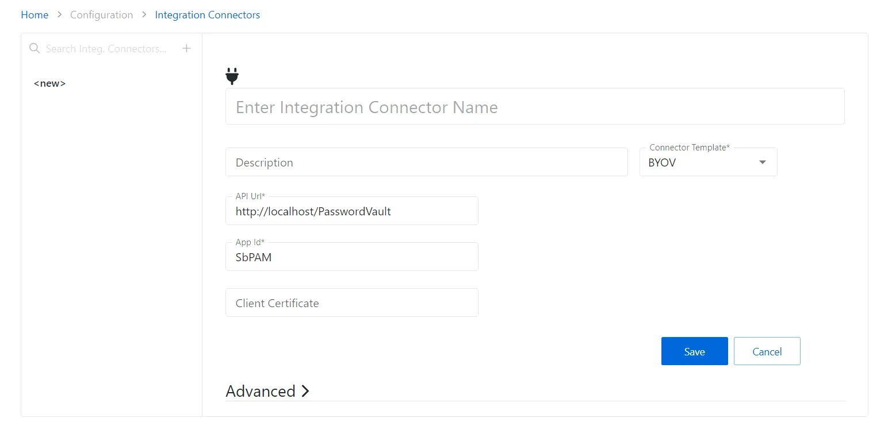

# Bring Your Own Vault (BYOV) Integration

Privilege Secure contains a built-in vault for credential management, but can integrate with vaults from other vendors using the Bring Your Own Vault® (BYOV) integration.

## Add a Vault Connector for BYOV

Follow the steps to add the BYOV Connector.

__Step 1 –__ Navigate to the Configuration > Integration Connectors page.

__Step 2 –__ In the Integration Connectors list, click the Add Integration Connector icon.

__Step 3 –__ Enter the following information:

- Connector Name – Enter a name to uniquely identify the connector
- Connector Description (Optional) – Enter a brief description to identify the service account
- Connector Template – A selection of templates for connector configurations. Select __BYOV__ from the drop-down list.
- API Url – The base URL for the API being used for the vault integration. Ex: https://localhost/PasswordVault.
- App ID – The application ID for the vault
- Client Certificate – The base 64 string from the certificate file being used to authenticate to the vault
- Advanced – Use this section to override the default behavior of the connector by providing a custom PowerShell script. Click on the __Advanced__ section to edit the Checkout Script Block and the Checkin Script Block or Skip the Certificate Check.

__Step 4 –__ Click the Save icon to create the new integration connector.

The Build Your Own Vault has been configured.
