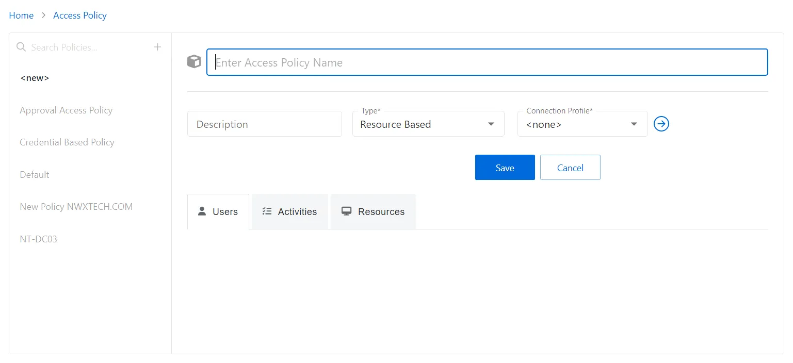

# Secret Vault Configuration

This topic walks through the steps necessary to configure a Netwrix Privilege Secure Secret Vault. Secret Vaults can be used to provide Privilege Secure users with access to vaulted secrets.

## Add a Secret Vault

Follow the steps below to add a new Secret Vault.

__Step 1 –__ Navigate to the Policy > Resources page.

__Step 2 –__ Click the Plus icon and select New Secret Vault from the drop-down list.

__Step 3 –__ Enter the following information:

- New Secret Vault Name — Name of the new secret vault
- Platform — Displays the type of platform, which defines the resource.
- Description _(optional)_ — Description of the policy

__Step 4 –__ Click __Save__ to create the Secret Vault.

__Step 5 –__ Once the Secret Vault is created, select the __Accounts__ tab.

__Step 6 –__ Click the __Add__ button to add an account to access the Secret Vault.

__Step 7 –__ The Add a Managed Account window will open. Enter the following information:

- Resource Name
- Username
- Password

__Step 8 –__ Click __Okay__ to add the account to the Secret Vault.

A secret vault has been created, and a secret added to the vault. See the [Secret Vault Details Page](../../policy/page/details/secretvault.md) topic for additional information.

__NOTE:__ Vaulted credentials must be manually entered and updated.

See the [Credentials Tab for Credential Based Access Policies](../../policy/tab/policycredentials/credentials.md) topic for additional information.

## Create an Access Policy

Follow these steps to add a credential-based access policy to Privilege Secure.

_Remember,_ a connection profile is required to create an access policy. You can create one ahead of time on the [Connection Profiles Page](../../policy/page/connectionprofiles.md) page or use the arrow button to create one during these steps.

__Step 1 –__ Navigate to the Policy > Access Policies page.

__Step 2 –__ In the Access Policy list, click the Plus icon.

__Step 3 –__ Enter the following information:

- Name – Displays the name of the policy
- Description – (Optional)Description of the policy
- Type – Classification of the access policy. Select __Credential Based__.
- Connection Profile – Displays the name of the connection profile associated to the access policy

__Step 4 –__ Click Save to create the new access policy.

__Step 5 –__ On the new access policy, select the __Users__ tab.

__Step 6 –__ Click the __Add__ button to add users to the access policy. See the [Users Tab for Credential Based Access Policies](../../policy/tab/policycredentials/users.md) for additional information.

__Step 7 –__ Once the users have been added, select the __Credentials__ tab.

__Step 8 –__ Click the __Add__ button to add the necessary credentials to access the Secrete Vault. See the [Credentials Tab for Credential Based Access Policies](../../policy/tab/policycredentials/credentials.md) for additional information.

The new Secret Vault access policy has been created. Users added to the policy will now have a Credential Release tile on the My Activities page.
