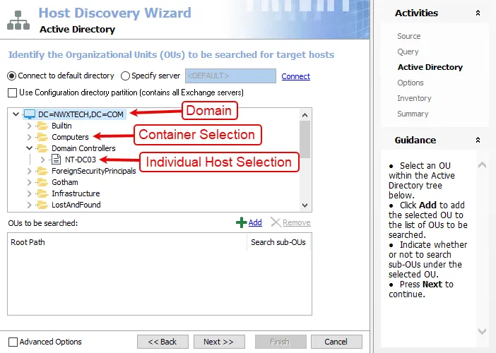

# Platforms Page

The Platforms page is accessible from the Navigation pane under Policies. The menu on the left
displays all the supported platform types and previously configured platforms. This allows
administrators to apply default configurations across all resources defined by that platform type.

The pane on the left side of the page displays a list of the configured platforms. The pane has the
following features:

- Search — Searches the table or list for matches to the search string. When matches are found, the
  table or list is filtered to the matching results.
- Copy icon — Create a new platform based on the current selection. Icon appears when platform is
  hovered over. This is intended to cover use cases where the built-in account differs from the
  norm.
- Trashcan icon — Deletes the platform. Icon appears when policy is hovered over and is only
  available for duplicated platforms. A confirmation window will display.

Default platforms include:

- Active Directory — See the [Active Directory Platform Policy Configuration](activedirectory.md)
  topic for additional information on configuration options
- Microsoft Entra ID (formerly Azure AD) — See the
  [Microsoft Entra ID Platform Policy Configuration](entraid.md) topic for additional information on
  configuration options
- Cisco — See the [Cisco Platform Policy Configuration](cisco.md) topic for additional information
  on configuration options
- Linux — See the [Linux Platform Policy Configuration](linux.md) topic for additional information
  on configuration options
- Microsoft SQL Server — See the [Microsoft SQL Server Platform Policy Configuration](mssql.md)
  topic for additional information on configuration options
- Oracle — See the [Oracle Platform Policy Configuration](oracle.md) topic for additional
  information on configuration options
- Secret Vault — See the [Secret Vault Platform Policy Configuration](secretvault.md) topic for
  additional information on configuration options
- Website — See the [Web Site Platform Policy Configuration](website.md) topic for additional
  information on configuration options
- Windows — See the [Windows Platform Policy Configuration](windows.md) topic for additional
  information on configuration options

See the Configure a Platform Policy topic for additional information on adding a Platform Policy.
