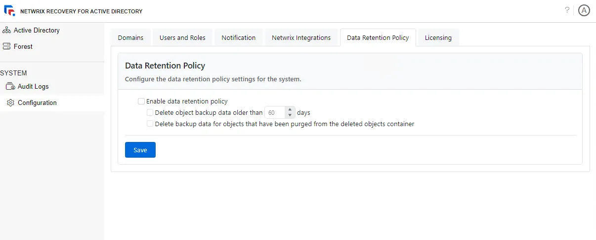

# Data Retention Policy Page

The Data Retention Policy page provides settings for deleting backup data that of domains and domain
controllers has aged by X number of days, and for deleting backup data for tombstone objects that
have been purged.

Click **Configuration** in the left pane. Then click the **Data Retention Policy** tab on the
Configuration page to open the Data Retention Policy page.

Follow the steps to specify a data retention policy.

**Step 1 –** On the Data Retention Policy page, select the **Enable data retention policy** checkbox
to enable policy settings.

**Step 2 –** Select the **Delete object backup data older than X days** checkbox to delete backup
data that is older than X number of days from the database. You can specify any number of days;
default is 60 days.

**Step 3 –** Select the **Delete backup data for objects that have been purged from the deleted
objects container** checkbox to delete data from the database for tombstone objects that have been
purged.

**NOTE:** The 'deleted objects container' is represented by the Recycle Bin in Recovery for Active
Directory.

When an object is deleted in Active Directory, it has _tombstone_ as its state. The object is not
physically deleted but is stripped off most of its attributes and is flagged as _deleted_. The
object remains in tombstone state for 180 days by default, after which it is permanently deleted
from Active Directory. Selecting the **Delete backup data for objects that have been purged from the
deleted objects container** checkbox deletes data for permanently deleted objects from Recovery for
Active Directory.

**_RECOMMENDED:_** As permanently deleted objects cannot be rolled back or recovered using Recovery
for Active Directory, it is recommended to enable this setting.

**Step 4 –** Click **Save**.

A data retention policy has been defined in the system.
