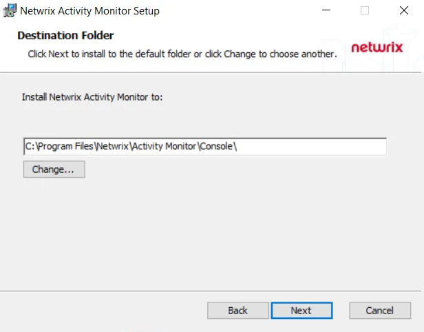
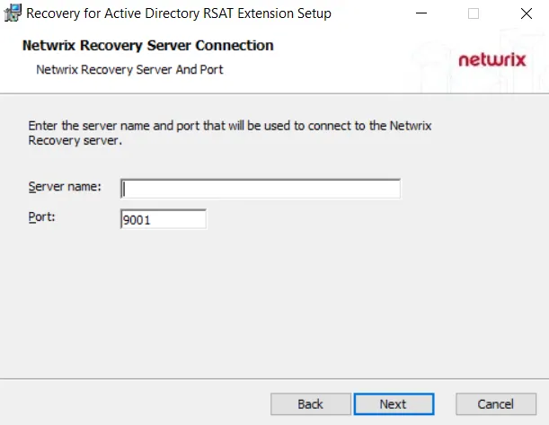
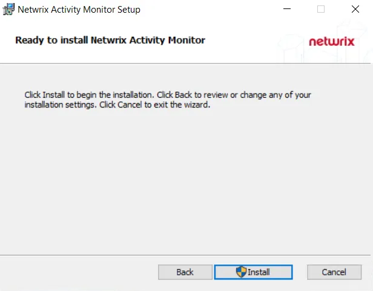

# Install the RSAT Extension

The RSAT Extension is installed automatically on the machine where the Recovery Application Server
and web console are installed. To use the RSAT Extension on a remote machine where Active Directory
Users and Computers (ADUC) is installed, you have to manually install it using the RSAT installer.
The installer is located in the following installation directory on the Recovery Application Server:

...Netwrix\Recovery for Active Directory\RSAT Extension\NetwrixRecovery_RSAT_Extension.msi

Follow the steps to install the RSAT Extension.

**Step 1 –** Copy the `NetwrixRecovery_RSAT_Extension.msi` file to the machine where you want to
install it.

**Step 2 –** Run `NetwrixRecovery_RSAT_Extension.msi` . The RSAT Extension Setup wizard opens.

**Step 3 –** On the Welcome page, click **Next**.

**Step 4 –** On the End-User License Agreement page, read the End User License Agreement and check
the **I accept the terms in the License Agreement** box. Click **Next**.

**Step 5 –** On the Destination Folder page, specify the file path to install the RSAT Extension.
The default path is:

C:\Program Files\Netwrix\Recovery for Active Directory RSAT Extension\

Optionally, you can change the installation directory location for the RSAT Extension. Click
**Change** to open the Change destination folder page.

> - Use the Look in field to select the desired installation folder.
> - When the Folder name box is set as desired, click **OK**.

The wizard returns to the Destination Folder page. Click **Next** to proceed.

**Step 6 –** In the Server name field, enter the name or IP address of the Recovery Application
Server, so the RSAT Extension identifies it in the environment.

**NOTE:** 9001 is the default port. If a different port is specified on the Netwrix Recovery Server
Configuration page of the Recovery for Active Directory Setup wizard while installing the
application, then that specific port is applicable here.

Click **Next**.

**Step 7 –** Click **Install** to begin the installation process.

**Step 8 –** The installation process begins and the Setup Wizard displays the Setup Progress. When
installation is complete, click Finish to exit the wizard.

After installation has completed, open a new instance of ADUC and verify that the RSAT Extension has
been successfully installed. Right-click on an object and ensure the **Rollback** option has been
added to the right-click menu. Also, a Recycle Bin node should be added to the root tree view.
