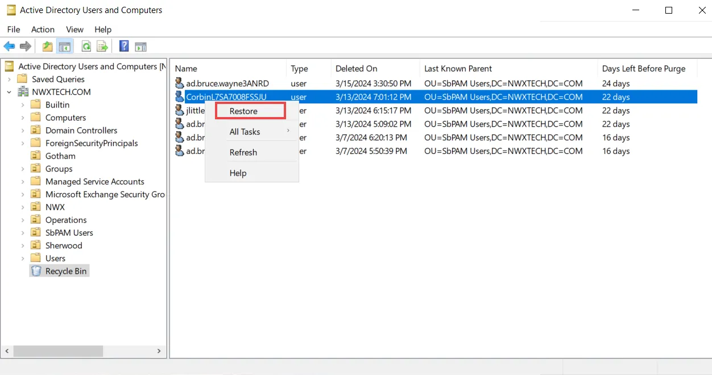
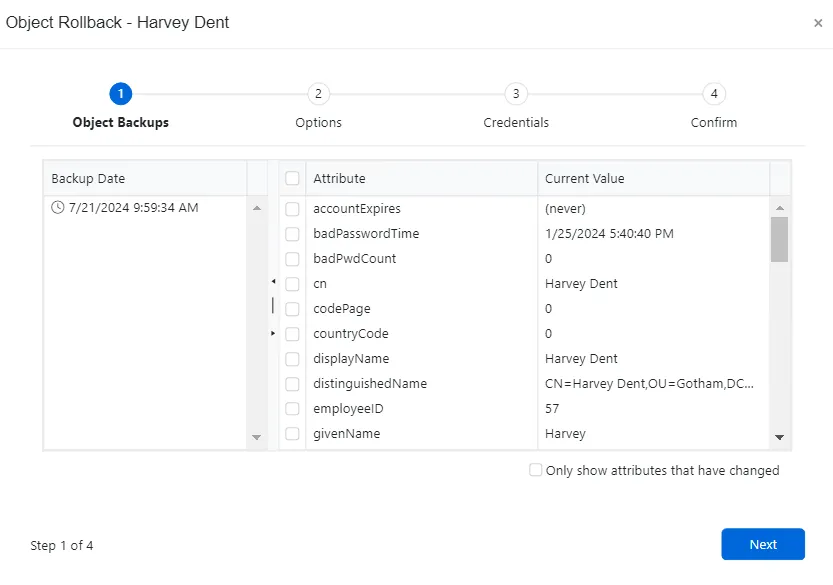
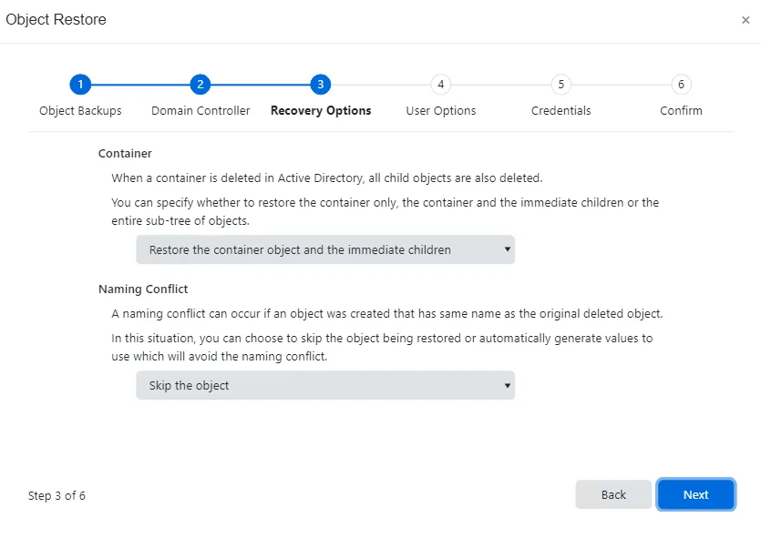
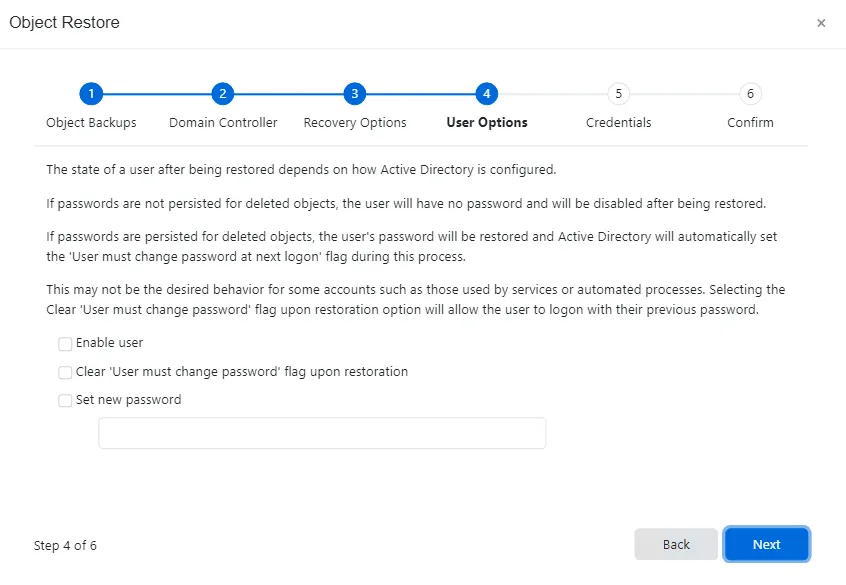
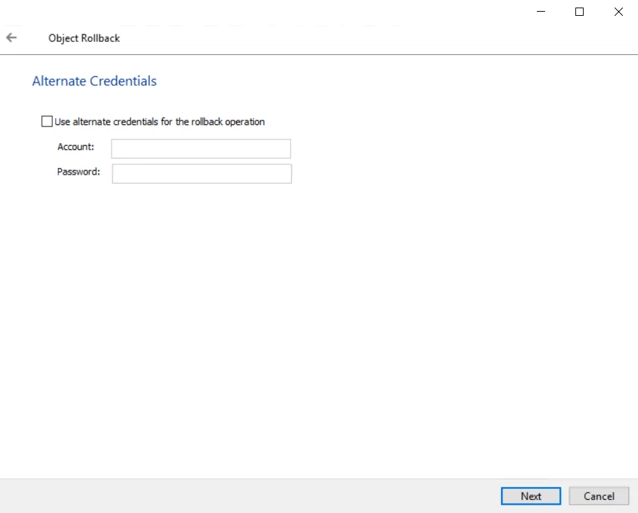
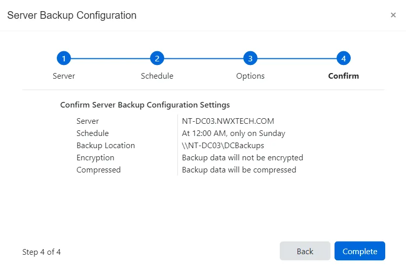
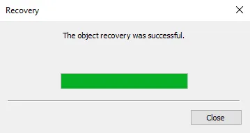

# Restore an Object

The Restore feature recovers deleted objects (users, computers, groups, OUs, etc.) from the Recycle Bin in Active Directory Users and Computers (ADUC).

## Prerequisites

The following prerequisites must be met before you can rollback or recover an object using ADUC:

- You must register the RSAT Extension on the Recovery Application Server to add the Rollback and Restore options to the ADUC console. See the [Register/Unregister the RSAT Extension](../install/configurationutility.md#registerunregister-the-rsat-extension) topic for additional information.
- At least one backup of the domain must be available in the Recovery for Active Directory Console. See the [Domains Page](../admin/configuration/domain.md) topic for additional information.

## Restore an Object Using ADUC

Follow the steps to restore a deleted object.

__Step 1 –__ Open ADUC and select the Recycle Bin.

__Step 2 –__ In the Recycle Bin, right-click on the object to be restored and select __Restore__ on the menu. The Object Recovery wizard opens.

__Step 3 –__  On the Object Backups page, select the desired date timestamp to identify the backup for recovery. Multiple backups may be available for a single day depending on the configured schedule. Click __Next__ to continue.

__Step 4 –__ On the Recovery Options page, select the Container and Naming Conflict actions for the recovery process.

- Container – When a container is deleted in Active Directory, all child objects are also deleted. Select a container restore option from the drop-down menu:

  - Only restore the container object – Restores the container object but no children
  - Restore the container object and the immediate children – Restores the container object and its immediate children
  - Restore the entire sub-tree – Restores the container object and all children

  __NOTE:__ Selecting the Restore the container object and the immediate children or the Restore the entire sub-tree option enables the User Options page.

- Naming Conflict – A naming conflict can occur if an object was created post-deletion that has identical values to the original object. From the drop-down menu, select an option to implement if a naming conflict occurs:

  - Skip the object – If there is a conflict with naming, do not restore and skip the object
  - Automatically use alternative values – If there is a conflict with naming, a numeric value will be appended to the name of the object being restored to create a unique name

Click __Next__.

__Step 5 –__ The User Options page is displayed when user objects are being restored. When a user object is included as a child object being restored, this page is also displayed. Consider the following configurations in ADUC before choosing the options for deleted user objects:

- Passwords are not persisted – User account is disabled and will have no password, and be disabled after restoration
- Passwords are persisted – User password is restored and ADUC automatically sets the _User must change password at next logon_ flag

Select the desired checkboxes relating to the state of a user password upon restoration:

- Enable user – Enables the user in Active Directory
- Clear 'User must change password' flag upon restoration – Restored users do not receive an alert to change their password upon first login after a recovery. Instead, their old password prior to deletion is still active.
- Set new password – Implement a new password upon recovery. Type the new password in the text box.

  _Remember,_ when a new password is created, the user needs it to login the first time. The password should be copied and given to the restored user.

Click __Next__.

__Step 6 –__ On the Domain Controller page, select the Domain Controller to run the restoration action. This page consists of two sections:

- Domain Controller

  - Use the current domain controller
  - Use any writable domain controller
  - Use the selected domain controller – Select a domain controller from the drop-down menu
- Details – Provides information about the selected domain controller

Click __Next__.

__Step 7 –__ The account preforming the operation must have Domain Admin privileges to access the domain tree area where the object resides. On the Alternate Credentials page:

- If the account specified during domain configuration has Domain Admin privileges, click __Next__.
- If the domain account does not have Domain Admin privileges, select the __Use alternate credentials for the recovery operation__ checkbox and enter an account with Domain Admin privileges, then click __Next__.

For a Least Privilege Access Model to provision an Active Directory security group with the permissions that are necessary to perform backups, rollbacks and recovery, see the [Least Privilege Access Model](../requirements/targetdomain.md#least-privilege-access-model) topic.

__Step 8 –__ On the Confirm page, review the summarized object restore settings. Click __Finish__ to start the recovery.

__Step 9 –__ The Recovery window displays the action status. Click __Close__ to exit.

The ADUC object has been successfully recovered from the Recycle Bin.
