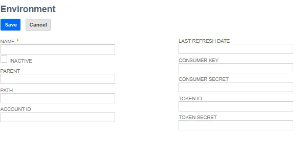
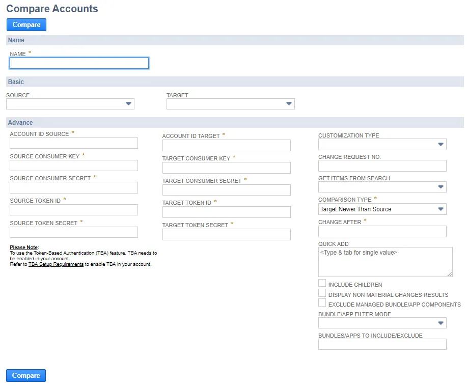

# Comparing Environments

Compare Environments is a powerful tool to locate customization differences between accounts. It is
a best practice to compare accounts by type (this is a mandatory field). You can compare up to 1000
records. If there are more than 1000 records, it compares the first 1000 and sends you a
notification that there were more than 1000 records to compare and to restrict the comparison.

- Set up TBA Credentials
- Run Compare Environments
- Determining What to Compare
- Viewing Differences Between Environments

## Set up TBA Credentials

Your TBA Credentials only need to be set up once. These are the credentials you need to run Compare
Environments and to use the **Change Account** feature on a Change Requests.

1. Open **Strongpoint** > **Change Management Tools** > **Compare Environments**

    

2. Click New (**+**) beside the **Source** field.

    

3. Enter the information for the environment:

    - **Name** enter the environment name.
    - **Account ID** enter the account ID. If it is a Sandbox account, make sure **\_SB1** is
      appended. Do not use -sb1.
    - **Consumer Key** enter the consumer key.
    - **Consumer Secret** enter the consumer secret.
    - **Token ID** enter your token ID.
    - **Token Secret** enter your token secret.

4. Click **Save**. Your credentials are now saved for the environment.

Repeat this process for all environments you use for environment compare or looking up
customizations with the **Change Account** feature on a Change Request. Refer to
[Creating a Change Request](creating_change_request.md).

## Run Compare Environments

The tool is also available as a **Run Compare** button within a Change Request.

Token-based authentication (TBA) is required by NetSuite. Follow the steps in the **Set Up
TBA Credentials** section the first time you use this feature.

1. Open **Strongpoint** > **Change Management Tools** > **Compare Environments**

    

2. Enter the information for the target account and source accounts. Tokens are persistent between
   your sessions.

Here are the field and filter options.

Only administrators can view the Consumer Key, Consumer Secret, Token ID and Token Secret
information.  
This information is generated when you create your Integration Record with the Token-Based
Authentication option enabled. If you lose or forget these credentials, you must reset them to
obtain new values.

### Fields

- **Name**: Enter a name to use as a reference if you export the results of the comparison.
- **Source**: Select source environment.
- **Target**: Select target environment.

Once you enter the source and targets, the following information is populated:

- **Account ID Source**: ID for the source environment account .
- **Source Consumer Key**: Consumer Key of the Integration Record from the source account.
- **Source Consumer Secret**: Consumer Secret of the Integration Record from the source account.
- **Source Token ID**:Token ID of the Integration Record from the source account.
- **Source Token Secret**:Token Secret of the Integration Record from the source account.
- **Account ID Target**: ID for the Target environment account.
- **Target Consumer Key**: Consumer Key of the Integration Record from the Target account.
- **Target Consumer Secret**: Consumer Secret of the Integration Record from the Target account.
- **Target Token ID**: Token ID of the Integration Record from the Target account.
- **Target Token Secret**: Token Secret of the Integration Record from the Target account.

### Filters

- **Customization Type**: Compares all the object types in one account to another. For example,
  compare all entity fields between two accounts. If this field is blank, everything is compared.
  This filter is advised for a sandbox refresh or when deploying by record type.
- **Change Request No**.: Compares the customizations within a specific change request. If you
  clicked Run Compare from a Change Request, the number is automatically populated. This filter is
  advised when deploying a bundle of changes from one account to another.
- **Get Items from Search**: Compares objects identified by the criteria in a Customization Saved
  Search. Create the Saved Search prior to running the comparison. Within the Saved Search, you must
  have the **Script ID** in the **Results** column. This filter is advised when comparing changes in
  a bundle or other criteria that you can use for a saved search.
- **Comparison Type**: This a mandatory field. There are two predefined comparison types.
    - **Target Newer Than Source** looks for any objects that were changed in production after
      changes were made in the sandbox. This makes you aware if something may be overwritten or lost
      in your target environment before the deployment.
    - **Diff** looks for any differences between the environments.
- **Change After**: Compares objects in the account with a Change Log record dated on or after the
  date specified. This filter is used to restrict the comparison. This is only available for
  Comparison Type **Target Newer Than Source**.
- **Quick Add**: Add individual customization records you want to compare.
- **Include Children**: Check to include Children in your comparison.
- **Display Non-Material Changes Results**: Check to include non-material changes between the
  environments. This does not affect functionality. **Non-Material Object Changes** are changes
  detected in the object definition not caused by human intervention and do not have any functional
  impact. Examples include NetSuite internal IDs, object XML structure or JSON representation or
  reordering values in a list.
- **Exclude Managed Bundle/App Components**: Check to exclude all Managed Bundle or App
  customizations from the results.
- **Bundle/App Filter Mode**: Select **Include** or **Exclude** if you are going to use the
  **Bundles/Apps to Include/Exclude** option.
- **Bundles/Apps to Include/Exclude**: Add bundle or App internal IDs to include/exclude (based on
  the **Bundle/App Filter Mode**) in the comparison. You can set multiple bundles/apps to be
  included/excluded, separating them with commas.

When using filters, it is recommended that you only use one filter at a time. An exception is using
**Customization Type** and **Get Items from Search** together.

## Determining What to Compare

### Pre-Deployment

If you are migrating new objects, they will not exist in your target account.

To determine what to compare pre-deployment:

1. Create a **New Change Request** in Production (so it survives any Refreshes).
2. Attach the **Customization Record(s)** to the Change Request.
3. Wait for Approval (if required).
4. On the **Change Request** open **Deployment Validation** > **Run Compare Tool**
5. Select the environments for the **Target** and **Source** Accounts.
6. Set the **Comparison Type** to **Target Newer than Source**.
7. Set the **Change After Date**. (Set the date from when you want the comparison to start.)
8. Click **Compare**.

### Post-Deployment

To determine what to compare post-deployment:

1. Use the **Change Request** from the pre-deployment or create a new one.
2. If creating a new one, attach the **Customization Record(s)** to the Change Request.
3. On the **Change Request** go to > **Deployment Validation** > **Run Compare Tool**
4. Select the environments for the **Target** and **Source** Accounts.
5. Set the **Comparison Type** to **Diff**.
6. Click **Compare**.

### Communicating Results

An **Environment Compare Log** is created, and automatically linked to the Change Request for
reference. The log can be shared if there are issues.

If there are issues, the Deployment Engineer can make changes and re-run the Environment Comparison
to ensure the environments are synchronized.

## Viewing Differences Between Environments

Environment comparison can be used on any Customization Type, including Body Fields.

1. Open **Strongpoint** > **Change Management Tools** > **Compare Environments**.
2. Enter the **Name**, select the **Source** and **Target** environments and all the required
   credential information.
3. Select **Body Field** for the **Customization Type**.
4. Select **Diff** for the **Comparison Type**.
5. Add one or more searches in **Quick Add**. For example, **Cash Register** and **Special Scheme
   Code**.
6. Click **Compare**.

### Search Exists in Both Environments

In this example, **Cash Register** appears in both environments.

On the **Source** tab:

On the **Target** tab:

On the **Diff** tab:

### Search Exists in Only One Environment

In this example, **Special Scheme Code** body field only exists in the **Target** environment.

On the **Diff** tab:

