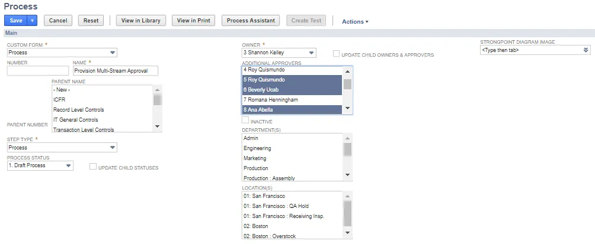
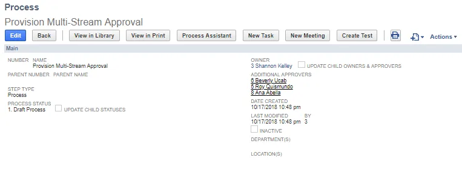
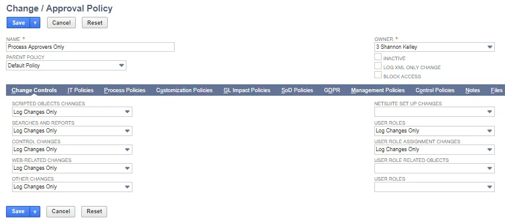

# Setting Up Multi-Stream Approval

This process enables an administrator to select approvers other than the IT Approvers outlined on the Policy. The administrator selects the approvers in the order they will approve the request. The process owner is the final approver. This differs from selecting Additional Approvers from the Change Request, where the mandated approvers are included.

## Configure Multi-Stream Approval

1. Create a Process Record.
2. Create a new Policy Record.
3. Attach the new Process Record.
4. Create a Change Request using the new policy.

### Create a Process Record

1. Open __Strongpoint__ > __Manage Processes__ > __Process__ > __New__
2. Enter the __Name__ and __Owner__ for the process. For this example, the name is __Provision Multi-Stream Approval__.
3. __Custom Form__ and __Step Type__ should be set to __Process__.
4. Ctrl-Click to select one or more __Additional Approvers__. NOTE: Select the additional approvers in the order you want them to approve.

   
5. Click __Save__. Note the approvers are listed in the order selected, not the order they appeared in the list. If you need to reorder the approvers, __Edit__ the record, de-select and re-select the additional approvers.

   

### Create a new Policy Record

1. Open __Strongpoint__ > __Change Management Tools__ > __Change / Approval Policy__ > __New__
2. Enter a __Name__ and __Owner__ for the Policy. For this example the name is __Process Approvers Only__.
3. Set the Change Levels on the __Change Controls__ tab.
4. Leave the fields blank on the __IT Policies__ tab.
5. Make sure __Require Affected Process Approval__ is selected on the __Process Policies__ tab.
6. Click __Save__. Leave the new policy open and continue with the next steps.

   

### Attach the new Process Record

1. Set __View__ to __Strongpoint View__ on the __Process Policies__ tab.
2. Select the __Process__ you created. For this example, it is __Provision Multi-Stream Approval__.

   
3. Click __Attach__. The process is now shown on the __Process Policies__ tab.

   

### Create a Change Request

1. Open __Strongpoint__ > __Change Management Tools__ > __New ITGC Change Request__
2. Enter a __Name__ and __Change Overview__ for the Change Request. For this example the name is __Sample Change Request - Multi-Stream Approval__.
3. Select the affected process. For this example it is __Provision Multi-Stream Approval__.
4. Click __Pending Approval__ in the status bar when complete.
