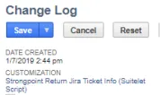

# Using Change Logs

Change Logs allow you to see the type of change, who made the change and view the system notes of the NetSuite record. Change Logs are accessed from the [Change Management Reports](change_management_reports.md).

Once a change request is complete, best practice is to change the status to __Completed__. If there are multiple open change requests referencing the same object, any changes to the object result in the change log being associated with the oldest of the approved change requests.

To open a Change Log:

1. Open __Strongpoint__ > __Change Management Reports__ and select a report.
2. Click __View__ beside the Change Log to open.

If the __Actual Change Date__ is empty or __Change By__ is set to __Could Not Be Determined__ or __Pending Autospider__, a __Refresh Changed By__ button is available. When clicked, it populates __Actual Change Date__ and __Change By__ fields.

The button is only available for Object types where the __Actual Change Date__ and __Change By__ fields can be retrieved.

## Change Log Header

Change Logs are different based on the type of change. These are the major fields.

__Change Log Created__: Date the Change Log was created.

__Deletion Date__: Date a customization was deleted. Used with deleted Script Deployments.

__Actual Change Date__: Date of the system note entry reflecting the change date. There must be an available system note to display the date.

__Customization__: Linked customization(s) that have changed.

__Deleted Customization__: Name of the deleted customization. Used with deleted Script Deployments.

__Managed Bundle/App Customization__: Checked when customizations belong to a managed bundle.

__Changed By__: User who made the change. There must be an available system note to display the user.

__Deleted By__: User who made the change. Used with deleted Script Deployments.

__Field Name__: Name of the changed field.

__Field Script ID__: Script ID of the changed field .

__Non-Compliance__: Checked if the change is non-compliant.

__Policy__: Policies associated with the Change Log.

__Change Level__: Change level required by the policy.

__Change Type__: Type of change based on the policy.

__Change Overview__: Overview of the change.

- When __Systemnotes.Type__ is included as result column and one of the system note lines is __Created__, the Change Overview displays: _`<incident employee>`___created__ _`<record>`_.
- When there are no system notes columns, __Change Overview__ displays _`<incident employee>`___changed__ _`<record>`_.
- Deleted records display _`<incident employee>`___deleted___`<record>`_
- For grouped results with multiple records, __Change Overview__ displays __See Change Data Table for details.__

__Related Change Request__: Change request related to the change or used to perform regression analysis of a non-compliant change.

__Related Process Issue__: Process issue related to the change or used to resolve it.

__Resolution Description__: Description of any steps taken to bring the change back into compliance.

__Non-Material Clearance Reason__: Used when a change is evaluated as non-material. __Non-Material Object Changes__ are changes detected in the object definition not caused by human intervention and do not have any functional impact. Examples include NetSuite internal IDs, object XML structure or JSON representation or reordering values in a list.

__Non-Material Checked__: Indicates if the change log has been evaluated as non-material.

__Status__: Current state of the Change Log. This field is manually set, except it is automatically set to complete when a compliant change is complete.

__Operation__:The reason for the Change Log. For example, __edit__ or __delete__.

__System Note Available__: Indicates a system note was found.

__Jira Ticket Link__: Link to the Jira ticket if used to create the Change Log.

## Values Tab

The __Values__ tab displays the changes that occurred in the Change Log.

__Diff. View__: Highlights the changes that occurred within specific fields.

__Diff. Summary__: Displays the difference between the old value and the new value.

__Data Error__: Checked if a data error occurred.

## Finding Users Who Have Made Changes

When you want to find out who has made changes, you can run any of the Change Reports and view who made a change in the __Change By__ column.

The __Change By__ and __Actual Date__ of the change logs are retrieved using System Notes Search for supported record types. If a System Note is not available, __Change By__ displays __Could Not Be Determined__ in the Report List.

Recorded types that are not supported can be retrieved from the AutoSpider.

| Supported Records for System Notes Search | Change By retrieved from the AutoSpider |
| --- | --- |
| Body Field   Bundle Installation Script   Client Script   Column Field   CRM Field   Custom Record Field   Entity Field   Item Field   Item Number Field   Item Option Field   Library Script File   List   Map/Reduce Script   Mass Update Script   Other Field   Plug-in Script   Portlet Script   Record   Restlet Script   Scheduled Script   Script Deployments   Setup Preference\*   Suitelet Script   User Event Script   User Role   Workflow   Workflow Action Script   Deleted Objects\*\* | Bundle   Custom Report   Entry Form   Mass Update   Search   Transaction Form   User Role / Global Permission Changes |

\* System notes can be retrieved for: Company Preferences, Company Information, Enable Features, Account, Foreign Currency Variance Posting Rule, Nexus, Tax Code, Taxation Type, Fair Value Formula, Fair Value Price List, Project Expense Type, and Item Revenue Category.

\*\* Deleted by and actual delete date are available for: Workflow, Custom Record, List, Script Deployment, and Script.

## Viewing System Notes

In an open Change Log:

1. Click on a linked __Customization__ to open the Customization Record. __Strongpoint Return Jira Ticket Info (Suitelet Script)__ in this example.

   
2. Click __Go to Record__
3. Open __System Notes__

