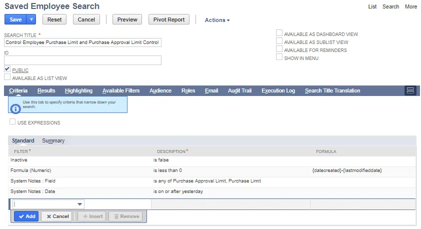
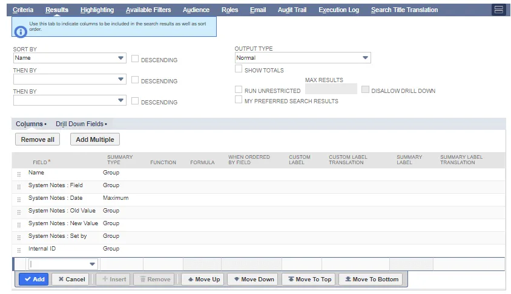
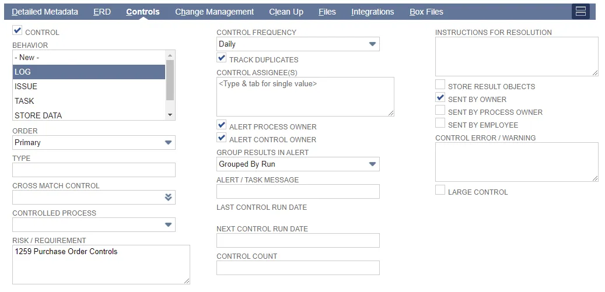

# Example: Set an Agent Control

Here is the process to create a control to monitor changes:

1. Create a Saved Search
2. Create the Customization Record
3. Designate the Customization as a Control

## Create a Saved Search

1. Open **Lists** > **Search** > **Saved Searches** > **New**
2. Select **Employee** for the **Search Type**
3. Add **Control Employee Purchase Limit and Purchase Approval Limit Control** for **Search Title**
4. Check **Public**
5. Add filters on the **Criteria** tab:

    

    | Select Filter           | What to Set                                                                                        | Resulting Description                             | Formula To Set                           |
    | ----------------------- | -------------------------------------------------------------------------------------------------- | ------------------------------------------------- | ---------------------------------------- |
    | Inactive                | Select **No**                                                                                      | Is false                                          |                                          |
    | Formula (Numeric)       | Select **less than** for Formula (Numeric) Enter **0** for Value                                   | is less than 0                                    | **\{datecreated\}-\{lastmodifieddate\}** |
    | System Notes Fields     | Select **Field** Select **any of** Click **Purchase Approval Limit** Ctrl-Click **Purchase Limit** | Is any of Purchase Approval Limit, Purchase Limit |                                          |
    | System Notes Fields     | Select **Date** Select **on or after** Select **yesterday**                                        | is on or after yesterday                          |                                          |
    | Field                   | Summary Type                                                                                       |
    | ---                     | ---                                                                                                |
    | Name                    | Group                                                                                              |
    | System Notes: Field     | Group                                                                                              |
    | System Notes: Date      | Maximum                                                                                            |
    | System Notes: Old Value | Group                                                                                              |
    | System Notes: New Value | Group                                                                                              |
    | System Notes: Set by    | Group                                                                                              |
    | Internal ID             | Group                                                                                              |

6. Open the **Results** tab. You can Remove all to clear the defaults. Add the following fields:

    

7. **Save** the search.
8. Note the assigned **ID** for your new Search. For example, **customsearch5673**

## Create the Customization Record

You can wait until the next AutoSpider run, or manually create the customization record:

1. Open **Strongpoint** > **Customizations** > **Customization** > **New**
2. Enter information in the required fields:

    - **Custom Form**: Use the **Simplified Form**, or select a different form if you want to add a
      **Process/Step**, such as **Financial**.
    - **Name**: Best practice is to enter a meaningful **Name** and **Description**. For this
      example, **Name** is the same as the Saved Search:  
      **Control Employee Purchase Limit and Purchase Approval Limit Control**
    - **Type**: Select **Search**
    - **Script ID**: Enter the **ID** from your Saved Search. For example, **customsearch5673**

        

3. **Save** the customization.
4. Click **Respider Now**  
   Leave the Customization Record open.

### Designate the Customization as a Control

From the customization record:

1. Click **Edit**
2. Open the **Controls** tab.
3. Check the **Control** box.
4. Fill in the following fields:

- **Behavior**: Select **Log**.
- **Controlled Process**: If you added a **Process/Step** when you created the customization, select
  it here.
- **Risk/Requirement**: Assign or create a new Control Process and Risk Requirement. For example,
  **1259 Purchase Order Controls**.
- **Control Error/Warning**: warnings or errors are displayed in this box.
- **Cross Match Control**, **Cross Match Field** and **Cross Match Operator** can be set to
  effectively perform a double join to filter your data and eliminate false positives. For example,
  a script to create an invoice from the user interface is saved to be run as administrator. A user
  creates the invoice from the interface as part of their work flow. Running a search for
  administrator-touched transactions causes false positives as the user is not an administrator.
  Using cross match, the first Saved Search is for all transactions by an administrator. The second
  Saved Search is an employee search using the administrator role. Cross Match returns the
  intersection of those two searches, showing only the transactions performed by administrators.
- Check the **Large Control** box if the expected results for this control are over 1000.
- Set other optional values.

5. **Save** the record.

    

The control is triggered as configured and all instances are logged under **Unresolved Control
Incidents**, **Resolved Control Incidents** or **Pre-approved Control Incidents**.
