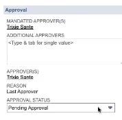

# Go Live Frequently Asked Questions

Here is a list of common questions customers have asked after they Go Live.

> _How To_: Create a Change Request for Role Assignment
>
> _How To_: Add New Customizations to a Change Request
>
> _How To_:Search for Customizations
>
> _About_: Prototype Customizations
>
> _About_: Approval Overrides
>
> _Help_: Change By Field Showing AutoSpider or Could Not Be Determined
>
> _Help_: New Script Deployments on Non-Compliant Changes Report
>
> _Help_: Change Logs Attached to the Wrong Change Request
>
> _Help_: Managed Bundle changes showing up as non-compliant changes?
>
> _Help_: You do not have a Valid License Message

## Create a Change Request for Role Assignment

For a Role Assignment (or any role change), you create a Change Request:

1. Open __Strongpoint__ > __Change Management Tools__ > __ITGC Change Request__ > __New__
2. Enter a __Name__ and __Change Overview__.
3. Click __Lookup Customization__
4. Select __User Role__ for __Type__ and click __Lookup__
5. Select one of more user roles.
6. Click __Add Selection Customization__
7. Click __Pending Approval__ on the Approval Status bar.

Once the Change Request is approved, you add the employee:

1. In the NetSuite __Search__ box, enter __emp:__ and start typing the employee's name. Click __Edit__ by the employee in the Search results.
2. Click Edit on the Employee Record.
3. Open the __Access__ tab and assign the new role, or delete an existing role.
4. Click __Save__.
5. Open the Change Request you created for this role change.
6. Click __ReSpider Now__. Once the Spider is complete, you can review your change.
7. Click __Complete__ in the Change Request status once you verify your changes.

## Add New Customizations to a Change Request

Customizations can be added to any open Change Request. On the Change Request, click __Lookup Customization__ to launch a window where you can search for customizations, or enter existing customizations in the __Customizations__ field. The __Proposed Customizations__ are for new customizations that do not exist in any account. Refer to [Creating a Change Request](../change_management/creating_change_request.md) for details.

## Search for Customizations

To access a customization quick search, open __Strongpoint__ > __Customizations__ > __Customization Quick Search__

You can search using several factors and submit. When looking up by __Name__, using __Contains__ helps if you do not have the exact name.

## Prototype Customizations

If a user creates a new customization without using a NetSuite prefix, the system flags it as a Prototype Customization. When you use Platform Governance for NetSuite to create your customizations, the prefix is added for you. An example is adding a new field to a form.

To fix this situation:

1. Open the Change Request.
2. If the ScriptID is correct, you can edit the Object and use __Change ID__ to fix the object.
3. If the ScriptID is not correct:

   1. Return the Change Request to __In Progress__.
   2. Fix the identifier.
   3. Set the Change Request to__Pending Approval__ to restart the Approval process.

## Approval Overrides

Administrators can perform Approval Overrides on a Change Request.

1. Open a Change Request that is __Pending Approval__.
2. Click __Edit__.
3. Select __Approved__ from the __Approval Status__ list.

   

The Status bar is set to __Approved (Override)__ and the administrator's name is displayed in the __Approval Override By__ field.

## Change By Field Showing AutoSpider or Could Not Be Determined

If the AutoSpider is not run, your Change Logs will be missing the __Changed by__ and __Actual Change Date__ fields. When the Change Log is newly created, the fields contain __Pending AutoSpider__. If too many days go by, the fields change to __Could not be determined__.

Refer to [Setting Up the AutoSpider and Alerts](running_the_spider.md) for details.

## New Script Deployments on Non-Compliant Changes Report

This situation occurs when you create a script through a Change Request, but do not include the Deployment Record on the Change Request. To properly add and deploy a script:

1. Create the Change Request to add a new script.
2. Create the script.
3. Create a Deployment Record for the script.
4. Add the Deployment Record to the Change Request.
5. Deploy the script.

If your site uses [Opportunistic Clearance](../change_management/opportunistic_clearance.md), the deployment record is handled automatically. You should make sure you understand all of the ramifications of Opportunistic Clearance prior to enabling it for your account.

## Change Logs Attached to the Wrong Change Request

This situation occurs if you have multiple open Change Requests referencing the same customization. The Change Log is attached to the oldest open Change Request.

Best practice is to change the status of completed Change Requests to __Complete__.

## Managed Bundle changes showing up as non-compliant changes?

This situation is generally caused due to a time gap between Spider runs. Managed Bundles are evaluated after other changes. The Spider adds them to the non-compliant report the first time a Managed Bundle is encountered. When the Spider is next run, it knows about the Managed Bundle and removes it from the non-compliant report.

No action is required to fix this situation.

## You do not have a Valid License Message

If a user sees a License message, you need to grant them a license. Refer to the [License Manager](license_manager.md) topic.
