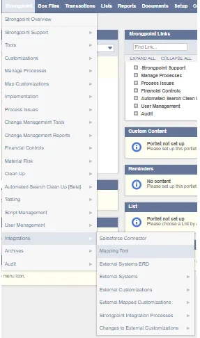
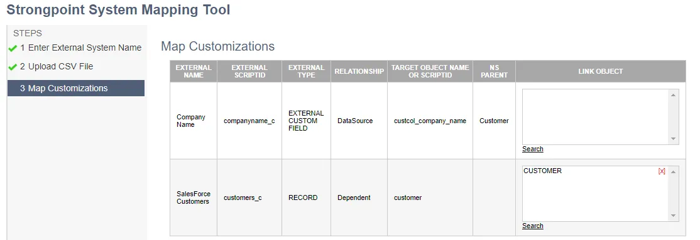
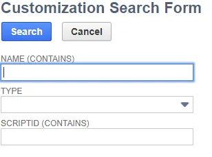
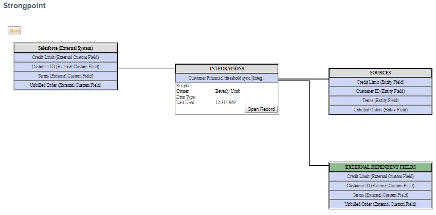

# Integration Mapping

The Integration Mapping tool maps customizations between External Systems and NetSuite.

Here is the basic process. You can click on any of the steps to jump to the section.

Step 1: Create the External System Customization record. (optional)

Step 2: Create a __.csv__ file.

Step 3: Open Integration Mapping tool.

Step 4: Select or Enter the External System.

Step 5: Upload your __.csv__ file.

Step 6: Review and Finish.

Step 7: View the Summary and ERD.

## Step 1: Create the External System Customization Record

You can create the External System before using the mapping tool. If you do not create the External System, it can be automatically created by the tool.

1. Open __Strongpoint__ > __Customizations__ > __Customization__ > __New__
2. Enter a __Name__ for the External System, for example: _Salesforce_. (External System) is appended to the Name. For example, _Salesforce (External System)_.
3. Enter a __Description__.
4. Select __External System__ from the __Type__ list.
5. Click __Save__.

## Step 2: Create a .csv file

The __.csv__ file is where you specify the customization mapping between the External System and NetSuite. The file is uploaded when you run the tool. You can create a file with the specified headings, or download the template with the link on the first page of the Integration Mapping tool. Do not change the specified headings. Here is the template:

- __External Name__ is the Object’s __Name__ in the external system.
- __External Script ID__ is the Object’s __Identifier__ in the external system.
- __External Type__ is the Object’s __Customization Type__ in the external system.
- __Relationship(DataSource or Dependent Object)__ specifies where the object originates. __DataSource__ indicates an object from the external system translates into NetSuite. __Dependent__ indicates the object translates from NetSuite to the external system.
- __Target Object Name or ScriptID__ is the Object’s __Name__ or __ScriptID__ in NetSuite.
- __NS Parent__ is the __Parent__ of the __Target Object__ in NetSuite.

## Step 3: Open Integration Mapping tool

The Mapping Tool menu item is hidden by default. If you do not see the option in your menu, refer to the [Managing Menus](../installing_strongpoint/managing_menus.md) topic for information on making it available.

Open __Strongpoint__ > __Integrations__ > __Mapping Tool__

____

## Step 4: Select or Enter the External System

1. Select an existing External System from the list if you created it during Step 1, or Enter a new name to have the tool automatically create a new External System, for example: _Salesforce_. Strongpoint appends (External System) to the Name. For example, _Salesforce (External System)_.

   
2. You can use the link to download the __.csv__ template if you have not already created the file.
3. Click __Next__ to continue.

## Step 5: Upload your .csv file

1. Click __Choose File__.

   
2. Navigate to the__.csv file__ containing your mappings.
3. Click __Next__ to continue.

## Step 6: Review and Finish

1. Review customization mappings. If you entered a __ScriptID__ in your __.csv__, the associated __Link Object__ is shown.

   
2. Click __Search__ to open the search form and select or research additional __Link Objects__.

   
3. Search by all or part of a __Name__, __Type__ or all or part of a __ScriptID__. For example, enter _cust_ for __Name__ and click __Search__ to find all customizations containing the search term:

   

   - Click in the __Add__ column to select one or more objects.
   - Click __Select__.
   - Close the form when complete.
4. Click [X] to remove a __Link Object__.
5. Click __Finish__ to begin the mapping.

## Step 7: View the Summary and ERD

1. Check the Summary for any __Import Errors__.

   
2. Click the linked __Internal ID__ to display the ERD for each mapped customization.

Here is an example of an expanded ERD showing __Integrations__, __Sources__, and __External Dependent Fields__. Note the __External Dependent Fields__ is highlighted with a green header.

