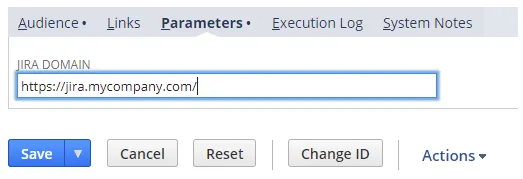
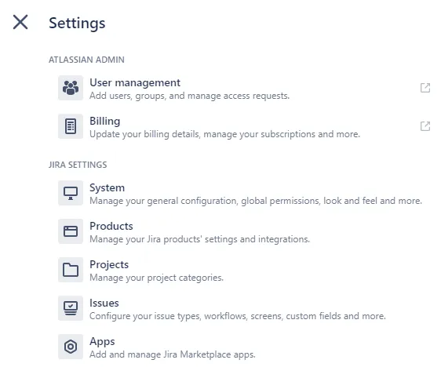
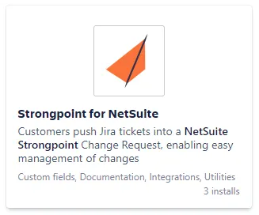

# Jira

Platform Governance for NetSuite's Change Management capabilities are integrated with Jira, one of
the most popular issue ticketing and development project management systems. Customers are able to
look for and include NetSuite Customizations, assess impacts for requested changes, and push Jira
change tickets into a Change Request. This enables easy management of changes, seamless tracking of
compliant changes and automating the reconciliation of change logs during an audit.

## Integration Overview

- Features and Benefits
- Technical Considerations
- Jira Process Flow
- Set Up the Integration

### Features and Benefits

With Platform Governance for NetSuite's integration of NetSuite and Jira (Cloud), you can use the
Jira tool while we automatically add and track the associated changes in your NetSuite account. The
integration eliminates the need for double entry in the two systems.

The Jira integration automatically syncs Jira tickets with NetSuite change request:

- Creates a corresponding Change Request when a Jira ticket is generated.
- Updates NetSuite with the corresponding customizations.
- Sets the Change Request status to according to its corresponding Jira ticket status.

Change Managers and System Administrators quickly realize the integration benefits:

- Uses Jira to organize their development process.
- Maintains data integrity within Jira and NetSuite .
- Streamlines processes for updating daily activities and tasks.
- Reduces turnaround time for change deployments.
- Eliminates waiting for others to transition a change request status.
- Enables creating a change request to a target NetSuite account.

### Technical Considerations

Review these considerations prior to deploying the Jira integration:

1. Platform Governance for NetSuite's integration is a client script that can be enabled or disabled
   by form, user, or role. It has high order value to ensure it is the last thing to run and does
   not interrupt any other process.
2. All functions are self-executing, complying with Jira best practices.
3. No DOM manipulation or global scripts are deployed.
4. No external libraries are needed. It is plain JavaScript.
5. No direct or custom database access is required.
6. NetSuite connections use the REST Jira interface, executing on the client side to prevent server
   load.

### Jira Process Flow

## Set Up the Integration

To set up the Strongpoint Jira integration:

1. Review Your Jira Statuses
2. Install the Netsuite Bundle
3. Configure NetSuite and Jira
4. Install the App
5. Create an Integration User Account (optional)
6. Set Up Token Based Authentication
7. Jira Integration Deployment

### Review Your Jira Statuses

To take advantage of the automatic synchronization feature, we recommend reviewing your Jira
statuses to be mapped to the Change Management statuses. When a ticket status is updated to a mapped
status, Platform Governance for NetSuite handles the synchronization between Jira and NetSuite.

The mapping allows multiple Jira statuses to map to each Change Request status.  
The mapping is part of the Configure NetSuite and Jira procedure.

Refer to the Atlassian documentation for instructions on
[Defining status field values](https://confluence.atlassian.com/adminjiraserver070/defining-status-field-values-749382903.html?_ga=2.262596428.1900070949.1572132057-2138500458.1540834491).

### Install the Netsuite Bundle

1. Open **Customization** > **SuiteBundler** > **Search & Install Bundles**
2. Search for bundle **311231**
3. Click on **StrongPoint Jira integration Client Side** in the search results.
4. Click **Install** when the Bundle Details opens.
5. Click **Install Bundle** on the **Preview Bundle** Install page.

### Configure NetSuite and Jira

1. Open **Strongpoint** > **Strongpoint Support** > **Installation Settings**
2. Click **Edit** by the latest report to open **Configuration and Stats**.
3. Open the **Jira Integration** tab.
4. Enter your **Jira User name** and the **Jira Token**. Refer to the
   [Atlassian documentation](https://confluence.atlassian.com/cloud/api-tokens-938839638.html) to
   obtain a Token
5. Enter the mappings between your Jira statuses and the Change Request statuses. For best practice,
   define your Jira statuses prior to this step. You can enter multiple Jira statuses for each
   Change Request status, separated by commas. For example, **Ready for Deployment,Done**. Assign
   your mapping for each of the Change Request statuses:

    - **Jira Statuses for In Progress Status**
    - **Jira Statuses for Pending Approval Status**
    - **Jira Statuses for Approved Status**
    - **Jira Statuses for Complete Status**
    - Jira Statuses for Rejected Status
    - Jira Statuses for Canceled Status

6. Check **Automatic Synchronization** to enable Platform Governance for NetSuite to handle the
   synchronization between Jira and NetSuite when a Ticket status is updated to a mapped status.
   without having to click **Push**. If you are using an account where you do not want to create a
   Change Request, leave this unchecked so you can do your research or testing without generating
   Change Requests.

    

7. Check **Allow NS to Jira Push** to enable pushing NetSuite change requests into Jira.
8. Click **Save**.
9. Open **Customization** > **Scripting** > **Scripts**.
10. **View** the Suitelet script **STRONGPOINT Return Jira Ticket Info**
11. Open the **Deployments** tab.
12. Click the script **Title** to edit it.
13. Open the **Parameters** tab and enter the domain you use to access Jira.

    

14. Click **Save**.

### Install the App

1. From Jira, open **Settings** > **Apps**.

    

2. Search for _Strongpoint for NetSuite_.

    

3. Click on the **Strongpoint for NetSuite** tile to open the details and follow the installation
   prompts.

### Create an Integration User Account (optional)

Consider creating an _Integration User_ for your users to enter for the Jira Credentials. For
accounts that use Two Factor Authentication (2FA) or Single Sign On (SSO), the _Integration User_
can be configured with a limited role not requiring 2FA or SSO. The only requirement is the user
must have access granted for the **Strongpoint Developer Role**.

### Set Up Token Based Authentication

Token Based Authentication is set up through NetSuite. Here is the basic process:

1. NetSuite Administrator creates an Integration Record for the Platform Governance for NetSuite
   application. This only needs to be performed once per account. Open **Setup** > **Integration** >
   **Integration Management** > **Manage Integrations** > **New**  
   Refer to the NetSuite help
   [Create Integration Records for Applications to Use TBA](https://netsuite.custhelp.com/app/answers/detail/a_id/82077/kw/tba).  
   To
   view a list of integration records in this account, open **Setup** > **Integration** >
   **Integration Management** > **Manage Integrations**.
2. Each user creates their token in NetSuite. Refer to the
   [NetSuite help Manage TBA Tokens in the NetSuite UI](https://netsuite.custhelp.com/app/answers/detail/a_id/41902)
   for details. Once you have created your tokens, add them to Jira.
3. Open **Jira**.
4. Open your **Projects** page:

    

5. Expand **Add-ons**.
6. Select **Strongpoint Settings**.

    

7. Click **New Token Based Authentication** to add your credentials. This needs to be done once for
   each of your accounts.

    

8. Enter your credentials and click **Add Token Based Authentication Credential**.
9. When logging into Platform Governance for NetSuite from Jira you can select your credentials.
   Credentials persist once selected.

### Jira Integration Deployment

This process is performed by the Jira Administrator.

1. Create a Jira ticket for deployment.
2. Select **Strongpoint NetSuite** activity tab. Select a NetSuite account to connect to.
3. Add customization/s(existing or proposed) to the Jira ticket:

    - Two ways to add: (a.) Click on **Lookup Customization** or **Proposed Customization** to
      narrow down customizations to attach. (b.) Click on **Import Customization** , add
      customizations in bulk from a file. File format accepted are XML and ZIP files. File contents
      for XML should have the same format as the MANIFEST.xml file in the SDF Project. SDF zip
      format uses the SDF structure as extracted from an existing SDF project.
    - Added as customizations(existing or proposed), objects added are reflected in the Existing
      Customization table and/or the Proposed Customization table in the Jira ticket.

4. Click **Push** when complete. Platform Governance for NetSuite creates a Change Request using the
   changes in the Jira ticket.
5. Start a Respider to create the Change Log and documents.

**Next Step:** [ Jira Walkthrough Example](jira_walkthrough_example.md)
