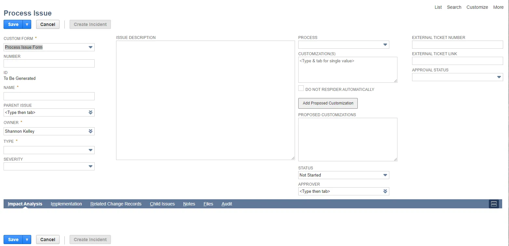

# Using Process Issues

The Process issue ticketing system:

- Enables anyone one with permission and access to NetSuite to initiate a ticket.
- Enables management and IT staff to triage issues and enhancements to determine if a change request should be created.
- Attaches Customization and Process Records to automatically determine how risky the change is and what level of change process is required for compliance.
- Can be linked to subsequent Change Requests to provide end to end reporting of changes for audit purposes.

This is an optional part of the process. If you have an established ticketing system, you can continue to use that and reference the external ticket in the Change Request.

## Initiate a Process Issue

1. Open __Strongpoint__ > __Process Issue__ > __New__

   
2. Select a __Custom Form__ or use the default __Process Issue Form__.
3. Assign a __Number__ for the Process Issue. This is any alphanumeric code you use to identify this process issue.   
   A Unique __ID__ is generated after the Process Issue is created.
4. Enter a meaningful __Name__ for the Process Issue.
5. Select a __Parent Issue__ if applicable. This field is used to group issues. You can either type part of the name and press Tab, or use the drop down icon and select from a list.
6. Change the __Owner__ if needed.
7. Select a __Type__ for the issue. __Type__ is used for sorting and organizing issues. You can set up types to trigger alerts to object owners and managers. You can use the predefined types or use __New__ to create your own. Here are basic definitions:

   - __Question__: question about a feature, function or process.
   - __Suggestion__: idea for improving functionality or process.
   - __Broken Process__: problem with a process, but not blocking productivity or performance.
   - __Waste__: steps or work that is not necessary.
   - __Control Log__: An automatically created process if you have the __Strongpoint Controls__ package.
   - __Script Error__: error within a script causing it not to function as expected.
   - __Material Risk__: risk to threaten the success of an enterprise in any material way.
   - __Requirement__: a documented, actionable, measurable, testable, traceable task or functionality related to identified system need.
8. Select an optional __Severity__ for the issue. __Severity__ is used for sorting and organizing issues.

   - __Low Importance__: minimal business impact for a production system, with no impact to quality, performance, or functionality
   - __Medium Importance__: partial non-critical functionality loss, time-sensitive issue for long term productivity not causing an immediate work stoppage.
   - __Urgent Issue__: critical business impact, loss of service, or data loss or corruption.
9. Best practice is to enter a meaningful __Issue Description__ to make it easy to identify the issue in a list or report.
10. Select the __Process__ affected by the issue.
11. Add one or more __Customizations__ affected by the issue. Platform Governance for NetSuite analyzes the customization records, attaches them to appropriate policies and determines the Change Control Level required.
12. Check __Do Not ReSpider Automatically__ if you prefer not to automatically run the spider when the __Status__ is set to __Closed__.
13. Click __Add Proposed Customization__ to create a customization for this Process Issue. Select the __Type__ and complete the __Script ID__ or __Name__, depending on the __Type__. Click __+Add more proposed customizations__ to add another, or __Add Proposed Customization(s)__ to continue.
14. Assign a __Status__ to help track the issue. Do not assign as __Completed As Process Issue__ or __Closed__ until all work has been done, and all change requests are completed, deployed and verified.

    - __Not Started__ is the default.
    - __In Progress__: work or investigation has started.
    - __Completed As Process Issue__: work has been completed, all changes and change requests are complete, deployed and verified.
    - __Converted to Change Request__: a change request has been created for the issue.
    - __Next Review__: indicates the issue will be looked at again the next time process issues are reviewed.
    - __Closed__: either the process issue is closed with no action, or the same criteria as __Completed As A Process Issue__. The Spider is automatically run when the __Status__ is set to __Closed__ unless __Do Not ReSpider Automatically__ is checked.
15. Select one or more additional __Approvers__. Mandated approvers are set by the appropriate policy.
16. Enter an optional __External Ticket Number__ and __External Ticket Link__ to cross reference processes with an external ticket system.
17. Assign an __Approval Status__ based on the investigation and change request activities. The Spider is automatically run when the __Approval Status__ is set to __Approved__
18. Add additional details on the __Implementation__ tab. For example, you can assign the process issue, or add existing Change Request information.
19. __Save__ the Process Issue.

Once a Process Issue is saved, you can open it and use the __New Task__ and __New Meeting__ functionality, or edit the issue to update status information.

Use the ERD tab to visually view the records and see the relationships.

## View Process Issues

You can manage your Process Issues through reports:

Open __Strongpoint__ > __Process Issues__ > __Process Issue Overview__

You can enter filters to sort the issues and click on the column heads to change the sort order. Reports can be exported to CSV, Excel, PDF, printed or emailed using the icons.

You can also edit some fields inline:

1. Click on __EDIT__ in the report tool bar. When enabled, it is green with a check mark.
2. Click on the red pencil icon in the column head. Columns without the pencil icon cannot be edited.
3. Click in the column to open a text box.

