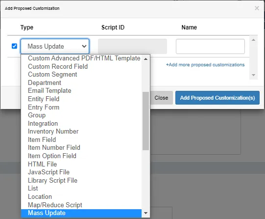
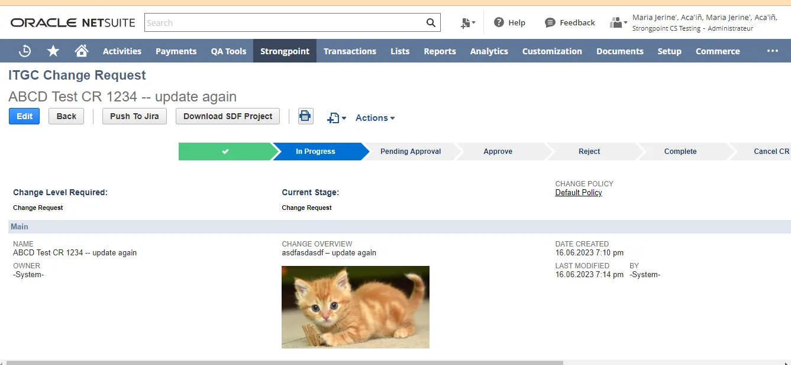
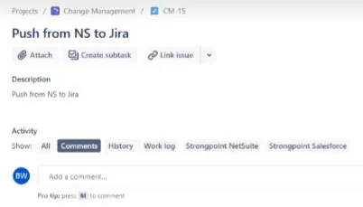

# Netwrix Strongpoint for Netsuite 7.0 Release Notes

## Core 7.0.3

July 28, 2023

- Improved handling of searches used in script deployments. Changes are now evaluated as scripted objects to check for deployment dependencies.
- Added a warning on the change request for generic deployment script IDs. Using the generic ID fetches all deployment customizations that share this non-unique ID.

  
- __Bill of Materials__ and __Inventory Number__ fields are deprecated and inactive in the policy record and list views.

## Core 7.0.2.1

June 23, 2023

- Clarified handling of User Role Assignment changes with associated scripts. Assignments are now reported more accurately in the Change Log and not noted as Scripted Object changes.

## Core 7.0.2

June 16, 2023

- __Autospider__, __Manual Spider__ and __ReSpider Now__ now support French (both France and Canada) for Strongpoint customers using French in NetSuite.
- __Changed By No HTML__ and __Diff No HTML__ result options are available for customizing your Searches. Specifying these options enable you to export the Change Management Reports with the fields in plain text, removing the HTML tags to improve readability.

  - Open __Strongpoint__ > __Change Management Reports__ > _report_name_ > __Customize__.
  - Click __Edit this Search__.
  - Open the __Results__ tab.
  - Click __Add Multiple__.
  - Click to select a __Field__. Use Ctrl-Click to select subsequent fields.
  - Click __Add__.

    
  - Click __Save__.

## Core 7.0.1

May 16, 2023

- Updated handling of system changes due to a NetSuite change in user base permissions. System changes are now handled as platform changes, and do not generate non-compliant change logs for user roles.

  You must manually resolve any of the non-compliant changes system generated prior to this release. This update is not retroactive.
- Added a __Print__ button to all Change Request screens.

## Core 7.0

April 21, 2023

### __Reset Strongpoint scripts to Low Priority__

This change ensures the Strongpoint scripts do not impact your performance. This change affects both new installs and updates to existing Strongpoint for NetSuite installations.

There is an exception for customers using the __Agent__ module to run __Large Controls__. These scripts are set to __Standard__ priority. Contact your Customer Success Manager for assistance if you are considering changing these associated scripts to a lower priority.

### __Mass Update Type Available as a Change Request Proposed Customization__

__Mass Update__ can be selected as a __Type__ under __Proposed Customizations__. Specify the __Name__ of the Mass Update you want to create.

### __NetSuite Make Copy Creates Content and Resets Status__

Strongpoint ensures the __Make Copy__ command found under the __Actions__ option only copies the content, not the status. Copied change requests are set to the __Not Started__ status.

## Jira 1.2.14

- Added the ability to receive and store images attached in the Jira description by Jira ticket ID.

  

## Jira 1.2.13

Here are the enhancements for the release:

- Change customization name to allow Single quotes (').
- Added __Location__ to the __Type__ drop down on the __Add Proposed Customization__ form.

## Jira 1.2.11

Here are the enhancements for the release:

- Import Customizations from Jira
- Enable Allow NS to Jira Push (must be done prior to creating a ticket from NetSuite to Jira)
- Create Ticket from NetSuite to Jira
- Change customization name to allow Single quotes (').
- Added __Group__ to the __Type__ drop down on the __Add Proposed Customization__ form.

### Import Customizations from Jira

An __Import Customization__ button has been added to the Jira Strongpoint form. You can import an xml file exported from a Jira ticket.  

### Enable Allow NS to Jira Push

This feature must be enabled before you can create tickets from NetSuite to Jira.

1. Open __Strongpoint__ > __Strongpoint Support__ > __Installation Settings__
2. Open the __Jira Integration__ tab
3. Check __Allow NS to Jira Push__ to enable pushing NetSuite change requests into Jira.  

   

### Create Ticket from NetSuite to Jira

Create Ticket from NetSuite to Jira must be enabled before you can create tickets from NetSuite to Jira.

1. Create or open a change request in Strongpoint.
2. Add your information and customizations.
3. Click __Push to Jira__.
4. Select your Jira project.  
   
5. Click __Push__. A Change Request Pushed message is displayed. Click __Close__.
6. Open the __Related Change Records__ tab. The ticket number is added as an __External Change Request Number__. __CM-15__ in this example.  
   
7. Open Jira.
8. Navigate to __CM-15__ ticket.  
   
9. Click __Strongpoint NetSuite__. The customizations from the change request are added.  
   

## Jira 1.2.10

Here are the enhancements for the release:

- Credentials are now persistent, and do not need to be entered every time.
- Strongpoint Settings page added to Jira

### Strongpoint Settings for Jira

The Strongpoint Settings app is accessed through Jira. This is where you create your Token Based Authentication (TBA) credentials for your account. Once created, they are available to you for easy selection when performing your tasks.

Token-Based Authentication is set up through NetSuite. Refer to [Setting up Token-Based Authentication](../integrations/jira_integration.md).

1. Open __Jira__.
2. Open your __Projects__ page:

   
3. Expand __Add-ons__.
4. Select __Strongpoint Settings__.

   
5. Click __New Token Based Authentication__ to add your credentials. This needs to be done once for each of your accounts.

   
6. Enter your credentials and click __Add Token Based Authentication Credential__.
