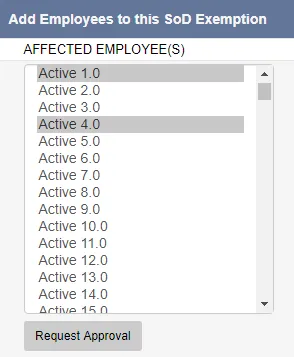

# Creating an SoD Approval Request

You can create a custom change request form for an SoD Approval Request. Refer to [Using Custom Change Request Forms](../change_management/use_custom_cr_forms.md) for information on implementing your custom form.

To create an SoD Approval request:

1. Open __SoD__ > __SoD Change Management__ > __New SoD Approval__
2. Select the SoD Examption Type. The __Scope__ selections are different depending on the type.

   - __Cross Role Exemption__ (default) isset on the employee level.
   - __Role Exemption__ is set on the role level. With Role based exemptions, you have the option to apply to current and/or future employees to streamline onboarding.
3. Select information for __Main__:

   - __Name__: Enter a name for the request.
   - __Priority Level__: Select the priority level for the request. Select __New__ to add a custom level.
   - __Reason or Compensating Control for SoD Exemption__: Enter the information supporting the approval request.
4. Enter information for __Scope__:

   - For __Cross Role Exemption__, select one or more of the __Affected Employee(s)__, __Affected Rule(s)__ or __Affected Role(s)__.
   - For __Role Exemption__

     - Select one or more of the __Affected Employee(s)__ and __Affected Rule(s)__.
     - Select one or more options for applying the exemption. If you choose __Select Current Employees__, the __Affected Employee__ entry is enabled.
5. Click __In Progress__ in the status bar to indicate you are working on the request.
6. __Save__ the Change Request.
7. The Approval section is now available. Click __Edit__ to add __Additional Approvers__ or __Approver Notes__. Click __Save__ if you make changes. Refer to [Create a Change Request](../change_management/creating_change_request.md) for more details about the status bar.

## Adding Employees to an Approved SoD Exemption

Employees can be added to an Approved and Open SoD Approval request. The __Add Employees to SoD Exemption__ button is available after the request is Approved.

1. Click __Add Employees to SoD Exemption__.
2. Select one or more __Affected Employee(s)__ to add.

   
3. Click __Request Approval__. Approvers must be [licensed](../installing_strongpoint/license_manager.md) Platform Governance for NetSuite users and have the correct [role permissions](../installing_strongpoint/setting_permissions.md) if they are using a custom (non-Strongpoint) role.  
   A new request is created with __Add to SoD Exemption__ prepended to the Name of the original request. The new request is set to __Pending Approval__.

   

When the new Request is approved, the employees are added to the __Open__ and __Approved__ parent Change Request and the new Request is __Closed__. If the parent request status has changed, the status of the new Request is unchanged.
