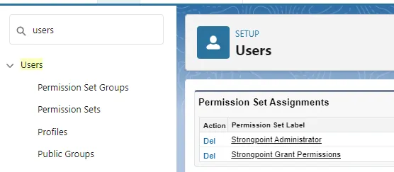
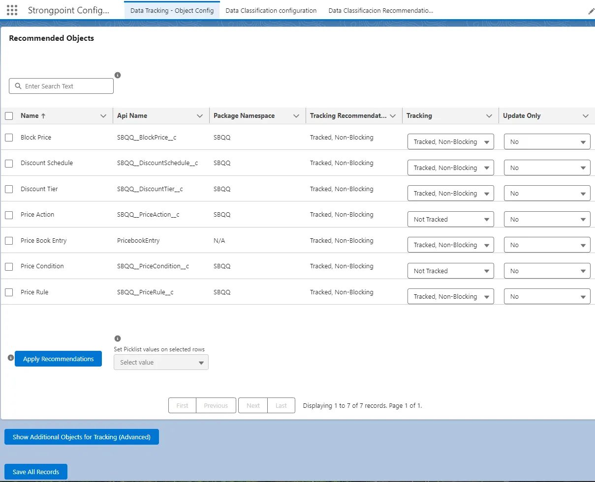
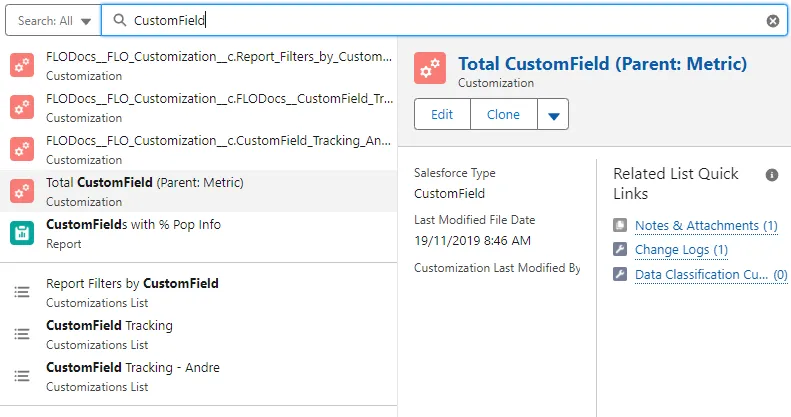

# Set Up Data Tracking

Data tracking is used for Salesforce CPQ and any sensitive data fields you want to track. Setting up data tracking enables Platform Governance for Salesforce to track data and create change logs for any data changes.

If you track an object, all changes to the object and fields are tracked. Consult with your security and audit teams to develop a list of objects before enabling data tracking.

## Prerequisites

Here are the requirements to set up data tracking:

1. Enterprise Compliance license
2. Access to the Configuration app. You must have the __Strongpoint Administrator__ and __Strongpoint Grant Permissions__ assignments to access the app. This access is set through:  
   __Setup__ > __Users__ > __Permission Sets__ > __Strongpoint Administrator__ > __Manage Assignments__

   

## Add Objects to Track

1. Open the Salesforce App Launcher.
2. Click __View All__ to expand the app list.
3. Select __Strongpoint Configuration__. The __Recommended Objects__ list is displayed.

   
4. Click the checkbox to select each __Recommended Object__ to track.
5. Set the __Tracking__ for each selected Object:

   - __Not Tracked__: Changes in data records are not tracked.
   - __Tracked, Blocking__: Changes in data records are blocked if there is not an approved Change Request.
   - __Tracked, Non-Blocking__: Changes in data records are logged. The Change Logs show the change as non-compliant if there is not an approved Change Request.
6. Set the __Update Only__ for each selected Object:

   - __No__: Tracks changes to existing and new records.
   - __Yes__: Tracks changes to existing records but does not apply to new records.
7. Click __Apply Recommendations__.
8. Click __Save All Records__ if you do not need any additional objects, otherwise continue these steps.
9. Click __Show Additional Objects for Tracking (Advanced)__. The Additional Objects list is displayed.
10. Click the checkbox to select each __Additional Object__ to track. You can search for objects, or use the navigation at the bottom of the form to page through the records.
11. Set the __Tracking__ and __Update Only__ values for each additional selected object.
12. Click __Apply Recommendations__.
13. Click __Save All Records__.
14. Wait until the __Deployment Status__ is complete, then click __Done__.

    
15. Open the App Launcher and return to the __Strongpoint Lightning__ app.

## Select Customizations to Track

1. Open __Customizations__.
2. Enter __CustomField__ in the __Search__ box.

   
3. Select __CustomField Tracking__.
4. Select a customization and edit the Data Change Tracking field.

   
5. Click __Save__ at the bottom of the form to save your changes.

## Add Tracked Objects to a Policy

Adding a tracked object to a specific policy facilitates tracking. For example, you can create a report based on changes of that policy. In your Change Enablement process, you can set a change level for tracked components by adding them to a specific policy.

1. Open __Change / Approval Policies__. Change the view to __All Policies__ instead of __Recently Viewed__.
2. Select a policy to track the object.
3. Open the __Related__ tab.
4. Click __Add Customizations__.
5. Enter __(Data Records__ in the Search Customization box.

   
6. Select the customization to add. Use Shift-click (contiguous items) or Ctrl-click to select multiple customizations.
7. Click __Add__ to add your selections to the Selected Customizations pane.
8. Click __Save__ when you are done.

## Change Logs

__Tracked, Non-Blocking__ generates a Compliant Change Log (CL-11674) if there is an approved Change Request or a Non-Compliant Change Log (CL-11672) for changes made without an approved Change Request.

__Tracked, Blocking__ generates a Compliant Change Log (CL-11672) if there is an approved Change Request. If a user attempts to save a change to a __Tracked, Blocking__ object without an approved Change Request, an error is generated and the change is not saved.
