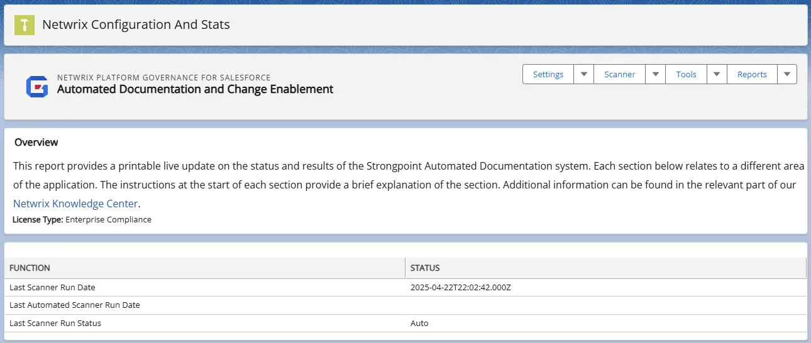
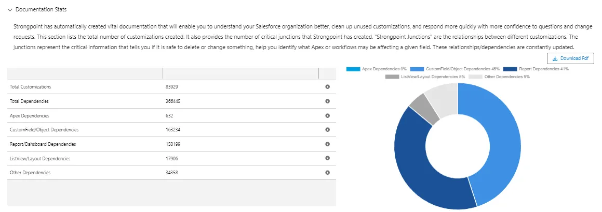
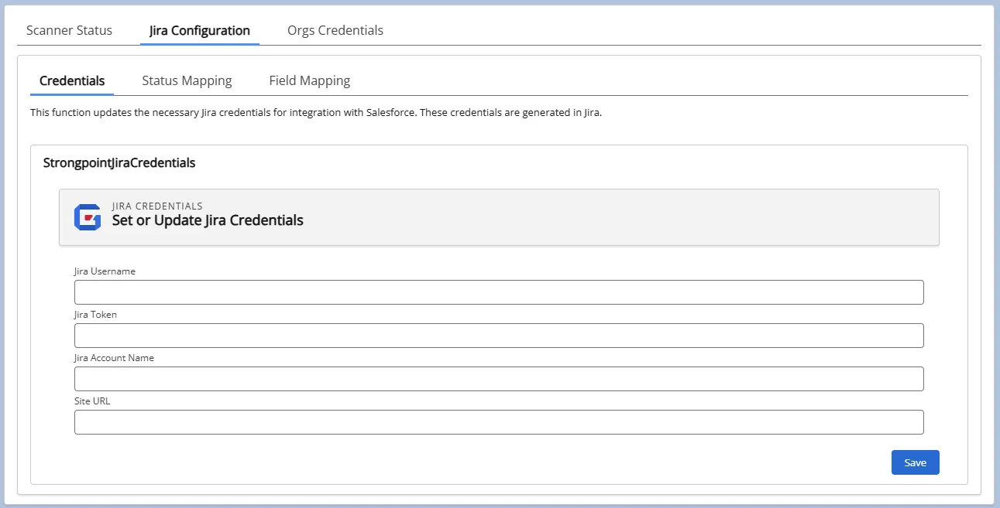
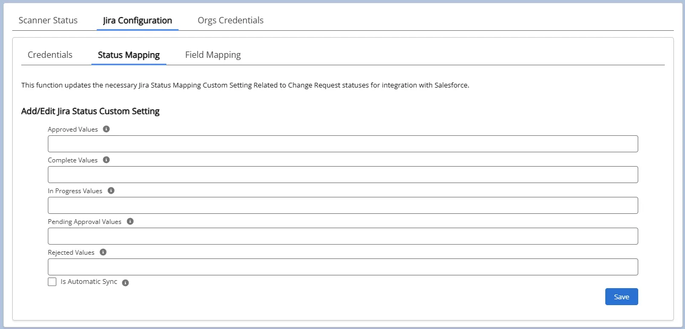
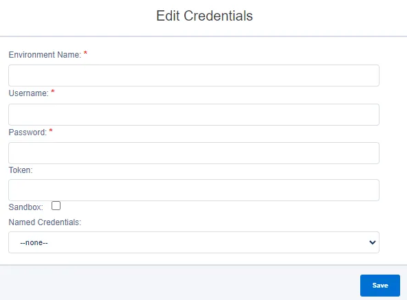

# Configuration and Stats

The Configuration and Stats report is a live update on the status and results of the Automated Documentation system.

From the Netwrix Dashboard:

Click __Configuration and Stats__ in the __Resources__ section, or open __Settings__ > __Configuration and Stats__.

The __License Type__ displays your current license.

The report is divided into multiple tabs:

> Scanner Status
>
> > Documentation Stats
> >
> > Scanner Logs
> >
> > Scanner Additional Information
> >
> > Change Log Creation (sandbox option)
>
> Jira Configuration
>
> Orgs Credentials

## Scanner Status

Accesses the documentation stats, scanner logs, scanner additional configuration and change log creation (sandbox).

### Documentation Stats

This section displays the current status of the documentation Platform Governance for Salesforce has created for your account. The statistics included the total number of customization, and the various __junctions__ created to track the relationships between customizations. __junctions__ represent critical relationship information to help you determine if it is safe to delete or change something, and how it affects other items. Click __Download PDF__ to export a copy of the report.

### Scanner Logs

The section displays details for each of the scanner logs:

- Scanner Log Name
- Salesforce Type:
- Retrieved Stage: this column displays the current status when a scanner is running. For example, __DeDuplicate__ is displayed if the scanner is running the __DeDuplicate__ process during the scan.
- Total Customization: this column shows the number of customizations processed while a scanner is running. When the scan is complete, the column matches the total __Scanner Count__.
- Scanner Count

### Scanner Additional Information

This section only applies to sandbox orgs. It displays each scanner function and the status:

- Last Scanner Run Date
- Last Automated Scanner Run Date
- Last Scanner Run Status

### Change Log Creation

If you are in a sandbox, you can control whether change logs are created. Due to Salesforce space limits on different [sandbox accounts](https://help.salesforce.com/articleView?id=data_sandbox_environments.htmandtype=5), you may want to disable change logs to save space.

## Jira Configuration

Use these features to enter your Jira credentials and map the statuses between Jira and Platform Governance for Salesforce.

- Credentials
- Status Mapping
- [Jira Field Mapping](../integrations/jira_field_map.md) (separate topic)

### Credentials

Your credentials are generated in Jira. Enter them here for the Platform Governance for Salesforce Jira integration.

1. Open __Netwrix Dashboard__ > __Settings__ > __Configuration and Stats__.
2. Open the __Jira Configuration__ tab. It opens on the __Credentials__ tab.

   
3. Enter your credentials:

   - __Jira Username__ is your Jira login email associated with your Jira API token.
   - __Jira Token__ is your Jira API token. If you do not have your token, follow the steps in the [Atlassian](https://confluence.atlassian.com/cloud/api-tokens-938839638.html) documentation.
   - __Jira Account Name__ is the _company specific part_ of the Jira site URL (__https://___JiraAccountName___.atlassian.net__). Only enter the _JiraAccountName_, not the entire URL.
   - __Site URL__ is __https://site.force.secure.com__
4. Click __Save__.

### Status Mapping

1. Open __Netwrix Dashboard__ > __Settings__ > __Configuration and Stats__.
2. Open the __Jira Configuration__ tab.
3. Open the __Status Mapping__ tab.

   
4. Enter the mappings between your Jira statuses and the Change Request statuses. You must define your Jira statuses prior to this step. You can enter multiple Jira statuses for each Change Request status, separated by commas. For example, __In Progress, Backlog__. Assign your mapping for each of the Change Request statuses:

   - __Approved Values__
   - __Complete Values__
   - __In Progress Values__
   - __Pending Approval Values__
   - __Rejected Values__
5. Check __Is Automatic Sync__ to enable Platform Governance for Salesforce to handle the synchronization between Jira and Salesforce when a Ticket status is updated to a mapped status. without having to click __Push__. If you are using an org where you do not want to create a Change Request, leave this unchecked so you can do your research or testing without generating Change Requests.
6. Change Requests are not automatically created, as not all tickets result in a Change Request. Tickets must be pushed to Platform Governance for Salesforce to begin the process. If Automatic Synchronization is turned on, then changes to the Status and Customizations are synchronized between Jira and Platform Governance for Salesforce without the need to keep manually pushing the changes.
7. Click __Save__.

## Orgs Credentials

Create credentials for your Salesforce orgs and link the a Named Credential Change Request deployments.

1. Open __Netwrix Dashboard__ > __Settings__ > __Configuration and Stats__.
2. Open the __Orgs__ Credentials tab.

   
3. Click __New__ to enter new credentials. For existing credentials, you can click __Edit__ to modify the credential, __Delete__ to remove it, or the __credential name__ to sync your credentials.

   
4. Click __Save__.
