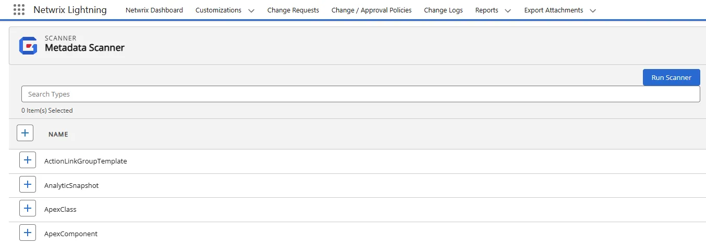
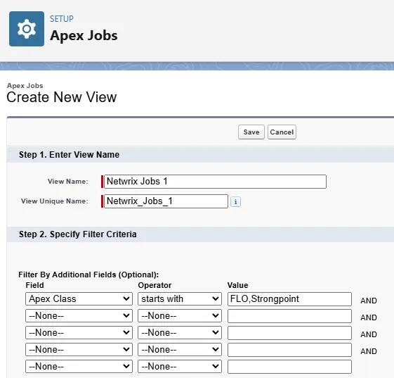
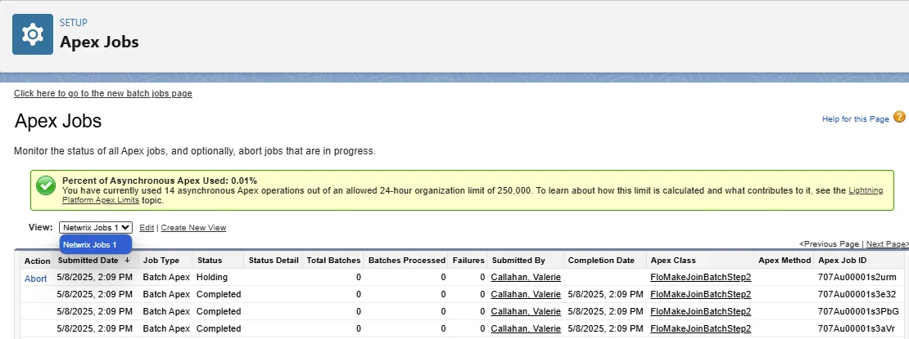

# Manual Scanners

When the initial scan is complete, you can run additional on demand scans as required.

When you add or change a specific customization, you can choose to run an on demand scan of only the
Metadata type of the affected customization, instead of scanning the entire environment. This type
of scan reduces the run time. For example if you change a Report, pick reports as the Metadata type
and Platform Governance for Salesforce only scans reports.

The scanner is only available to Administrators.

To run the scanner:

1. Open **Netwrix Dashboard** > **Scanner** > **Manual Scanners**
2. Use the optional **Search Types** to narrow the focus of the list if you are looking for a
   specific type.
3. You can select + beside one or more types to scan or you can scan the whole environment by
   clicking + on the **Name** row to select all the types.

    

4. Click **Run Scanner**.
5. The batch runs in the background. You receive an email notification when the scan is complete.

    You can create your own Salesforce view for the scanners.

    - Open Salesforce **Setup**.
    - Search for **apex jobs** or navigate to **Environments** > **Jobs** > **Apex Jobs**.
    - Click **Create New View**.  
      
    - Enter a **View Name**. The system assigns **View Unique Name**. _Netwrix Jobs1_ is used in
      this example.
    - Select **Apex Class** for the **Field**.
    - Select **starts with** for the **Operator**.
    - Assign **FLO, Strongpoint** for the **Value**.
    - Click **Save**. You can now see the status of all of the Strongpoint jobs.  
      

6. From the Netwrix Dashboard: click **Configuration and Stats** in the **Resources** section, or
   open **Settings** > **Configuration and Stats**.

**Next Step:** [Validate the Data ](validating_data.md)
