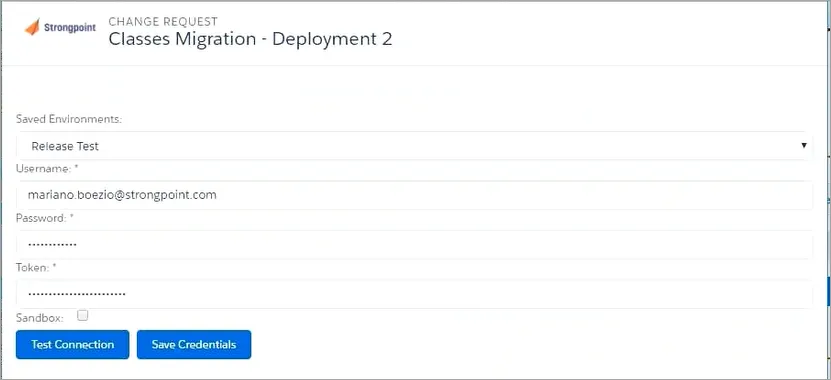
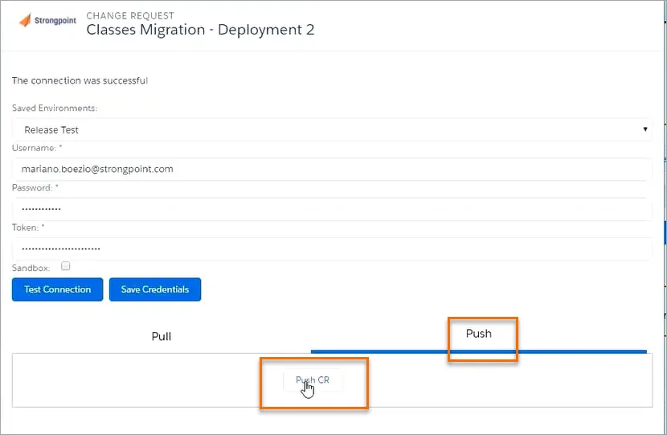
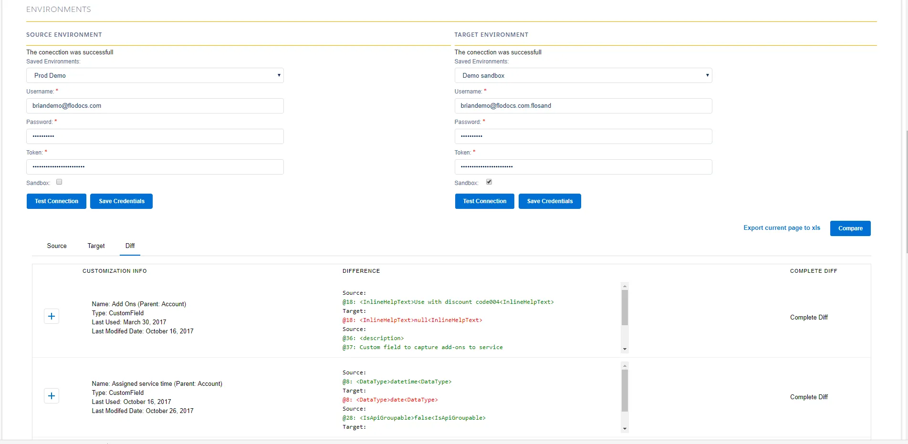
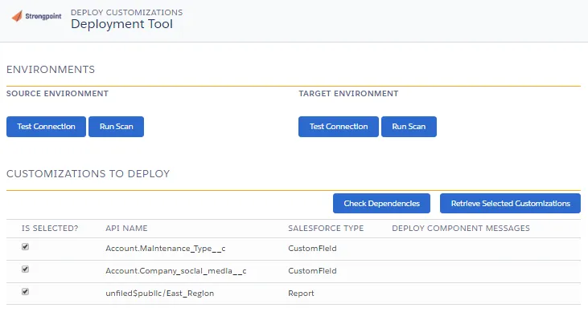
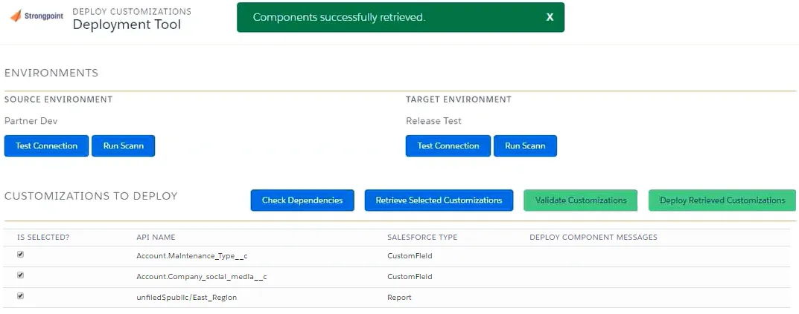

# Multiple Environment Deployment Tracking

A best practice is to create change requests in your production account so that they are not lost, they have an audit trail and approvals can be shown.

Here is the overall process flow for multiple deployment tracking:

> Create the Change Request
>
> Push the Change Request
>
> Push the Updated Change Back into Production
>
> Create the Deployment Record
>
> Create the Deployment Record
>
> Deploy the Changes
>
> Complete the Process

## Create the Change Request

1. In your Production environment, open __Change Requests__ > __New Change Request__
2. Enter the relevant fields, including:

   - __Change Request Name__: Enter a meaningful name.
   - Select the __Change Type__.
   - __Change Overview__: Enter a meaningful description.
   - Add __Customizations__. If you add __Proposed Customizations__ they do not show up on the change log as they do not exist in both environments.
   - Add __Additional Approver(s)__.
3. __Save__ the change request.
4. Click __Submit for Approval__

## Push the Change Request

Once the change request is approved:

1. Click on __Sync CR__.

   
2. Choose a __Saved Environment__. (Where you plan on developing/testing solutions and/or customizations.)
3. Add your __Credentials__.

   
4. Click on __Test Connection__ to make sure your credentials are correct. If your credentials are not correct,click on __Save Credentials__ and edit.
5. Make the necessary changes on your change request in your development/testing environment and __Save__.

## Push the Updated Change Back into Production

1. On the updated change request, click __Sync CR__.
2. Choose a __Production__ environment.
3. Add your __Credentials__.
4. Click __Test Connection__ to make sure your credentials are correct. If your credentials are not correct, click on __Save Credentials__ and edit.
5. Click __Push__.
6. Click __Push CR__.

After the push, the Change Request in Production has a related deployment record.

## Create the Deployment Record

1. Open the __Related Lists__ tab on your change request.
2. Click on __Run Compare Tool__. Refer to [Compare Environments](../tools/environment_comparison.md) for more information.

   
3. Click __Deploy__ in the change request tool bar. __Deploy__ is only available for approved change requests.
4. Enter your environments and credentials and __Test Connections__.
5. __Save__ the deployment record.
6. Click __Submit for Approval__.

## Deploy the Changes

These steps can be completed after the deployment record is approved.

1. Open __Change Requests__ and select the approved deployment record.
2. Click __Deploy Changes__

   
3. Click __Retrieve Selected Customizations__

   

   This creates a package to:

   - __Check Dependencies__: Use to check what has been referenced.
   - __Validate Customizations__: Use to check the deployment is going to work. It simulates your deployment.
   - __Deploy Retrieved Customizations__: Use to deploy your customizations when you are ready to proceed.
4. Check your dependencies and validate your customizations.
5. Click __Deploy Retrieved Customizations__ to start the deployment. This may take some time, since it runs the test cases into the target environment.

   
6. Run the Compare Tool to verify all changes moved correctly.

## Complete the Process

When the deployment process is finished:

1. Check the [Deployment Logs](deployment_logs.md).
2. Fix any errors and repeat the deployment if needed.
3. Once the deployment is successful, open the change request and set the status to __Completed__.

   
