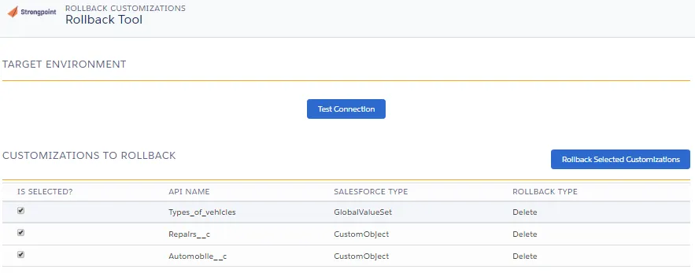
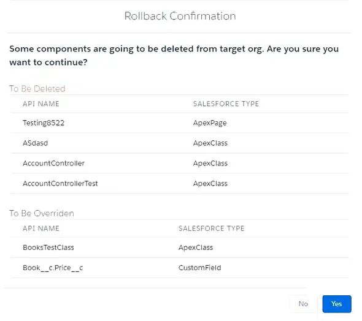
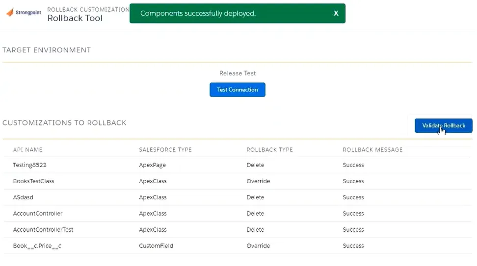

# Rollback

When deploying changes in a single Salesforce environment, you may find instances where you need to rollback to a previous state after a deployment. Platform Governance for Salesforce's rollback tool gives you the flexibility of rolling back all or selected components of your deployment,enabling you to take action on a specific problem. There are two steps:

> Create the Rollback Record
>
> Execute and Validate the Rollback

## Create the Rollback Record

The Deployment Record status must be __Completed__ to be eligible for Rollback.

1. Open the Deployment Record to rollback. To locate the record, click __Change Requests__ and change the view to __Deployments__.
2. Click __Rollback__

   
3. Click __Test Connection__ to ensure your credentials are working. If your credentials are not correct, you can click on __Save Credentials__ and edit.

   
4. By default, all of the customizations are selected for rollback. Deselect any customizations to keep. The __Rollback Type__ specifies the effect of the rollback:

   - __Delete__: If a customization was created during the deployment, it is deleted during the rollback.
   - __Override__: If a customization existed in the target environment and was changed during deployment, it is reset to the previous version.
5. Click __Rollback Selected Customizations__. The __Rollback Confirmation__ is displayed.

   
6. Click __Yes__ to continue. A Rollback Record is created.
7. Click __Submit for Approval__ on the Rollback Record.

## Execute and Validate the Rollback

The Rollback Record must be approved before it can be executed.

1. Open the Rollback Record. To locate the record, click __Change Requests__ and change the view to __Deployments__.
2. Click __Test Connection__ to ensure your credentials are working.
3. Click __Execute Rollback__. A Confirmation is displayed. Click __Yes__ to continue.
4. When the rollback is complete, click __Validate Rollback__.

   
5. Open __Netwrix Dashboard__ > __Reports__ > __Release and Deployment__ > __Rollback Logs__  
   You can use __Customize__ to add the __Status__ column to your report. Here is an example of a failed rollback [deployment log](deployment_logs.md).

   
6. Click on the report to open it. Check the __Notes & Attachments__ for a rollback validation file.
