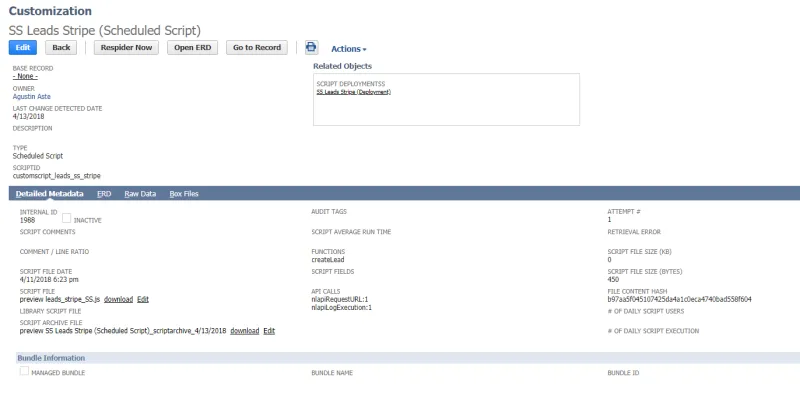

# Understanding the Customization Record

A Flashlight Customization Record contains all the information about a given customization in one
place, giving you everything you need to know about your objects at your fingertips. Customization
Records are created and maintained by Flashlight's spider as it documents your account. The records
enable us to search customizations and to attach them to processes.

Here is an example Customization Record for a Scheduled Script:

#### Menu

- **Edit**: enables editing of the record.
- **Back**: returns to the previous screen.
- **Respider Now**: triggers the Spider to update the documentation for this specific record.
- **Open ERD**: opens the Entity-Relationship Diagram for this specific record.
- **Go to record**: Opens the actual NetSuite record.

#### Summary

The top section summarizes the key data about the Object:

- **Base Record**: parent record. For Saved Searches it displays the Object Type.
- **Owner**: current owner of the record.
- **Description**: description of the record. If the object does not have a description field, click
  **Edit** and add it to the record.
- **Type**: NetSuite Object Type.
- **Scriptid**: Script ID of the record.
- **Dependent Objects**: related object dependencies by object type. For example, there could be
  multiple scripts and workflows that depend on this object.

#### Tabs

The bottom section displays tabs containing specific information for the record. The available tabs
and information vary depending on the type of Object being viewed.
