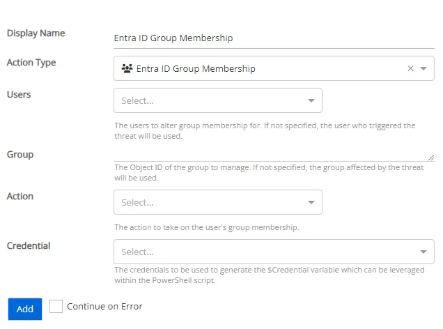
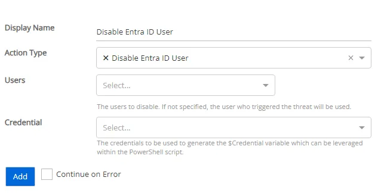
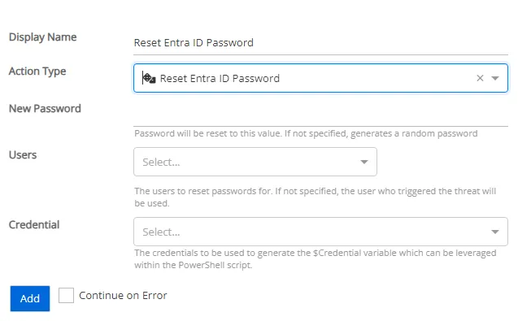

# Entra ID Target Actions

The following actions target an Entra ID application.

## Entra ID Group Membership

Manages an Entra ID group's membership by adding or removing an object from a group.

- Users – Select the users for whom to alter group membership. If not specified, the user who
  triggered the threat will be used.
    - Perpetrator – The account that initiated the threat
    - Users Affected – Users affected by the threat
    - Both Perpetrators and Users Affected – The account that initiated the threat and the users
      affected by the threat
- Group – Specify the identity of the group to manage. If not specified, the group affected by the
  threat will be used.
- Action – Select the action to take on the user's group membership
    - Add – Add the user to the specified group
    - Remove – Remove the user from the specified group
- Credential – Select a credential profile that contains valid Entra ID credentials. Credential
  profiles are configured on the
  [Integrations Interface](../../configuration/integrations/overview.md). If not specified, the
  action will be run as the credentials of the Action Service.

## Flag Entra ID User as Confirmed Compromised

Flag a user as confirmed compromised within your Entra ID tenant.

- Users – The users to flag as confirmed compromised. If not specified, the user who triggered the
  threat will be used.

    - Perpetrator – The account that initiated the threat
    - Users Affected – Users affected by the threat
    - Both Perpetrators and Users Affected – The account that initiated the threat and the users
      affected by the threat

- Credential – Select a credential profile that will mark the user as confirmed compromised.
  Credential profiles are configured on the
  [Integrations Interface](../../configuration/integrations/overview.md). If not specified, the
  action will be run as the credentials of the Action Service.

## Disable Entra ID User

This actions disables a user in your Entra ID tenant.

- Users –The users to disable. If not specified, the user who triggered the threat will be used

    - Perpetrator – The account that initiated the threat
    - Users Affected – Users affected by the threat
    - Both Perpetrators and Users Affected – The account that initiated the threat and the users
      affected by the threat

- Credential – Select a credential profile that will execute this action. Credential profiles are
  configured on the [Integrations Interface](../../configuration/integrations/overview.md). If not
  specified, the action will be run as the credentials of the Action Service.

## Reset Entra ID Password

Resets an Entra ID user's password to a specified password. If no password is specified, resets a
user's password to a random group of letters, numbers, and special characters.

- New Password – Password will be reset to this value. If not specified, generates a random
  password.
- Users – The users that will have their password reset. If not specified, the user who triggered
  the threat will be used.

    - Perpetrator – The account that initiated the threat
    - Users Affected – Users affected by the threat
    - Both Perpetrators and Users Affected – The account that initiated the threat and the users
      affected by the threat

- Credential – Select a credential profile that will execute this action. Credential profiles are
  configured on the [Integrations Interface](../../configuration/integrations/overview.md). If not
  specified, the action will be run as the credentials of the Action Service.
