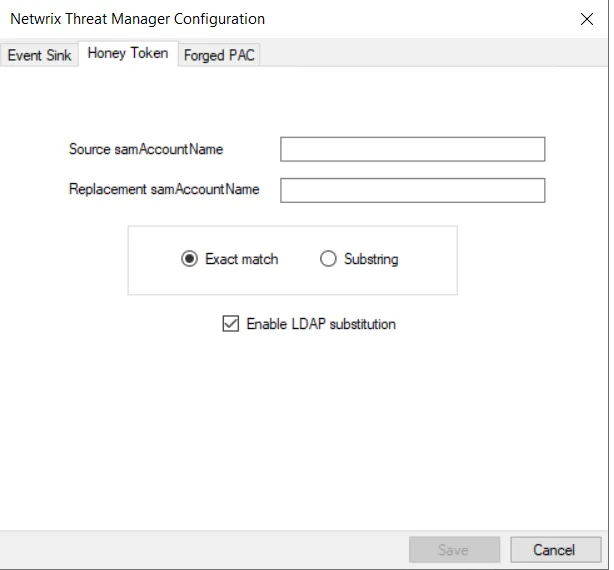
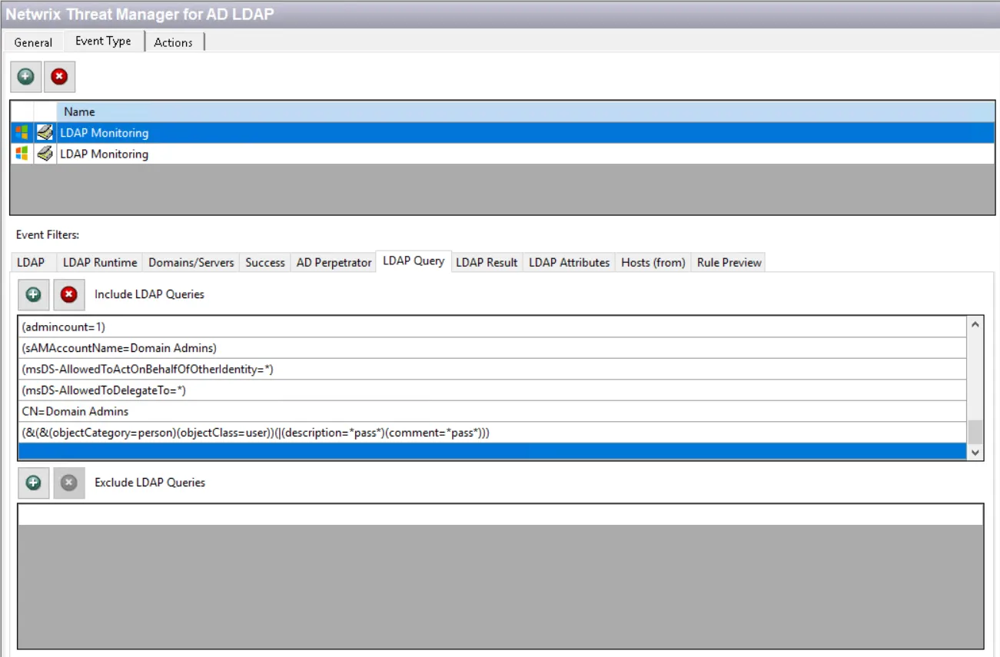

# Configure Honeytoken Threats

The first step for configuring Honeytoken threats is to select a good Honeytoken username format. This is important for a number of reasons.

- The Honeytoken name should be convincing enough that an adversary would want to use it.
- In order to reduce noise, the username format should not match (in part or in full) another user, group, or computer account in your environment.
- Token usernames are limited to 20 characters, and follow the validity rules for a regular Active Directory username.

The next step is to configure LDAP monitoring for Honeytokens.

## Configure LDAP Monitoring for Honeytokens

Adversaries may attempt to perform LDAP reconnaissance for users whose hashes they discover. In order to detect this activity in Threat Manager, LDAP monitoring must be configured for the Honeytoken username in Threat Manager or Activity Monitor.

### Obtain the LDAP Monitoring Configuration String

Follow the steps to obtain the LDAP monitoring configuration string.

__Step 1 –__ From the Threat Manager homepage, navigate to the Configuration menu and select Policies.

__Step 2 –__ On the Policies page, expand the Honeytokens list and select the related Honeytoken policy from the Policies list. Or, select the policy from the Policies table in the Overview box.

__Step 3 –__ On the Configuration tab of the policy, fill in the requested information and click __Copy LDAP Filter__. The Copy LDAP Filter button will automatically copy the exact string that is required for Activity Monitor or Threat Prevention to the clipboard to configure the LDAP events for this Honeytoken.

A notification will pop up and the filter will be saved to the clipboard.

### Configure LDAP Monitoring

Follow the steps to configure LDAP monitoring for Threat Manager.

__Step 4 –__ In the Threat PreventionAdministration Console , go to __Templates__ > __Netwrix Threat Manager__ > __Netwrix Threat Manager for AD LDAP__.

__Step 5 –__ Click the __Event Type__ tab.

__Step 6 –__ Under Event Filters select __LDAP Query__. If the Include LDAP Queries list is empty, select the other __LDAP Monitoring__ event type in the list above.

__Step 7 –__ Scroll to the bottom of the Include LDAP Queries list.

__Step 8 –__ Select the line below the last existing query filter and paste the string copied from Threat Manager.

_Remember,_ the Honeytoken tab of the [Netwrix Threat Manager Configuration Window](../../../../threatprevention/admin/configuration/threatmanagerconfiguration.md) must be configured in order to successfully send LDAP monitoring data to Threat Manager.

### Configure LDAP Monitoring in the Activity Monitor

Follow the steps to configure LDAP monitoring within Netwrix Activity Monitor for Netwrix Threat Manager.

__NOTE:__  LDAP Monitoring is not enabled, it must be enabled in the Monitored Domains tab.

__Step 9 –__ In the Activity Monitor, click on the __Monitored Domains__ tab.

__Step 10 –__ Select a domain and click __Edit__.

__Step 11 –__ Select the __LDAP Monitor__ tab.

__Step 12 –__ Select the __LDAP__ tab.

__Step 13 –__ In the “Query” section, double-click the blank line below the last filled in line.

__Step 14 –__ Paste the string copied from Threat Manager and press __Enter__.

LDAP monitoring has been configured for Threat Manager.
