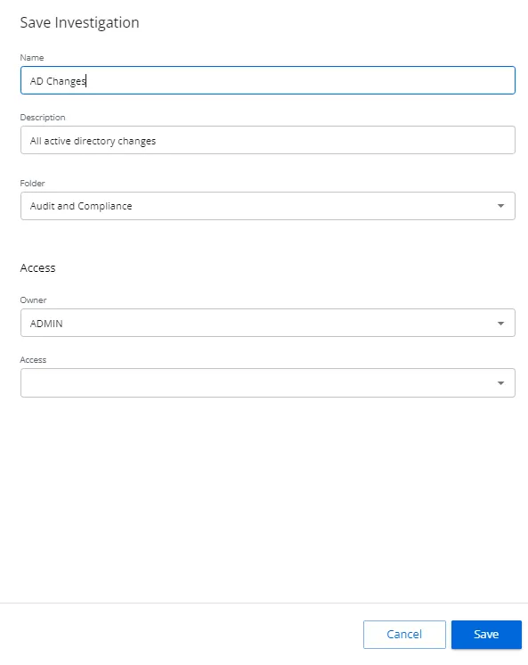
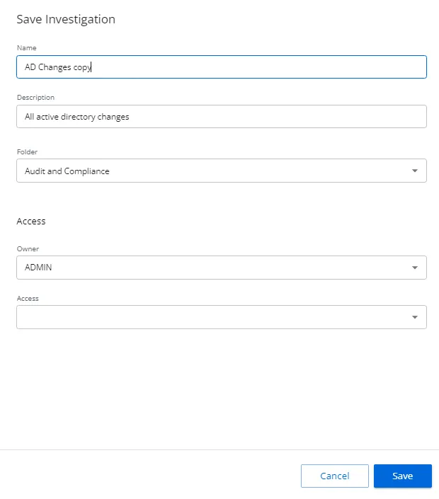

# Edit or Duplicate an Investigation

An investigation can be edited and even duplicated.

## Edit an Investigation

Follow the steps to edit an investigation.

**Step 1 –** Click **Investigate** in the application header bar to open the Investigations
interface. Then click a folder in the navigation pane to access a saved investigation. An
investigation is located in the folder where it was saved.

**Step 2 –** Modify the filter criteria of the investigation as desired.

**Step 3 –** Click the Edit option.

**Step 4 –** The Edit option opens the Save Investigation window in edit mode. You can modify the
name, description, and folder of the saved investigation. If you save the investigation to a
different folder, it will be moved from the original location to the new folder. You can also update
the user roles granted ownership and access to the investigation report.

**Step 5 –** Click **Save**. The Save Investigation window closes.

The investigation is saved with the modified settings.

## Duplicate an Investigation

Follow the steps to duplicate an investigation.

**Step 1 –** Click **Investigate** in the application header bar to open the Investigations
interface. Then click a folder in the navigation pane to access a saved investigation. An
investigation is located in the folder where it was saved.

**Step 2 –** Click the three dots at the top and select **Open as new**. The Open as New option
opens the investigation in Duplicate mode. The filter is the same as that of the base investigation.
You can save it as a new investigation.

**Step 3 –** Modify the investigation filter statement and click **Save**. The Save Investigation
window is displayed.

The Name box displays the investigation name with the word "copy" appended to it.

**Step 4 –** You can modify the following:

- Name – The name of the investigation
- Description – An optional description of the investigation
- Folder – The folder in the navigation pane where the investigation is saved

**Step 5 –** Select a user role from the **Owner** drop-down menu. All users assigned this role
would own this investigation and they will be able to modify the report.

**Step 6 –** In the Access box, type to search the role you want to give access of this
investigation. A list of user roles matching the search string is displayed. Select a single or
multiple user roles. All users belonging to the selected role(s) can view the report.

**Step 7 –** Click **Save**. The Save Investigation window closes.

The duplicated investigation is saved to the selected folder, and the folder expands in the
navigation pane to display the saved item. You can access the investigation from the navigation
pane.
