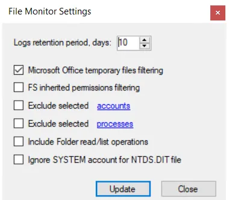
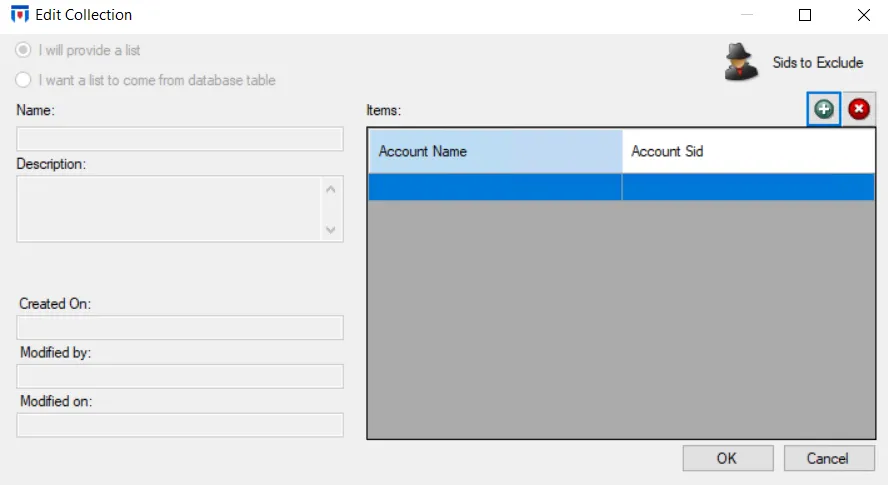
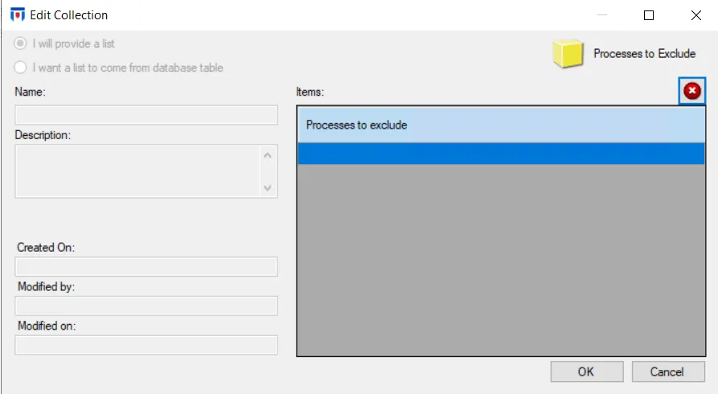

# File Monitor Settings Window

The File Monitor Settings window provides global settings for managing log retention, the ability to
disable office file filtering, inherited permissions for parent object changes, and AD accounts and
file system activity processes for Threat Prevention file monitoring and blocking policies.

Follow the steps to configure file system monitoring.

**Step 1 –** Click **Configuration** > **File Monitor Settings** on the menu; the File Monitor
Settings window opens. This window is only available to Threat Prevention administrators.

**Step 2 –** Enable or disable the following options:

- Logs retention period, days – Log retention period for activity logs (TSV files) created by the
  Threat Prevention Agent for Windows servers or by the Activity Monitor Agent for NAS devices and
  then read by the Threat Prevention Agent. This does not affect File System Access Analyzer event
  types.  
  The Threat Prevention Agent reads logs in real time and retains the original logs for a set number
  of days before the logs are automatically deleted. This setting configures the log retention
  period for all enabled policies using the File System Changes and/or File System Lockdown event
  types. By default, it is set to 10 days.
- Microsoft Office temporary files filtering – Global setting that is checked by default. If
  checked, the temporary files associated with Microsoft office operations, such as copy, paste,
  etc., are not monitored. When unchecked, all the temporary files associated with Microsoft office
  operations are monitored.
- FS inherited permissions filtering – Reports separate events for the parent object and each child
  object. When checked, it reports an event only for the parent object.
- Exclude selected accounts – When checked, the user-supplied list of AD user and group names as
  well as well-known SIDs for built-in users/groups are excluded from file system monitoring and
  blocking policies at the global level. See the Select Local Processes to Exclude topic to specify
  accounts.
- Exclude selected processes – When checked, the user-supplied list of processes are excluded from
  the file system monitoring and blocking policies at the global level. See the Select Local
  Processes to Exclude topic to specify processes.
- Include Folder read / list operations – When checked, all list/read folder operations are included
  in the reporting for file system monitoring and blocking at the global level.
- Ignore SYSTEM account for NTDS.DIT file – When checked, access to the .dit file by the SYSTEM
  account will not be reported by a File System monitoring policy and not be blocked in the case of
  a File System blocking policy. Backup programs often use the SYSTEM account to access the .dit
  file and you may not want to report on or block such activity.

**Step 3 –** Click **Update** to save your changes.

## Select Accounts to Exclude from Collections

A collection is a list of SIDs for built-in users/groups that is excluded for all File System
activity. You can add more accounts to this collection.

Follow the steps to populate the collection with accounts to be excluded from File System
monitoring.

**Step 1 –** Click **Configuration** > **File Monitor Settings** on the menu to launch the File
Monitor Settings window.

**Step 2 –** Check the **Exclude selected accounts** checkbox and then click **accounts**. The Edit
Collection window opens.

**Step 3 –** Use the **Add** (+) button to open the
[Select Active Directory Perpetrators Window](../policies/eventtype/window/selectactivedirectory/perpetrators.md)
to browse for and select AD accounts.

**Step 4 –** Click **OK** to save your changes.

**Step 5 –** Click **Update** on the File Monitor Settings window.

Any accounts added to the list are excluded globally from File System activity.

**NOTE:** If the **Exclude selected processes** option is checked, any file activity generated by
the processes added will have their File System activity ignored.

## Select Local Processes to Exclude

Follow the steps to select local processes for exclusion from File System activity.

**Step 1 –** Click **Configuration** > **File Monitor Settings** on the menu to launch the File
Monitor Settings window.

**Step 2 –** Check the **Exclude selected processes** checkbox and then click **processes**. The
Edit Collection window opens.

**Step 3 –** Use the Items textbox to enter process names. You must enter a process name exactly as
is; for example, as it appears on the Details tab of Windows Task Manager.

**Step 4 –** Click **OK** to save your changes.

**Step 5 –** Click **Update** on the File Monitor Settings window.

Any processes added to the list will not have their File System activity reported.
