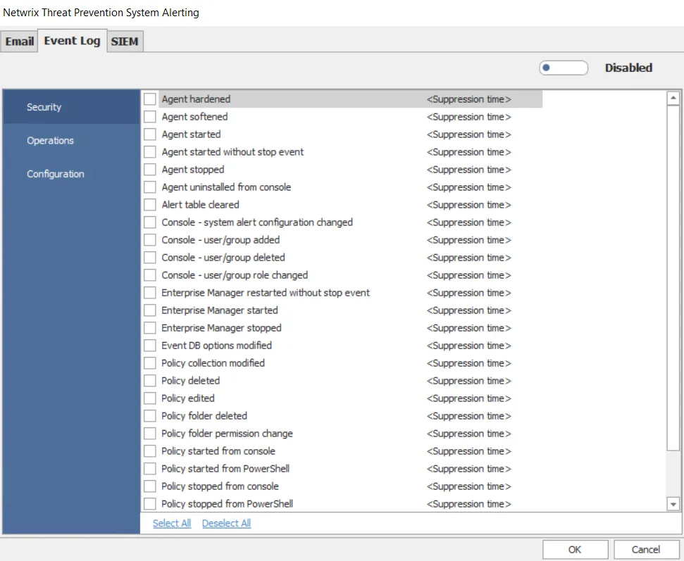

# Event Log Tab

Alert notification via Event Log sends event notifications to the Windows Event Log. Follow the
steps to enable Event Log alerting.

**Step 1 –** Click **Configuration** > **Alerts** on the menu. The Netwrix Threat Prevention System
Alerting window opens.

**Step 2 –** Click the **Event Log** tag.

**Step 3 –** Click the button next to Disabled to toggle the setting to **Enabled**.

**Step 4 –** Select an event category (Security, Operations, Configuration) in the left pane.

**Step 5 –** Check the checkboxes for the event(s) for which you want to trigger Windows Event Log
notifications.

**Step 6 –** For the Security, Operations, and Configuration event categories, the Suppression time
option is also available for each event. Use it to prevent Threat Prevention from generating alerts
for an event for a specified time period. This limits the volume of repeat alerts for the respective
event.

Click **Suppression time** for an event and select an option from the drop-down menu:

- A duration ( 1 min, 2 min, 5 min, 10 min, 30 min, 60 min) – Once an alert is generated for the
  event, Threat Prevention will not generate another alert for it during the next X minutes (X is
  the duration you selected) even if the event occurs.
- Disabled – Alerts will not be suppressed

Example

You select a suppression time of 30 minutes for an event. Next, an alert is generated for that
event. If the event occurs again within the next 30 minutes, an alert will not be generated.

The suppression time feature enables you to tackle situations where numerous alerts are generated
for an event, such as Agent Latency, causing the Enterprise Manager and Administration Console to
freeze.

**Step 7 –** Click **OK** to save the settings.

The Windows Event Log now receives alert notifications for the checked events.
