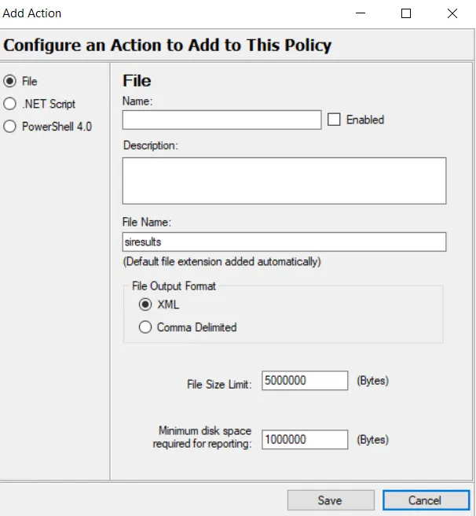

# File Actions

A File action can output the event data collected by a policy to a log file. Follow the steps to add
a File action to a policy/template.

**Step 1 –** On a policy or template **Actions** tab, click **Add** (+) to open the Add Action
window.

**Step 2 –** In the left pane, select the **File** radio button.

**Step 3 –** Configure the File action:

- Name – Provide a unique, descriptive name for this File action
- Check the box for **Enabled** to allow the policy to send the event data to the file
- Description – Provide a clear and detailed description for this File action. This is optional but
  recommended.
- File Name – Provide a name for the file. The file extension is added automatically

    - By default, the file is created at the following location:

    …\Netwrix\Netwrix Threat Prevention\SIEnterpriseManager\output\file

    - The name can include a full UNC path to place the file at a desired location.

- Select the radio button for the desired File Output Format:
    - XML
    - Comma Delimited (CSV)
- Adjust the File Size Limit and Minimum disk space required for reporting values as desired

    **NOTE:** Set thresholds for file event consumers to maximize performance and minimize
    individual file sizes. When a file reaches its maximum size, it continues to record data but the
    oldest data in the file is deleted to make room for the newest.

    The default file size settings are the following:

    - File Size Limit: 5 MB
    - Minimum disk space required for reporting: 1 MB

**Step 4 –** Click **Save** to apply changes and close the Add Action window.

The Actions tab now displays the configured settings for the specified File action. The action
configuration can be directly edited through this display as well.
