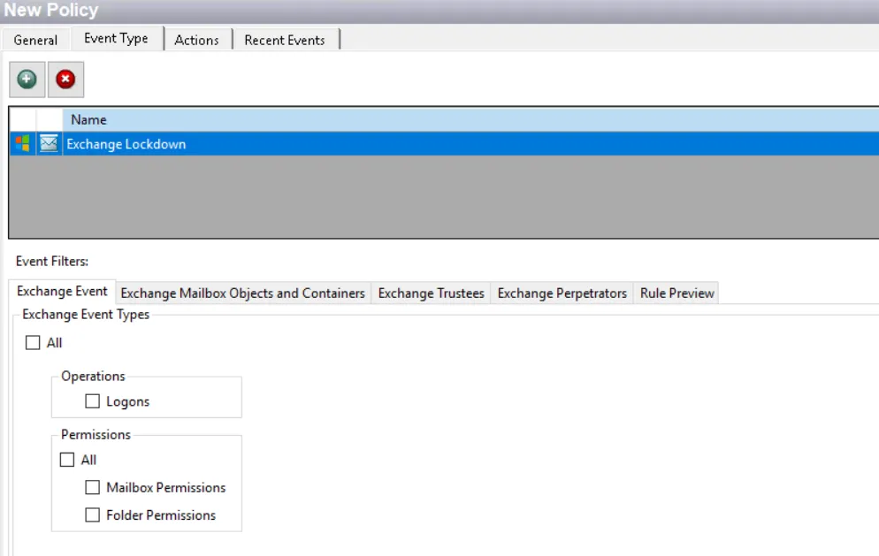
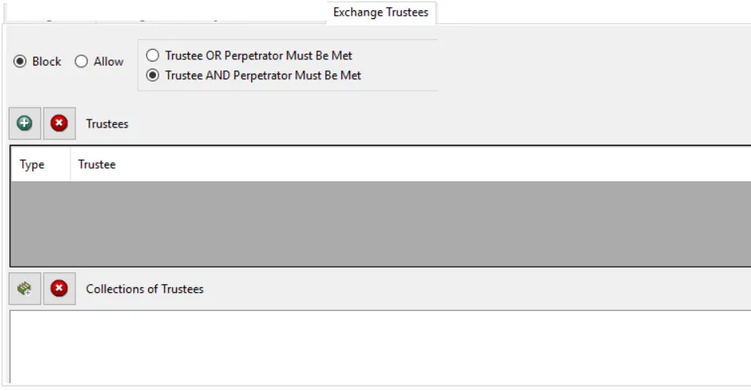
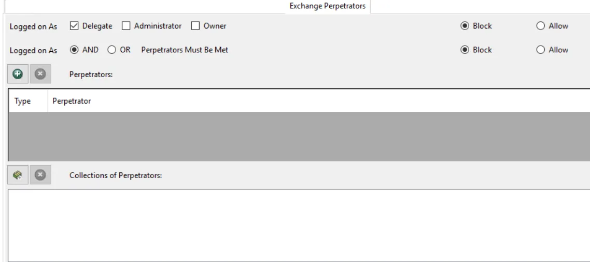

# Exchange Lockdown Event Type

The Exchange Lockdown event type prevents specified types of changes in Exchange and generates an
event with details of the blocked activity.

The event filters for the Exchange Lockdown event type are:

- Exchange Event
- Exchange Mailbox Objects and Containers
- Exchange Trustees
- Exchange Perpetrators
- Rule Preview

Each filter tab acts like an "AND" statement for the filter. Any filter tab left blank is treated
like an "ALL" for that filter set.

**CAUTION:** Lockdown/blocking policies with blank filters result in everything being locked down or
blocked.

After enabling an Exchange login blocking policy, mail clients with existing connections to Outlook,
OWA, PowerShell, EWS, ECP, and ActiveSync will not be blocked while the existing connection remains.
See the [Exchange Lockdown Considerations](../../../troubleshooting/exchangelockdown.md) topic for
information on resolving this.

**NOTE:** There are additional factors to consider in order to block delegations through Outlook.
See the [Troubleshooting FAQs](../../../troubleshooting/overview.md#troubleshooting-faqs) topic for
additional information.

## Exchange Event Filter

On the Exchange Event filter for lockdown, select the types of Exchange events to be locked down by
the policy.

Check the **All** box at the top of the tab to include all operations and permissions or select
specific operations and permissions:

- Operations:

    - Logons – Scope to Exchange logon events

- Permissions:

    - All – All listed permission changes
    - Mailbox Permissions – Scope to mailbox permissions changes
    - Folder Permissions – Scope to folder permissions changes

Whether these events are blocked or allowed depends on the other filters applied to the policy.

## Exchange Mailbox Objects and Containers Filter

Use the Exchange Mailbox Objects and Containers filter for lockdown to set the scope of the policy
to lockdown changes to specific objects or containers within Exchange or to exclude changes to
specific objects or containers from being locked down.

Select the **Include** or **Exclude** button and then edit the list.

- The **Add** (+) button opens the
  [Select Exchange Objects from Active Directory Window](window/selectactivedirectory/exchangeobjects.md).
- The Collection button opens the
  [List of Collections Window](../../configuration/collectionmanager/listcollections.md) to the
  appropriate Collection category.
- The Remove (x) button deletes the selected item(s) from that box.

## Exchange Trustees Filter

Use the Exchange Trustees filter for lockdown to set the scope of the policy to only lockdown
specific Exchange trustees. Trustees are the accounts receiving permissions. For example, if an
administrator grants Joe Smith access to Bob Wilson's mailbox, Joe Smith is the trustee that is
granted permissions.

Select the **Block** or **Allow** option button and then edit the list.

Use the buttons in the Trustees and Collections of Trustees areas to edit the lists.

- The Trustees **Add** (+) button opens the
  [Select Active Directory Trustees Window](window/selectactivedirectory/trustees.md).
- The Collection button opens the
  [List of Collections Window](../../configuration/collectionmanager/listcollections.md) to the
  appropriate Collection category.
- The Remove (x) button deletes the selected item(s) from that box.

The other option button options dictate how the Exchange Trustees filter and the Exchange
Perpetrators filter relate to each other. They include:

- Trustee OR Perpetrator Must Be Met – When either the Trustee selection OR the Perpetrator
  selection is met, the filter will be set to true

    - For an Allow example, if this policy is protecting a CEO mailbox, the Trustee list includes
      Brad Wilson for Allow, and Administrator is included in the Perpetrator Allow list, then Brad
      Wilson can be added as the mailbox trustee by anyone AND Administrator can add anyone else as
      the mailbox trustee.
    - For a Block example, if this policy is protecting a CEO mailbox, the Trustee list includes
      Larry Dawson for Block, and John Adair is included in the Perpetrator block list, then Larry
      Dawson cannot be added as the mailbox trustee by anyone AND John Adair cannot add anyone else
      as the mailbox trustee.

- Trustee AND Perpetrator Must Be Met – Both the Trustee selection AND the Perpetrator selection
  must be met

    - For an Allow example, if this policy is protecting a CEO mailbox, the Trustee list includes
      Brad Wilson for Allow, the Administrator is included in the Perpetrator allow list, then
      Administrator can ONLY add Brad Wilson as the mailbox trustee.
    - For a Block example, if this policy is protecting a CEO mailbox, the Trustee list includes
      Larry Dawson for Block, the John Adair is included in the Perpetrator Block list, then ONLY
      John Adair will be blocked from adding Larry Dawson as the mailbox trustee.

## Exchange Perpetrators Filter

Use the Exchange Perpetrator filter for lockdown to set the scope of the policy to only lock down
specific security principals committing changes or to exclude specific security principals
committing changes from being locked down.

Options at the top enable you to block or allow user access to mailboxes based on the assigned
roles.

The Logged on As checkbox options are:

- Delegate – User who is not the owner of the mailbox being accessed
- Administrator – User who is not the owner of the mailbox being accessed but has administrative
  privileges
- Owner – User who is the owner of the mailbox being accessed

The Logged on As radio button options include:

- AND Perpetrators Must be Met – Both the Logged On As selection AND the Perpetrator must be met
  before the event passes the filter

    - When the Allow option button is selected for both the Logged on As options – If the
      Administrator is Allowed for the Logged On As option and Joe Smith is Allowed in the
      Perpetrator list, then the filter will only be true if the event is triggered by Joe Smith AND
      Joe Smith is an Administrator of the affected mailbox. All other perpetrators will be blocked
      for the affected mailbox.
    - When the Allow option button is selected for the Logged On As checkboxes and the Block option
      button is selected for the AND/OR options – If the Administrator is Allowed for the Logged On
      As option and Joe Smith is Blocked in the Perpetrator list, then the filter will only be true
      if the event is triggered by Joe Smith AND Joe Smith is an Administrator of the affected
      mailbox which will result in Joe Smith being blocked.

- OR Perpetrators Must Be Met – When either the Logged On As selection OR the Perpetrator is met,
  the filter is set to true

    - When the Allow option button is selected for both the Logged on As options – If Administrator
      is Allowed for the Logged On As option and Joe Smith is Allowed in the Perpetrator list, then
      the filter will be true if the event is triggered when Joe Smith made changes to the mailbox
      OR when an Administrator made a change to the mailbox. All other perpetrators will be blocked.
    - When the Allow option button is selected for the Logged On As checkboxes and the Block option
      button is selected for the AND/OR options – If Administrator is Allowed for the Logged On As
      option and Joe Smith is Blocked in the Perpetrator list, then the filter will be true if the
      event is triggered when Joe Smith tries to make changes to the mailbox OR when an
      Administrator made a change to the mailbox. Administrator will be successful at making
      changes, but Joe Smith will be blocked.

Both the checkboxes and the option buttons have their own set of Block or Allow options.

Use the buttons in the Perpetrators and Collections of Perpetrators areas to edit the lists.

- The Perpetrators Add (+) button opens the
  [Select Active Directory Perpetrators Window](window/selectactivedirectory/perpetrators.md).
- The Collection button opens the
  [List of Collections Window](../../configuration/collectionmanager/listcollections.md) to the
  appropriate Collection category.
- The Remove (x) button deletes the selected item(s) from that box.

**NOTE:** To enable a Dynamic Policy, use the Collection button to select the desired Dynamic
Collection. See the [Dynamic Collections](../../configuration/collectionmanager/dynamic.md) topic
for additional information.

## Rule Preview Filter

The Rule Preview filter displays a summary of the selected filter options. This is primarily used
for troubleshooting.

The text displayed represents the rules created based on the policy’s selected filters. Each row is
a selected filter. Notice the Word Wrap checkox. If checked, a filter statement may cover multiple
rows so that all of it is visible.
