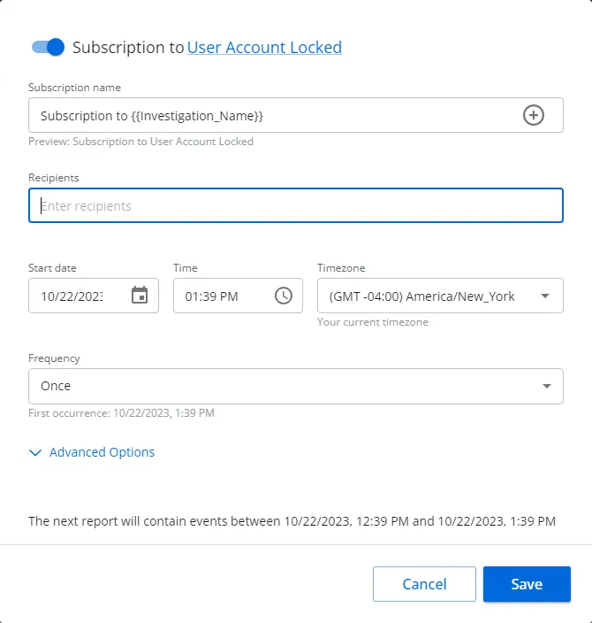

# Add Subscription

A subscription sends the report results for an investigation to recipients via email as an
attachment.

Click **Investigate** in the application header bar to open the Investigations interface. Then click
a folder in the navigation pane to access a saved investigation. An investigation is located in the
folder where it was saved.

Click the Subscriptions link to open the Subscription to window. You can specify recipients to
receive this report as an email attachment in a specified format.

**NOTE:** This option requires an email server to be configured.If this requirement is not met, a
message will appear in the window. See the[Email Page](../../configuration/integrations/email.md)
topic for additional information.

## Subscribe to an Investigation

Follow the steps to subscribe to an investigation.

**Step 1 –** From the desired investigation, click **Subscriptions**. The Subscription window opens.

The name of the respective investigation is displayed as a link. Click it to view the filter defined
for the investigation.

**Step 2 –** By default the subscription is enabled. You can disable it with the toggle button by
the window name.

**Step 3 –** Modify the subscription name as desired in the Subscription name field. The default
name is: Subscription for `\{\{Investigation_Name\}\}`. This variable will be replaced with the name
of the investigation. The + button opens a variable menu for the field.

**Step 4 –** Enter the email addresses for the recipients of this report subscription in the
Recipients box.

**Step 5 –** Set the start date, time, and timezone for the selected frequency:

- Start date – This field opens a calender. You can also type a date in the field.
- Time – This field opens a clock. You can also type a date in the field.
- Timezone – This field opens a drop-down menu. Select the desired timezone.

**Step 6 –** Set a frequency. Options in the Frequency drop-down menu are: Once, Daily, Weekly, and
Monthly. Ensure the frequency does not exceed the "Time to Retain" settings for the System Jobs
configured in the System Settings interface.

**Step 7 –** There are two additional settings in the Advanced Options section. Click the arrow to
expand this section.

**Step 8 –** Modify the email subject line in the Email subject field as desired. The default name
is: Subscription to`\{\{Investigation_Name\}\}` at \{\{Date\}\}. These variables will be replaced
with the name of the investigation and the date of the report. The + button opens a variable menu
for the field.

**Step 9 –** Set the file name in the File name field. The default name is:
`\{\{Investigation_Name\}\}`\_\{\{Date\}\}. This variable will be replaced with the name of the
investigation. The + button opens a variable menu for the field.

**Step 10 –** Select the file format for the export from the drop-down menu: CSV, PDF, JSON, Excel
Viewing.

**Step 11 –** Click **Save**. The Subscription export window closes.

The subscription is listed on the Subscriptions and Exports page of the Investigations interface.

See the [Subscriptions and Exports Page](../subscriptionsexports.md) topic for additional
information.
