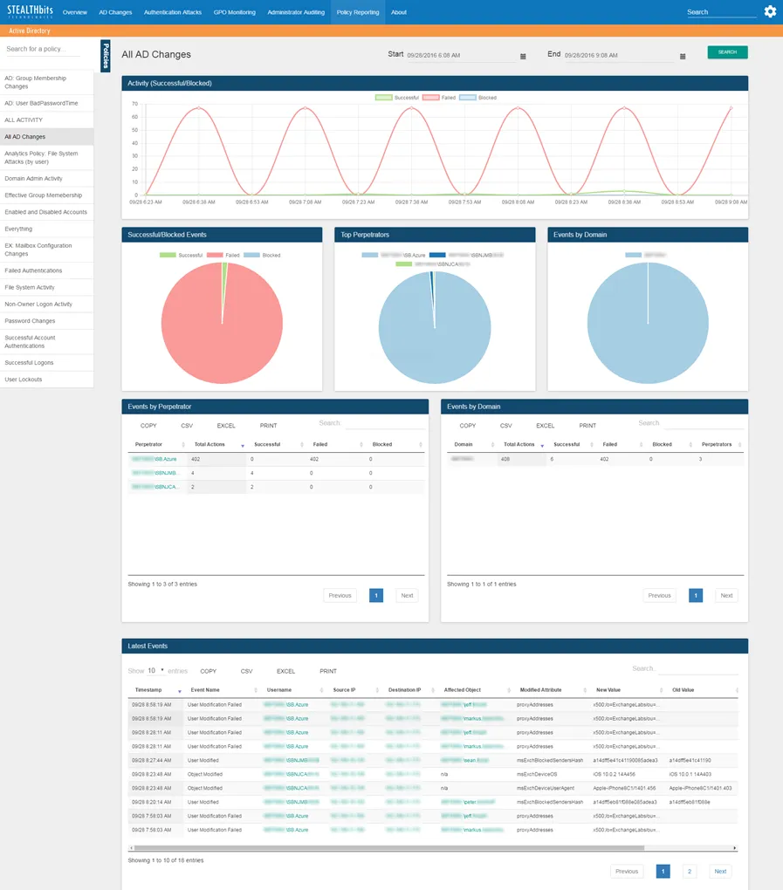

# Policy Reporting Dashboard

The Policy Reporting dashboard is for viewing Threat Prevention events from any enabled policy that
is sending events to QRadar. This dashboard requires the SEC token to be saved in the Settings
interface in order for QRadar to actively see Threat Prevention policies and associated recent
events. See the [Settings](../settings.md) topic for additional information.

The Policies tab on the left side of the dashboard toggles the Policies panel open and close. All
the enabled Threat Prevention policies sending event data to QRadar will be listed in alphanumeric
order. On selecting a policy, the dashboard cards will load the event data from that policy and will
reset to data search of the past three (3) hours.

The Policy Reporting dashboard contains the following cards:

- Activity (Successful/Blocked) – Timeline of successful/failed/blocked events related to the
  selected policy that have been recorded in the specified timeframe. See the
  [Graph Card Features](../navigate.md#graph-card-features) topic for additional information.
- Successful/Blocked Events – Breakdown of events related to the selected policy that have been
  recorded in the specified timeframe by successful/failed/blocked status. See the
  [Graph Card Features](../navigate.md#graph-card-features) topic for additional information.
- Top Perpetrators – Displays up to the top five (5) usernames related to the selected policy that
  have been recorded in the specified timeframe. See the
  [Graph Card Features](../navigate.md#graph-card-features) topic for additional information.
- Events by Domain – Breakdown of events related to the selected policy that have been recorded in
  the specified timeframe by domain. See the
  [Graph Card Features](../navigate.md#graph-card-features) topic for additional information.
- Events by Perpetrator – Tabular format of all usernames related to the selected policy for events
  that have been recorded in the specified timeframe. See the
  [Table Card Features](../navigate.md#table-card-features) topic for additional information.
- Events by Domain – Tabular format of all domains related to the selected policy for events that
  have been recorded in the specified timeframe. See the
  [Table Card Features](../navigate.md#table-card-features) topic for additional information.
- Latest Events – Tabular format of all events related to the selected policy that have been
  recorded in the specified timeframe. See the
  [Table Card Features](../navigate.md#table-card-features) topic for additional information.

The time interval is identified in the upper-right corner with the _Start_ and _End_ boxes. This is
set by default to the past three (3) hours. To search within a different interval, either manually
type the desired date and time or use the calendar buttons to set the desired date and time
interval. Then click **Search** to refresh the card data.

When a search using a time interval longer than twelve (12) hours is instigated, the database query
is broken into multiple mini-queries. This will result in a visible reset of the dashboard display
at the end of each mini-query until all data for the selected time interval has been retrieved.
