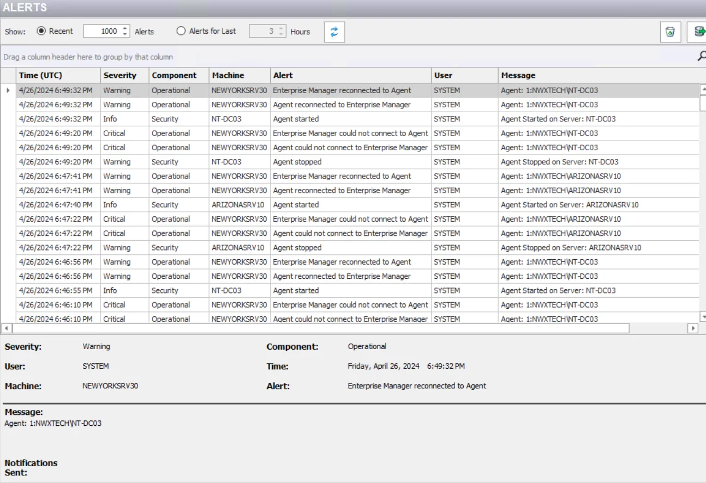

# Alerts Interface

The Alerts interface allows you to quickly view recent Security events, Operations events, and Configuration events for Threat Prevention - all of which are known as alerts. These events are system-generated and do not require any prior configuration.

You can choose to view alerts related to analytics configuration and monitoring status on the Alerts interface. See the [Alerts Cleanup Window](window/alertscleanup.md) topic for options to display this data.

Click __Alerts__ in the left pane to launch the Alerts interface.

The following options are available on the toolbar:

- Recent [number] Alerts radio button – Populates the data grid with the most recent alerts. Use the textbox to change the default number of 1000.
- Alerts for Last [number] Hours radio button – Populates the data grid with hourly alert data. Use the textbox to change the default number of three hours.
- Refresh button – Updates the data grid with the current alert data for the selected radio button option
- Clear icon – Delete, save, and schedule cleanups for alert data
- Export Data icon – Export alerts data from this grid to a local CSV file

Example for the Alerts for Last [number] Hours Option

Below is an example of how to use the Alerts for Last [number] Hours option.

The number of hours set is based on UTC and is adjusted for the time zones of the Administration Console server and the Agent that is monitoring the events. Let's assume the following:

- The Administration Console server is in New York, USA (UTC -5)
- The option is set to display events for Last 4 Hours
- The Agent that is monitoring the events is in London, UK (UTC +0)

If you click the Refresh button at noon New York time, then the events displayed would have been generated between 8 A.M. and 12 P.M. New York time, or between 1 P.M. and 5 P.M. London time.

## Alerts Data Grid

The data grid displays the following information for each event:

- Time (UTC) – Date timestamp for when the system event occurred, the specified time is UTC time. Hover over the data in this column to view the local time (of the Enterprise Manager) and UTC time simultaneously.
- Severity – Classification of the significance of the event indicated by the alert:
  - Critical – Might include data loss or other events with unexpected conditions
  - Error – Indicates a situation where Threat Prevention fails to complete an operation, for example, when it fails to connect to a SEIM server
  - Warning – Indicates change events that affect the global operations of Threat Prevention
  - Info – Covers all other system events
- Component – The type of system event for which the alert is triggered:
  - Threat Prevention Security events
  - Threat Prevention Operations events
  - Threat Prevention Configuration events

  For a list of the events that fall under each component, see the [System Alerting Window](../configuration/systemalerting/overview.md)
- Machine – Name of the originating host
- Alert – Name of the event that triggered the alert
- User – Security principal of the account that triggered the event
- Message – Description and details about the event. The __Policy updated on server Changeset #[number]__ link is displayed for events that represent a change to a policy, be it a policy under the Policies node or one defined for analytics. Click it to open the [Policy Comparison Window](window/policycomparison.md) where you can view any changes made to the policy. Alerts generated for an archive database maintenance job have "Archive DB:" as the message prefix to differentiate them from those generated for the database maintenance job.

This data grid employs features for sorting, filtering, searching, and more. See the [ Data Grid Functionality](../navigation/datagrid.md) topic for additional information.

Select an event in the data grid to view its details.

In addition to this information, several notifications have been sent for the event.

## Additional Considerations

Below are some considerations:

- Occasionally a Microsoft Security Bulletin impacting LSASS can interfere with the Agent instrumentation resulting in LSASS shutting down. The Agent is configured to monitor for an LSASS process termination shortly after a server reboot. The [LSASS Process Terminated](../../troubleshooting/lsass.md) alert (Operations alert) is triggered in this event and the Agent is stopped. As a result, all monitoring/blocking by that Agent stops. To resolve the issue, either upgrade to the latest version of the Agent or simply upgrade SI.ActiveDirectoryMonitor.dll - commonly known as ADMonitor DLL (recommended). See the [Upgrade ADMonitor](../agents/management/upgradeadmonitor.md)topic for additional information.

  ___RECOMMENDED:___  Activate an email notification for the _LSASS process terminated_ alert. See the [Enable the 'LSASS Process Terminated' Email Alert](../../troubleshooting/lsass.md#enable-the-lsass-process-terminated-email-alert) topic for additional information.
- In addition to the LSASS process termination check, the Agent can be configured for a Safe Mode. In Safe Mode, the Agent records the version of the LSASS DLLs that it hooks into during installation. When an Agent is restarted, it compares the DLL versions with the recorded list. If the versions do not match, the Windows AD Events monitoring module is not loaded. The Agent’s status in the Agents interface changes to Active (Modules Pending), and all Active Directory monitoring/blocking by that Agent stops. The 'Agent Started in AD Monitor pending mode' alert (Operations alert) is triggered in this event. To resolve the issue temporarily, the Threat Prevention administrator should start the pending modules. See the [Start Pending Modules](../agents/management/startpendingmodules.md) topic for additional information. It is also recommended to upgrade SI.ActiveDirectoryMonitor.dll (commonly known as ADMonitor DLL) to resolve the issue permanently. See the [Upgrade ADMonitor](../agents/management/upgradeadmonitor.md) topic for additional information.

  ___RECOMMENDED:___ Activate an email notification for this alert. See the [Enable Agent Started in AD Monitor Pending Mode Email Alert](../agents/safemode.md#enable-agent-started-in-ad-monitor-pending-mode-email-alert) topic and the [Agent Safe Mode](../agents/safemode.md) topic for additional information.
