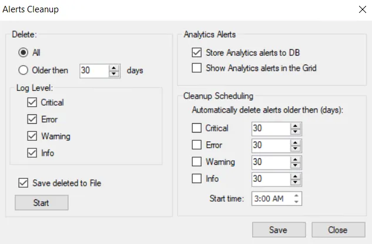

# Alerts Cleanup Window

You can clear alert data displayed on the [Alerts Interface](../overview.md) as well as schedule cleanups for this data.

___RECOMMENDED:___ Export alert data before using the Clear option. See the [Alerts Export Window](alertsexport.md) topic for additional information.

Follow the steps to clear the alerts data.

__Step 1 –__ Click __Alerts__ in the left pane to launch the Alerts interface.

__Step 2 –__ On the Alerts interface, click the __Clear__ icon in the top right corner.

__Step 3 –__ The Alerts Cleanup window has these options:

- Delete – Removes alert data from the database. Select __All__ to delete all alert data or select __Older than__ and specify a certain number of days to delete alerts older than the specified number of days.
- Log Level – Deletes alerts that have the log levels that are checked. The log levels are equivalent to the alert severity levels in the data grid on the [Alerts Interface](../overview.md).
- Save deleted to File – Saves alert data to a CSV file before it is deleted from the database. On clicking Start, the Save As window appears. Specify a file name and location; the default name is “Alerts_Backup_[date]_[timestamp]”. Then click Save.
- Analytics Alerts – Choose to display Threat Prevention analytics alerts in the database and/or show them in the Alerts interface. If you choose to display them on the Alerts interface, then this data will also be deleted in the cleanup function.
- Cleanup Scheduling – Deletes alerts after a specific number of days if the severity level is selected from the list. Set the start time for when the cleanup begins.

__Step 4 –__ Click __Start__ to run the alerts cleanup with the applied settings.

__Step 5 –__ Click __Save__ to save any changes or __Close__ to discard the changes and close the window.

Threat Prevention clears alert data from the database according to these configurations. It generates a new alert to notify that the alert data is cleared, identifies the user who cleared the alerts, displays a date time stamp, and what options were configured for the cleanup operation.
