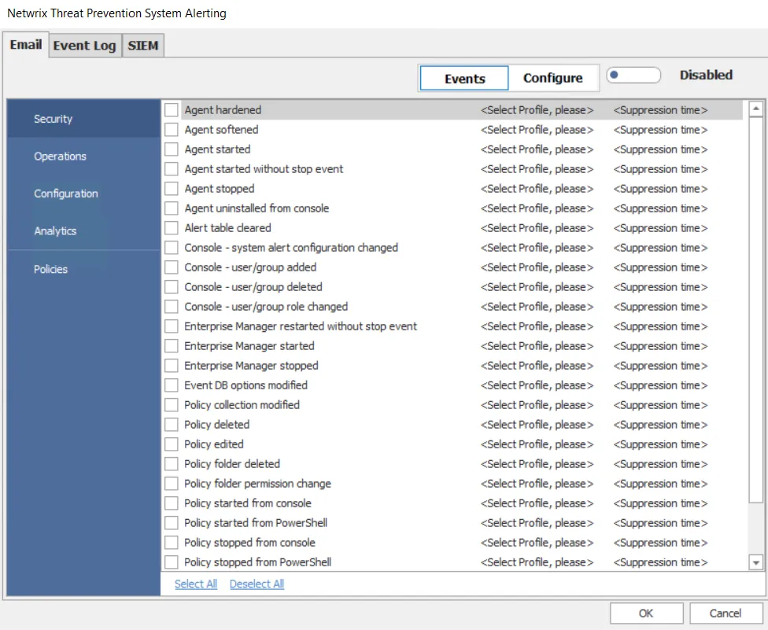
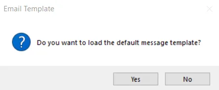

# Email Tab

Alert notification via email sends messages through an SMTP gateway. Alerts are designed to send email notifications to individuals or groups.

Follow the steps to configure the Email tab of the System Alerting window.

__Step 1 –__ Click __Configuration__ > __Alerts__ on the menu. The Netwrix Threat Prevention System Alerting window opens. The Email tab is displayed by default.

__Step 2 –__ Configure the following prior to enabling email alerting:

- Configure SMTP Host Information
- Create Message Profiles

__Step 3 –__ Once configured, click __Events__ on the __Email__ tab. Decide what events receive notifications and assign one or more message profiles to the event.

__Step 4 –__ Click the button next to Disabled to toggle the setting to __Enabled__.

__Step 5 –__ Select an event category (Security, Operations, Configuration, Analytics, Policies) in the left pane.

__Step 6 –__ Check the checkbox for the event/incident/policy for which you want to trigger email notifications.

__Step 7 –__ Click the __Select Profile, please__ option for an event/incident/policy and select a Message Profile from the drop-down menu to assign it to the event/incident/policy. When an alert is generated for the event/incident/policy, an email will be sent to all recipients specified in the Message Profile.

- For policies, multiple profiles can be assigned by either checking the desired profile(s) or the Select All option. Click __OK__ in the drop-down menu to confirm the selection.

You can assign a profile to as many events as required.

__Step 8 –__ For the Security, Operations, and Configuration event categories, the Suppression time option is also available for each event. Use it to prevent Threat Prevention from generating alerts for an event for a specified time period. This limits the volume of repeat alerts for the respective event.

Click __Suppression time__ for an event and select an option from the drop-down menu:

- A duration ( 1 min, 2 min, 5 min, 10 min, 30 min, 60 min) – Once an alert is generated for the event, Threat Prevention will not generate another alert for it during the next X minutes (X is the duration you selected) even if the event occurs.
- Disabled – Alerts will not be suppressed

Example

You select a suppression time of 30 minutes for an event. Next, an alert is generated for that event. If the event occurs again within the next 30 minutes, an alert will not be generated.

The suppression time feature enables you to tackle situations where numerous alerts are generated for an event, such as Agent Latency, causing the Enterprise Manager and Administration Console to freeze.

__Step 9 –__ For Analytics, choose whether or not to enable Ongoing Attack Alerts. When checked, Threat Prevention sends periodic reminders of an ongoing attack if it continues after the initial notification has been sent.

__Step 10 –__ Click __OK__ to save the settings.

Threat Prevention now sends email notifications for the selected events/incident/policies to the recipients of the selected Message Profiles.

### Configure SMTP Host Information

Follow the steps to configure the SMTP host information for email alerting.

_Remember,_ this is a one-time setting to enable email alerts from the Administration Console.

__Step 1 –__ Click __Configuration__ > __Alerts__ on the menu. The Netwrix Threat Prevention System Alerting window opens.

__Step 2 –__ On the Email tab, click __Configure__.

__Step 3 –__ In the Server section, provide the SMTP Host as either the IP address or the hostname of the SMTP gateway. Example: 192.168.189.56 or SIM1.netwrix.com

__Step 4 –__ In the __Port__ box, provide the appropriate port number.

__Step 5 –__ Check the __Enable SSL__ checkbox to use SSL communications for email.

__Step 6 –__ In the __From__ box, enter the email address to be used as the sender for the email. Example: Threat Prevention@Netwrix.com

__Step 7 –__ If the SMTP gateway requires authentication, check the __Requires Authentication__ checkbox and provide a username and password in the boxes that appear.

__Step 8 –__  Click __OK__ to save the settings.

### Create Message Profiles

Message Profiles are associated with events for email alerting. Follow the steps to create a Message Profile.

__NOTE:__ When the Message Profile is modified for an alert, all policies referencing the alert use the updated information.

__Step 1 –__ Click __Configuration__ > __Alerts__ on the menu. The Netwrix Threat Prevention System Alerting window opens.

__Step 2 –__ On the Email tab, click __Configure__.

__Step 3 –__ In the Message Profiles area, click the __Add__ (+) button to create a Message Profile. The default profile name (New Email Notification) is displayed.

___RECOMMENDED:___ Provide a unique and descriptive name for this new email notification profile.

__Step 4 –__ Choose between __Plain Text__ and __HTML__ email options. The Email Template window displays when selecting either radio button.

Changing the message template provides the option to load the default message template. Choose between:

- Yes – Loads the default message template for the selected format. This overwrites the current message template.
- No – Leads the current message body

__Step 5 –__ In the To box, provide an email address for each recipient of the email alert. This can be individuals, distribution lists, or a combination. To send alerts to multiple recipients, separate the addresses with either a comma (,) or a semi-colon (;). Example: IT@netwrix.com; ITdl@netwrix.com

__Step 6 –__ Click the Send Test Email link to send a test email. It sends an unformatted sample message to all recipients. Threat Prevention informs you if the message is successfully sent, but is not able to tell if it was received.

__Step 7 –__ In the Subject box, keep the default subject line for the email or provide one that is more suitable for the alerts these recipients receive.

__Step 8 –__ The Body box contains the default message, which includes all event data types available for notification. To customize it for the specific alerts, simply remove the Event Data Fields not desired. Customization can also include reformatting the message as desired. The default message is:

- Plain Text – An event has occurred in which you are on the notification list.
- HTML – The following Event has occurred at %TIME_STAMP% for which you requested notification

The available Event Data Fields and their associated tokens are:

| Event Data Field | Token |
| --- | --- |
| Time Stamp | %TIME_STAMP% |
| Event Source Type | %EVENT_SOURCE_TYPE% |
| Domain Name | %EVENT_SOURCE_NAME% |
| Policy Name | %SETTING_NAME% |
| Event Name | %EVENT_NAME% |
| Event Name Translated | %EVENTNAMETRANSLATED% |
| Originating Server | % ORIGINATING_SERVER% |
| Originating Server IP | %ORIGINATING_SERVERIP% |
| Target Host | %TARGETHOST% |
| Target Host IP | %TARGETHOSTIP% |
| Class Name | %CLASS_NAME% |
| DN | %DN% |
| Affected Object SID | %AFFECTED_OBJECT_SID% |
| Affected Object Account Name | %AFFECTED_OBJECT_ACCOUNT_NAME% |
| Operation Successful | %SUCCESS% |
| Operation Status | %STATUS% |
| Blocked Event | %BLOCKED_EVENT% |
| Perpetrator | %PERPETRATOR% |
| Perpetrator Name | %PERPETRATOR_NAME% |
| Perpetrator Sid | %PERPETRATOR_SID% |
| Originating Client | %ORIGINATING_CLIENT% |
| Originating Client Host | %ORIGINATINGCLIENTHOST% |
| Originating Client IP | %ORIGINATINGCLIENTIP% |
| Originating Client Protocol | %ORIGINATINGCLIENTPROTOCOL% |
| Originating Client MAC | %ORIGINATINGCLIENTMAC% |
| Events Count | %EVENTS_COUNT% |
| Attribute Values | %ATTRIBUTE_VALUE% |
| Old Attribute Values | %OLD_ATTRIBUTE_VALUE% |
| Attribute Operations | %OPERATION% |

__CAUTION:__ The tokens used within the message Body, the information between and including the % symbols (e.g. %TIME_STAMP%), must be present to retrieve that event data from the database. Tokens can be removed, but partial tokens do not retrieve data from the database.

__Step 9 –__ Click __OK__ to save the settings.

Now that at least one Message Profile has been created, it can be assigned to an event either through the System Altering window’s Email tab or assigned to a policy on the [Actions Tab](../../policies/actions/overview.md) of the policy configuration or the [Actions Tab](../../templates/actions.md) of the template configuration.
